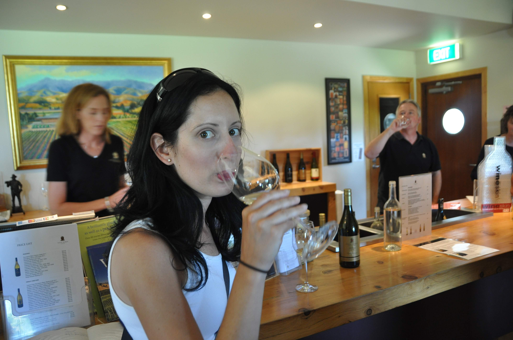

באיזור מלבורו מיוצרים 85 אחוזים מהיין שמיוצר בניו זילנד כולה - לשם השוואה מדובר בערך על כפי 40 מהכמות המיוצרת בישראל. האיזור כולו מלא ביקבים רחבי ידיים שצובעים בירוק את כל קו הנוף.

אמנם לא אימצנו את שרירי הרגליים במשך כל השהות שלנו כאן, אבל החך נאלץ לעבוד שעות נוספות. ההתמחות העיקרית שלהם כאן היא ביינות הלבנים עם דגש על סוביניון בלאן ופינו גרי. בסיור היין המקיף שעשינו תקפו את חייכנו האומלל בסוגים השונים של היין בליווי הסברים מעניינים על שיטות היישון הקטיפה והתיבול בהן משתמשים כאן. לא יאומן אילו טעמים אפשר להוציא מהענבים בעזרת טכניקות פשוטות  יחסית - אגסים, פרחים ואפילו פלפל שחור. הריזלינג כאן, שבארץ מריח בעיקר כמו גרביים, חמצמץ וטעים והשרדונה עמוק ומתוחכם. קנינו כמה בקבוקים ועכשיו באופן רשמי יש איתנו באוטו כמות אלכוהול שיכולה להרוג לווייתן! חוץ ממרתף היינות שאנחנו מחזיקים מתחת למיטה, בסופר-מרקטים תמיד יש מבצעים על קופסאות של 24 בקבוקי בירה ואפילו האיכותיות יותר ממש לא יקרות.

ליקבים היותר גדולים יש מכונות עצומות שמבצעות את הקטיף של רוב הענבים בצורה אוטומטית. בהתחלה חשבתי שהם פשוט לא שמעו על העם התאילנדי, ברם לטענתם המכונות מהירות וזולות הרבה יותר גם מהתאילנדים המובחרים והצייתנים ביותר. מצד שני, בשנים שיש קרה רצינית המאווררים העצומים שפזורים כאן לא מספיקים וכדי לא לאבד בציר שלם חייבים להטיס מעל היקבים מאות מסוקים שיכניסו אויר חם בעלות של 2000 דולר ליום למסוק (!)

כדי שנוכל לטעום מבלי לחשוש מהנהיגה בחזרה לקחנו סיור מאורגן בו מסיעים אותך בין היקבים ומוסיפים עוד קוריוזים והסברים בנסיעה. יקב רודף יקב והענבים כבר התחילו להסתובב - אז ישבנו לסעודת גבינות באחד היקבים שם התחברנו עם ג׳ורג׳ וג׳ני שהיו איתנו בסיור וגם עם ויני הכלבה הלקקנית.

את הסיור המשכר סיימנו בביקור במפעל שוקולד קטן ואיכותי שניצל את מצבנו ואהבתנו לאגוזי מקדמיה בהם הוא מתמחה. קנינו brittle מקדמיה יוקרתי וטעים כל כך.

בערב קבענו להפגש ולאכול יחד עם ג׳ני וג׳ורג׳. ג׳ורג׳ הוא גרוזיני וג׳ני במקור מבוסטון אבל שניהם גרים יחד בלונדון. הם עושים כמונו טיול בעולם של חצי שנה, אבל טיול עם אופי כל כך שונה: הם מגדירים עצמם תיירי אוכל ובכל מקום אליו הם מגיעים - מתמסרים הם לתענוגות החיים. קבענו איתם שנבשל ארבעתנו אצלם בקראוון ואכן - כמות התבלינים היינות והמצרכים שהם מחזיקים היא מטורפת! ג׳ני הכינה פריטטה מושקעת ואנחנו ניוקי ואת הארוחה קינחנו בערימת גבינות מקומיות ואני כבר לא יודע כמה סוגי יינות. ג׳ני הוציאה 3 סוגים של קרקרים רק כדי שיתאימו לכל סוגי הגבינות - בקיצור פסיכים לגמרי :) נפרדנו מג׳ני וג׳ורג׳ לא לפני שהחלפנו המלצות על מסעדות בכל העולם: קליפורניה, ניו יורק, אוסטרליה ואפילו יין גרוזיני שאנחנו חייבים לנסות. אתם מוזמנים לעקוב אחרי ג׳ני וג׳ורג׳ כאן: [http://hungry-george.blogspot.com](http://hungry-george.blogspot.com/)

נסיים עם פינת הבישולים. אם כשהגשתי מאטה מהביל לשגריר אורוגואיי בספל עליו מתנוסס דגל ארגנטינה לא איבדתי את הקשר למולדת הורי לחלוטין אז אולי עכשיו - לאחרונה התחלנו לצלות עוף על המנגל במקום הסטייקים המסורתיים - דווקא לא רע בכלל! ביי בינתיים...

