זהו, השארנו מאחור את האי הדרומי ופנינו מועדות צפונה אל אי חדש ושונה. היינו באי הדרומי חודשיים מדהימים בהם חווינו כל כך הרבה חוויות.עדיין נשארו לנו כמה חובות באי הדרומי - נאלץ לחזור לפה עם הילדים להשלמות... את האי הדרומי עזבנו במעבורת עצומה מעיירה ששמה פיקטון. בסעודת פרידה מהאי ניסינו מתכון חדש של המבורגר - הפעם ערבבנו את בשר הבקר יחד עם בשר כבש - ליצירת טעם מקומי.

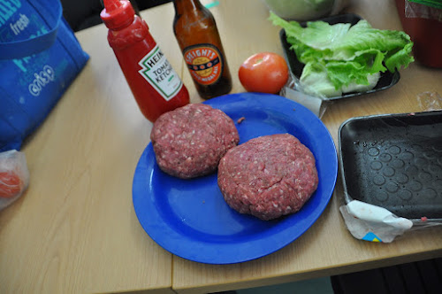

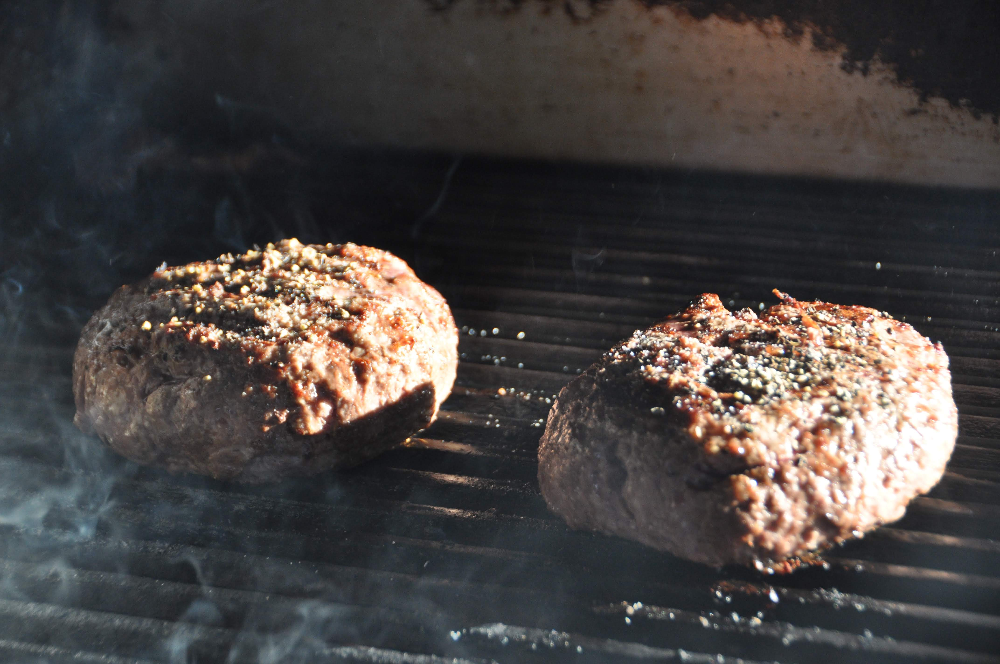

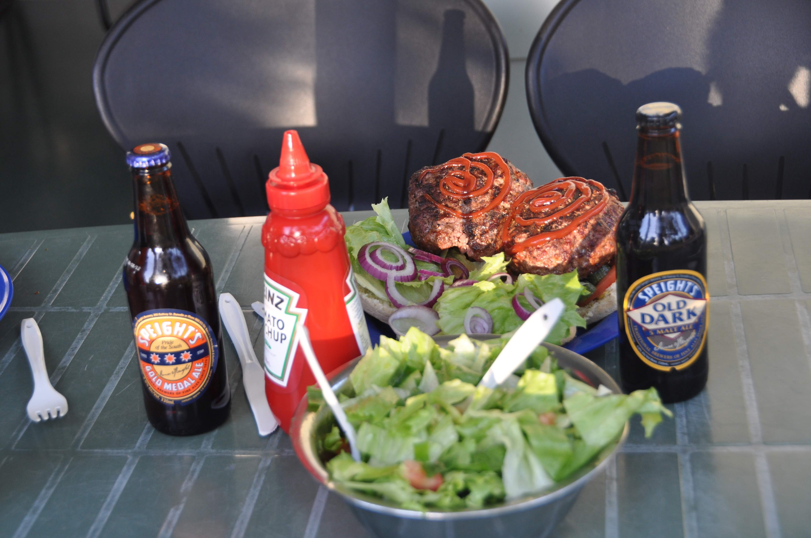
מפיקטון יוצא טרק של 4 ימים בשם Queen Sharlott שמאד דומה לאייבל טאזמן אותו לא מזמן עשינו לכן ויתרנו על ההליכה ועשינו נסיעה קצרה (Queen Sharlott Drive) מסביב לנופי המסלול ועצרנו לפיקניק באחת התצפיות. כמו שאמרתי - צריך להשאיר משהו בשביל הילדים המסכנים :)

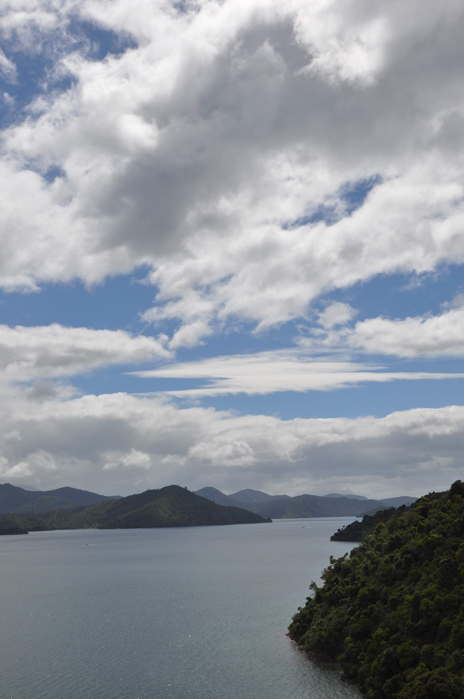

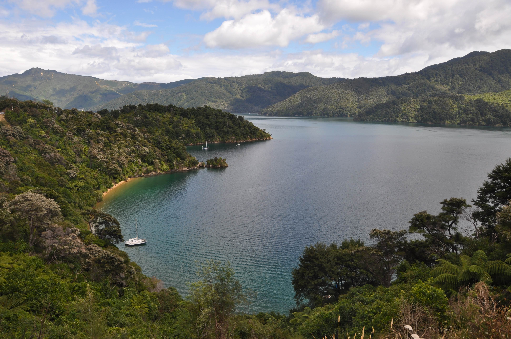

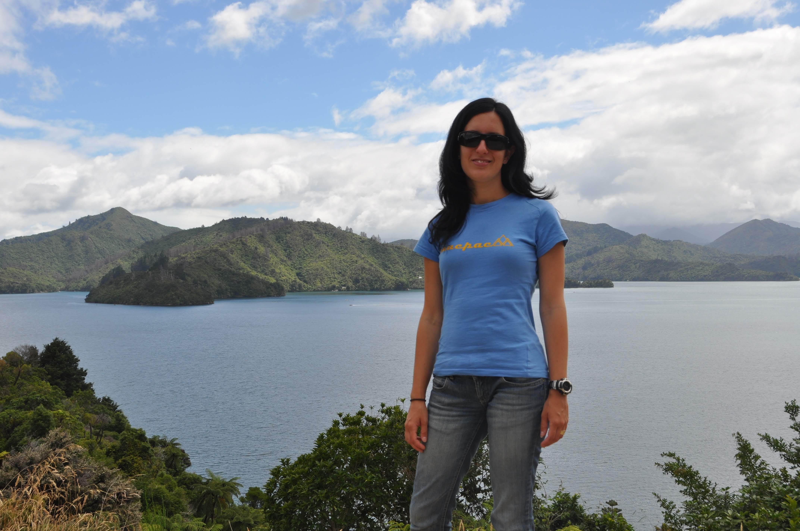
 אחרי שעברנו למעלה מ5000 קילומטרים של נסיעה ברחבי האי הדרומי שבמונחים עירוניים נחשב נטוש - עוברים לאי הצפוני המיושב, בשניה שירדנו מהמעבורת הופתענו לראות את הבניין הראשון שראינו במהלך הטיול!

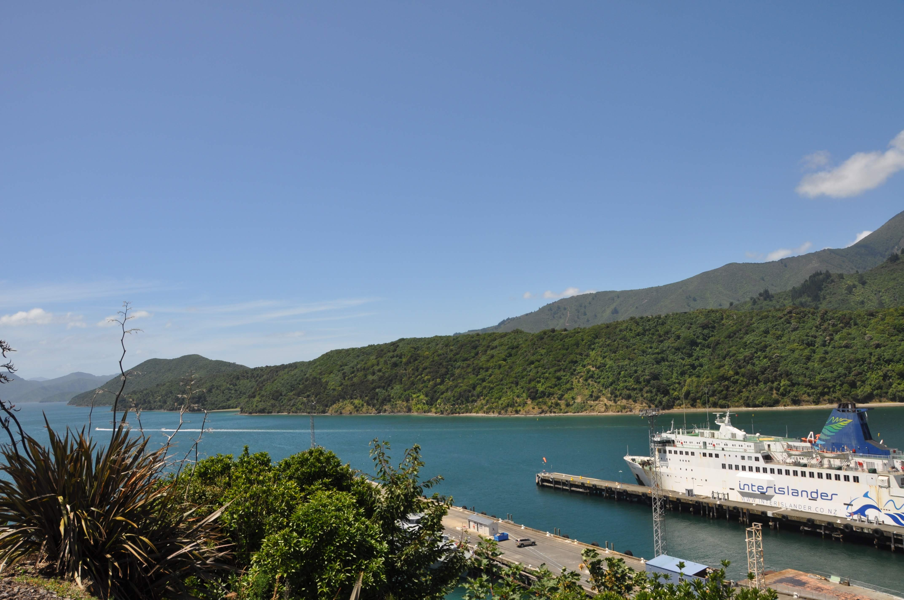

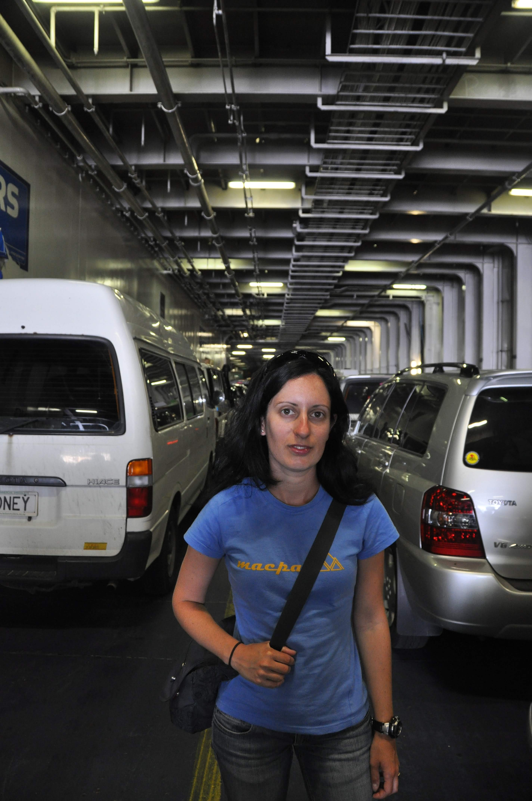
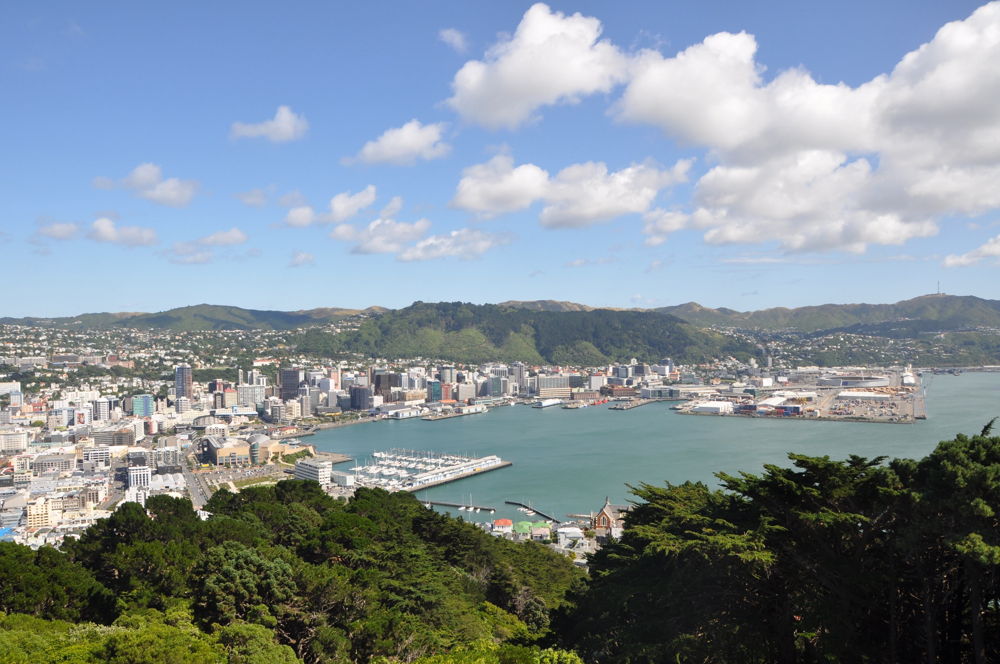
המעבורת הובילה אותנו לוולינגטון שהיא עיר הבירה של ניו זילנד. לאקי תומפסון, רכבנו הנאמן החזיק מעמד יפה עד העיר הגדולה אך נהייה חולה איך שהגענו והיינו צריכים לקחת אותו לרופא. למרות החששות היה מדובר במצבר בלבד ויצאנו בזול. מאחר ובדיוק חגגנו ללאקי 200 אלף קילומטרים לקחנו אותו לטיפול מלא בו החליפו את המסננים והשמן והוא בתמורה גירגר בהנאה.

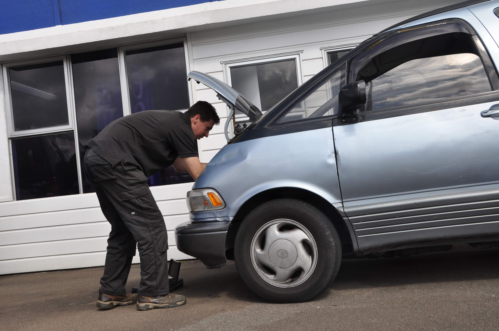
בתור איש ״של הרים״ ולא של ערים המעבר לאי העירוני קצת עצוב, אבל גם כאן יהיו הרבה אטרקציות של טבע בהמשך - יהיה כיף! בוולינגטון כמו בכל עיר עשינו אטרקציות עירוניות: היינו בקולנוע, בגנים בוטניים ובמוזיאון ״טה פאפא״ המעולה.

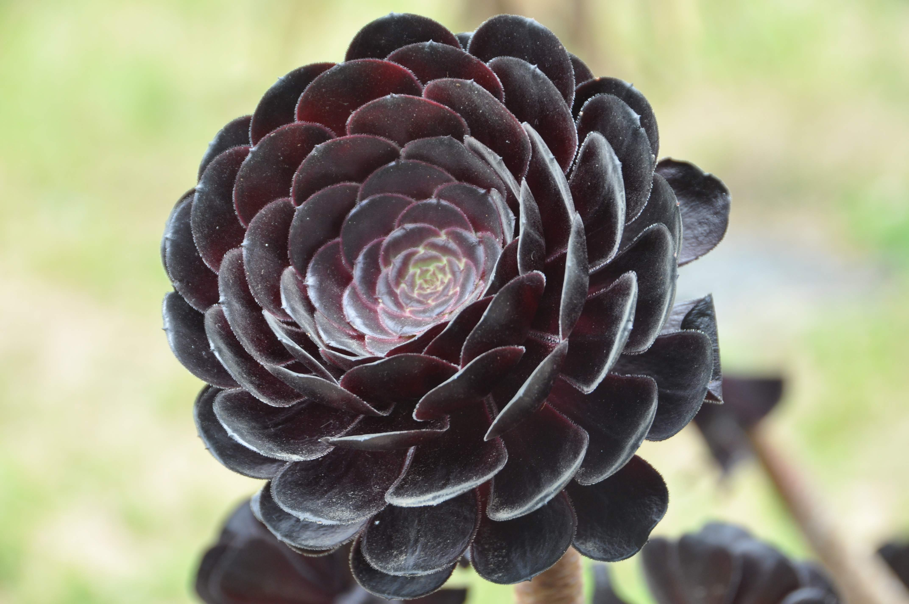

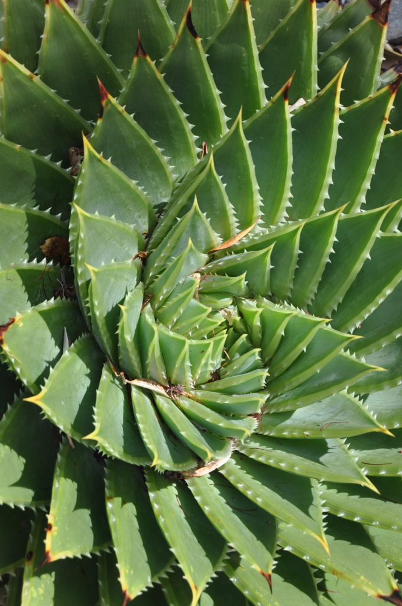
 המוזיאון העצום ״טה פאפא״ שם דגש על שני נושאים: הטבע של ניו זילנד והתרבות המאורית. בגלל שהמוזיאון באמת עצום ואפשר לבלות בו כמה ימים, לקחנו סיור התמצאות של שעה. למזלנו לא היה ביקוש באותה השעה כך שקיבלנו מדריכה מאורית פרטית. היא לקחה אותנו דרך החלקים העיקריים של המוזיאון ותיבלה בהסברים מעניינים. את רוב הנושאים הכרנו מקריאה, אבל תמיד עדיף לשמוע את הסיפור מפי מי שאמא שלה באמת גדלה בבונגלו מסורתי כפי שמוצג במוזיאון. עד לשנים האחרונות, מקורם של המאורים היה שנוי במחלוקת - חלק טענו שהם הגיעו מפרו, וחלק היו בטוחים כי מדובר דווקא במזרח אסיה. בשנים האחרונות התפתח המחקר הגנטי ואפשר להגיד די בוודאות שמדובר במזרח אסיה. המאורים נחתו כאן רק לפני כ1000 שנים ( - ניו זילנד היא הארץ האחרונה אותה גילה האדם) ומאד מעניין לראות את התרבות שהתפתחה כאן במקביל ליבשות הגדולות.

בילינו עוד מספר שעות במוזיאון המרתק הזה. החלק האהוב עלי ביותר היה כמובן החלק שעסק בחיות. שיא התצוגה הוא גופה של הדיונון הגדול ביותר שנתפס אי פעם, אך לא פחות מרשים הוא שלד גור לווייתנים באורך כמעט 30 מטר שהיה תלוי מעל חדר התצוגה הראשי. נחמד היה גם לקרוא הסברים עם החי והצומח שראינו באי הדרומי.

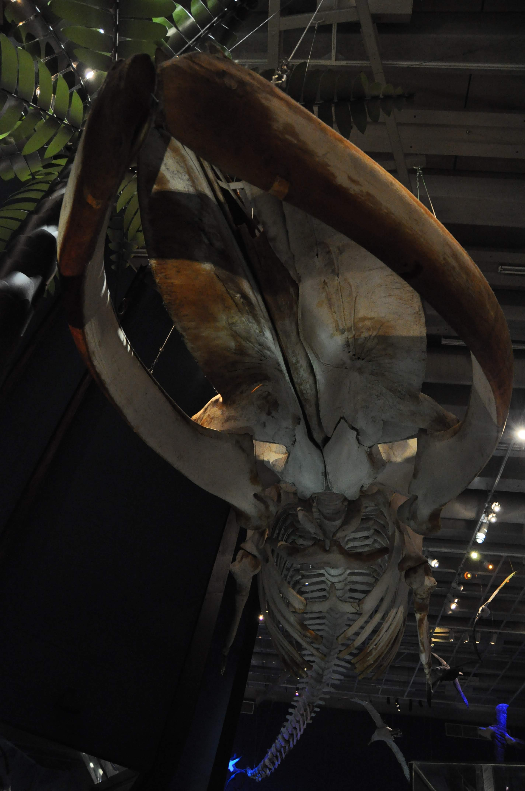
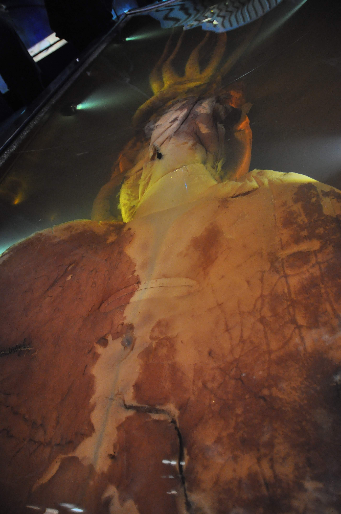
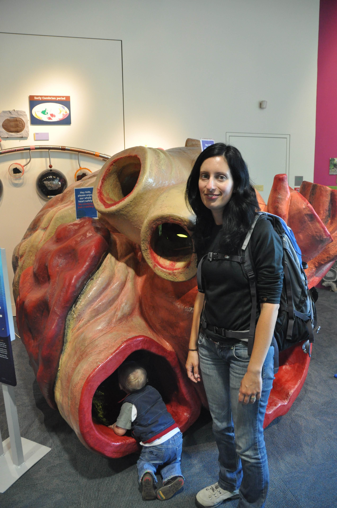
חוץ מתרבות מאורית וחיות למדנו במוזיאון על הגאולוגיה של ניו זילנד בכמה מיליוני השנים האחרונות. ניו זילנד,בדומה לישראל, ממוקמת ממש על החיבור בין לוחות טקטוניים ומכאן הרי הגעש ורעידות האדמה הכל-כך שכיחות. עברנו הכשרת ״הכן ביתך לרעידת האדמה הבאה״ ונכנסנו לבית קטן שהלך וטיפס בסולם ריכטר עד שעשה מאיתנו מילקשייק.

למחרת ביקרנו בשמורת ״זילנדיה״. שמורת טבע בפאתי וולינגטון ששמה לעצמה כמטרה לפחות בשטחה - להחזיר את החי והצומח לתקופה שלפני הגעת האדם. השמורה הענקית (בערך בגודל של רעננה) מגודרת כולה בגדר ״נגד יונקים״ וכל החיות ששרדו את האדם יכולות לחיות בשלווה. תקציר תולדות החי בניו-זילנד: לפני כ65 מיליון שנה, כפי שכולם יודעים, נכחדו הדינוזאורים. נשים רגע בצד את הדיון המעניין - איך הם נכחדו? ופשוט נסכים שהם כבר לא פה (חוץ משמעון פרס כמובן). הכחדות הדינוזאורים פתחה הזדמנויות חדשות לבעלי חיים חדשים לתפוס ״נישות״ שמולאו על ידי זוחלי הענק הקדמונים. בכל שאר היבשות בעולם היה זה ״זמן היונקים״ - יונקים גדולים כקטנים כיסו את כדור הארץ בהמוניהם. בניו זילנד אמנם היו דינוזאורים - אבל מאיזושהי סיבה לא היו כאן יונקים. הציפורים לא התבלבלו והחלו להתפתח ולהתרבות באיים של ניו זילנד והתפתחו בכיוונים שונים לחלוטין מהעופות אותם אנחנו מכירים. את התפקיד אותו ממלאים יונקים קטנים, תפסו ציפורים נטולות כנפיים עם חוש ריח דומה מפותח במיוחד ואת תפקיד היונקים הגדולים מילאו עופות ענק שהתנשאו לגובה של 3 מטרים. אפילו לתפקידה המגעיל של החולדה נמצא כאן מחליף בדמות חרק מגעיל בגודל חולדה בשם weka. בקיצור - במשך 65 מליון השנה האחרונות התפתחה האבולוציה בניו זילנד ממש כאילו היה זה כוכב אחר.

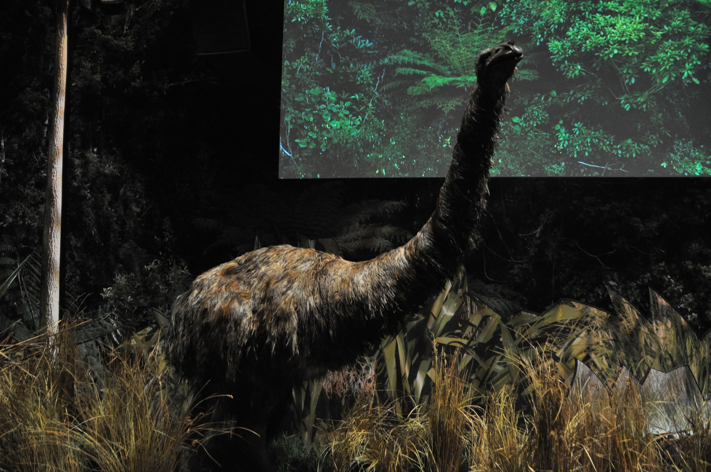
תכף מסיימים... בדיוק כמו בכל מקום אליו הגיע הומו-סאפיאנס ב70 אלף השנים האחרונות - ארכאולוגים מתארכים את המאובנים האחרונים של יונקים גדולים בדיוק סביב התקופה בה מתחילים למצוא עצמות אדם. אם אלו ממותות ברוסיה, אריות ענק באמריקה או יונקי כיס גדולים באוסטרליה - האדם השמיד את כולם. ניו זילנד לא שונה. חוץ מלאכול את עוף המואה אותו ניתן היה לפגוש עד לפני כ300 שנה בלבד, החולדות והיונקים אשר הביא איתו האדם חיסלו את הציפורים חסרות ההגנה והכנפיים. מידי כמה שנים מישהו אחר מדווח שהוא רואה מואה באיזור פיורדלנד. מי יודע - תפתחו עיניים אם אתם באיזור...

וולינגטון מכונה בפי המקומיים ווינדי וולי - בגלל הרוחות החזקות שנושבות בה דרך קבע. למרות מזג האוויר המצויין שהיה לנו כאן, בלילה אפשר היה להרגיש את האוטו רועד ברוח החזקה.

הפעם בפינת הבישולים - דגים. עדיף מאוחר מאשר אף פעם... למרות ההיצע הגדול והמחיר הזול לא השכלנו עד עכשיו להכין כאן דגים. חוץ מזה, קנינו המון יין לבן - ולמדנו כבר מה הולך עם דג. התחלנו עם סטייק סלמון עסיסי. בתיאבון ולהתראות.

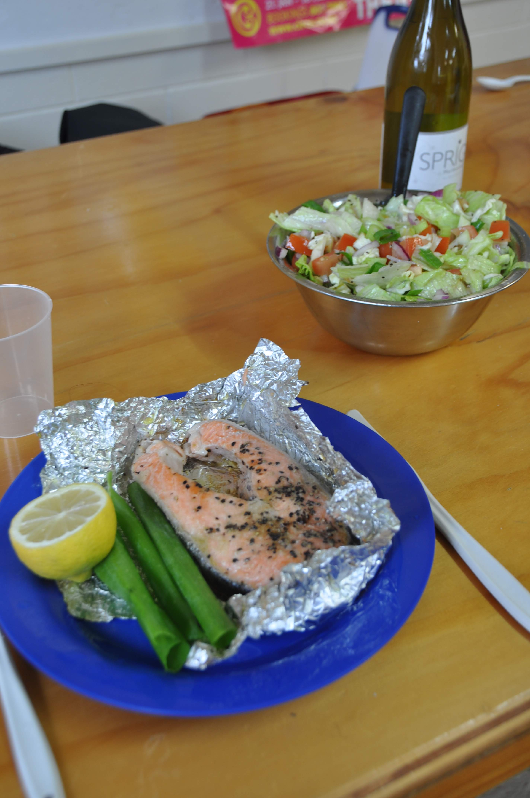
