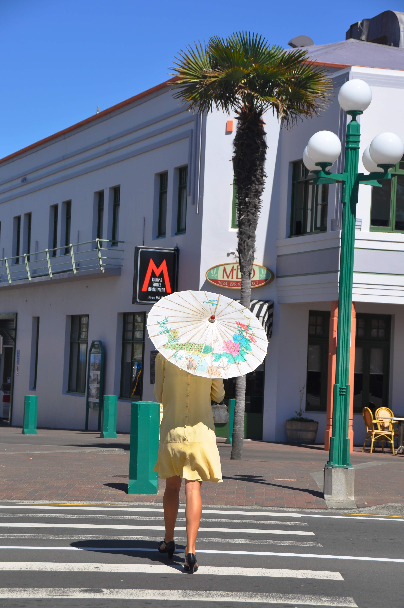
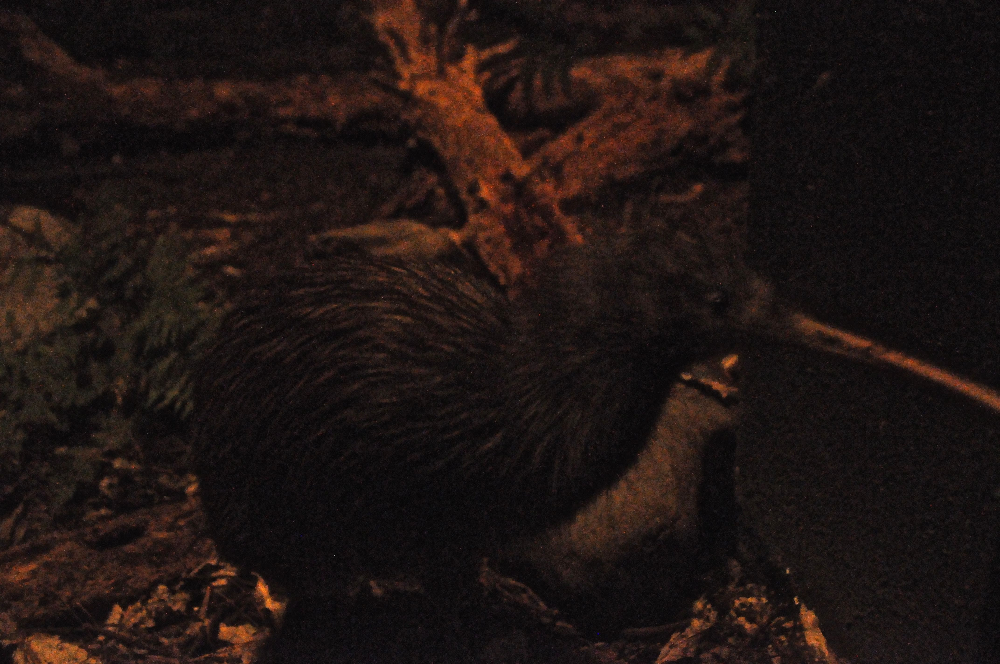

נפתח בבשורה משמחת ולא שגרתית (אני מקווה שאתם יושבים) - הנמלה שכחה בוולינגטון בקבוק סבון במקלחת! לא סתם שכחה משהו - אלא את קודש הקודשים - חפץ שאחראי על נקיון. לא רק שזה מוכיח את היותה אנושית - אני גם אוכל להשתמש במקרה נדיר זה בכל פעם שאשכח משהו בחיים - ולצאת זכאי. הידד! 

בכל מקרה, מוולינגטון המשכנו לניפייר. ניפייר נחשבת לעיר ה״אר(ט) דקו״ וחובבי ארכיטקטורה נוהרים לכאן כדי לחזות בפלא. ארט-שמרט, בגדול מדובר בעוד עיר כעורה בדיוק כמו וולינגטון רק שעל הבניינים מקושקשים קצת מלבנים וקוראים לה ניפייר. בגלל רעידות האדמה שפוקדות את ניו זילנד לילות לבקרים יש כאן הרבה ערים שנמחו מעל פני האדמה ואז נבנו מחדש בסגנון שהיה מקובל באותה התקופה. ניפייר היא דוגמא לעיר כזאת - רעידת אדמה השמידה אותה כליל בשנות השלושים של המאה ה20 (ולרוע מזלם של התושבים דווקא המלבנים היו אז באופנה...) לניפייר טיילת ארוכה ונחמדה וכמה רחובות מרכזיים שלא בלתי נסבל להסתובב בהם.

מכיוון שמזג האוויר בכל אחד מהיעדים הבאים הפוטנציאליים שלנו מחורבן במיוחד, החלטנו להשאר כאן קצת ולעשות עוד סיור יין - הפעם בhawke's bay. ניפייר ממוקמת ב״הוקס ביי״ שהוא אזור היין השני בגודלו בניו זילנד (אחרי מלבורו בה כבר סיירנו). גידול היין בניו זילנד החל כאן והאזור מפורסם ביינות הסירה שלו. אנחנו אהבנו יותר את היינות במלבורו, אבל תמיד נחמד להכיר עוד סוגי יינות ולשמוע עוד סיפורים...

בניפייר נמצא גם האקווריום הגדול ביותר בניו זילנד שאמנם דומה לאקווריומים שיצא לנו כבר לראות במקומות אחרים, אבל עדיין היה נחמד. כלומר חוץ מהצב-נחש הגועלי - רק שלא ״יבוא לי בחלום״.

הצב-נחש עושה היפ הופ ציוני

 

 

 

 

 

באקווריום היה גם חדר חושך בו דימו לילה עבור עופות הקיווי הליליים. מבעד זכוכית אטומה לרעש יכולנו לצפות בקיווי - סמלה המפורסם של ניו זילנד מתרוצץ ומחפש מזון. חוץ מכלוב הקיווים היו במקום גם לטאות טואטרה - לטאות שהן שריד נדיר מתקופת הדינוזאורים - הלטאות שניתן למצוא עצמות שלהן בנות 200 מליון שנים נחשבות ל״מאובן חי״ כיוון שניתן למצוא יותר מאובנים שלה מאשר פרטים חיים. בזכות איזשהו נס לא ברור שרדו הלטאות רק בניו זילנד וכיום ביולוגים מכל העולם מגיעים לכאן על מנת להשתמש בהן למחקרים אבולוציוניים. העצמות שבולטות מגבן מפחידות במבט ראשון, אבל יצא לנו לראות אותן מואכלות והן דווקא די חמודות...

זהו... הגענו שוב לפינת הבישולים. והפעם ניחוחות הודיים השתלטו על המטבח עם ״באטר צ׳יקן קורמה״. הלך טוב עם הריזלינג שקנינו ב״וילה מריה״ שבמלבורו. למתעניינים, היקב מייצא גם לישראל את אחת הסדרות הפשוטות שלו. לחיים!

