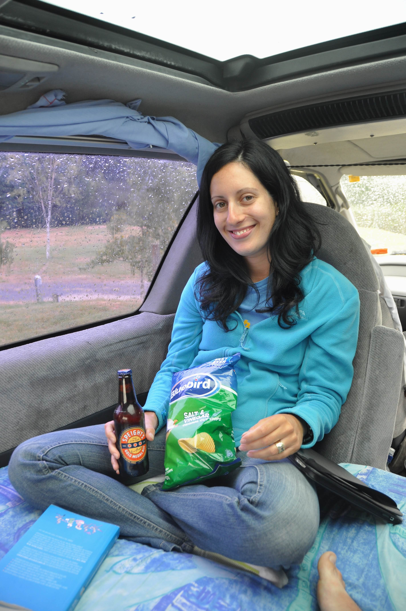
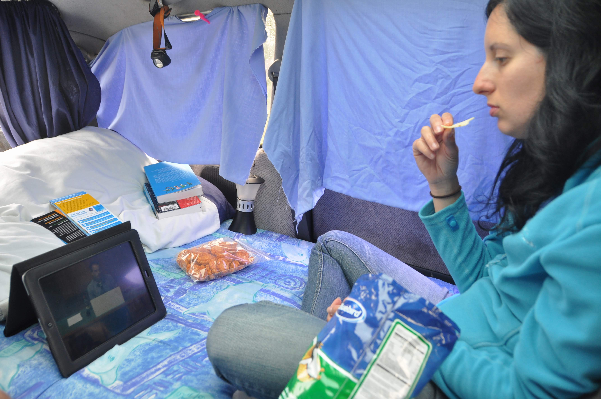
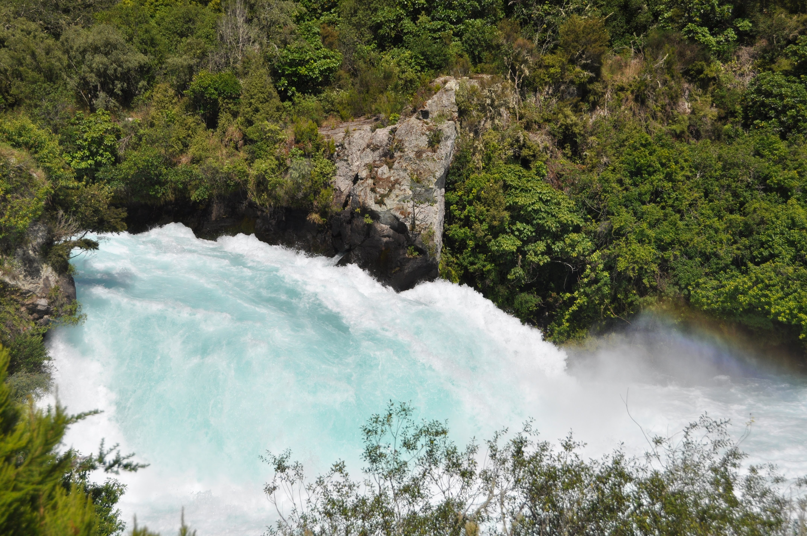
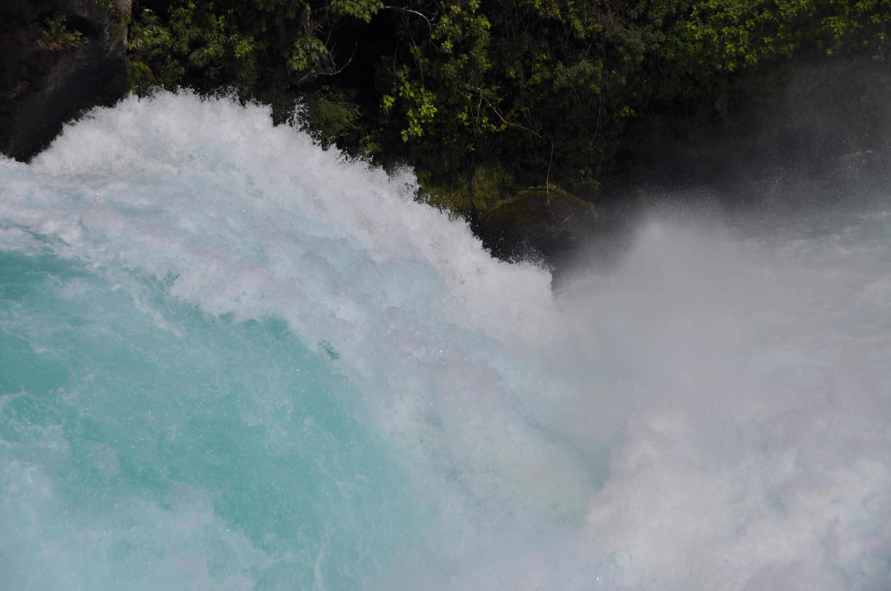
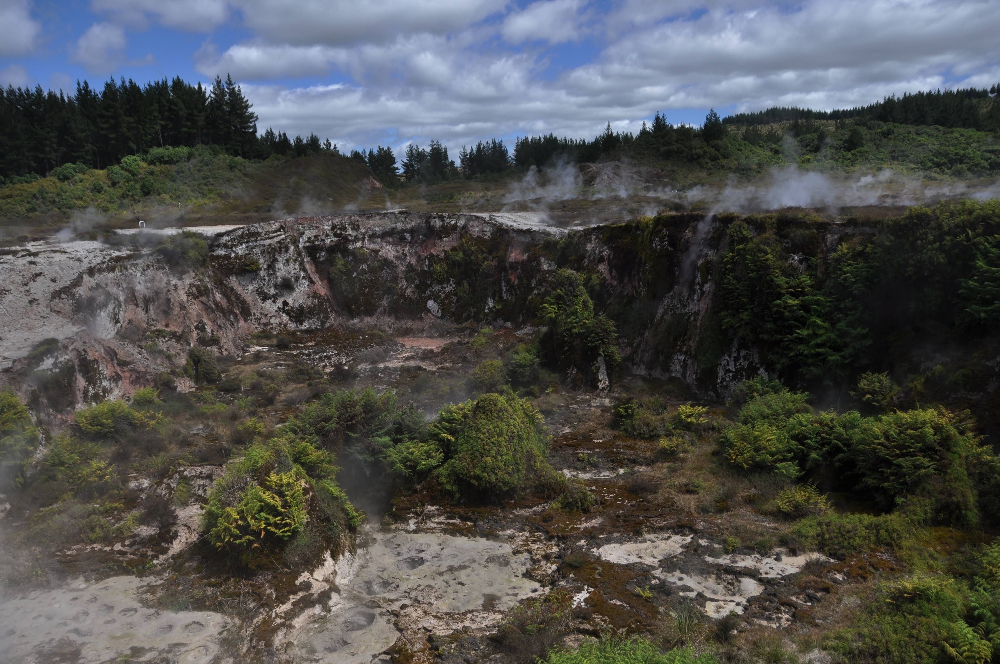
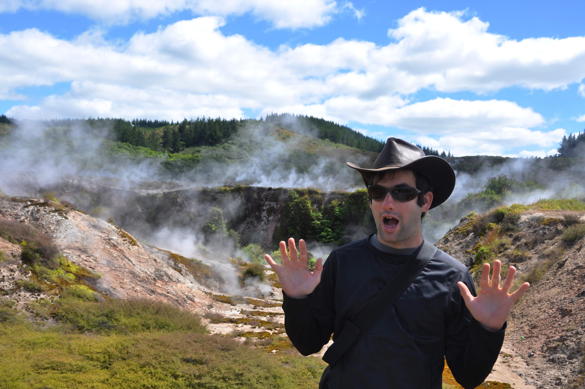
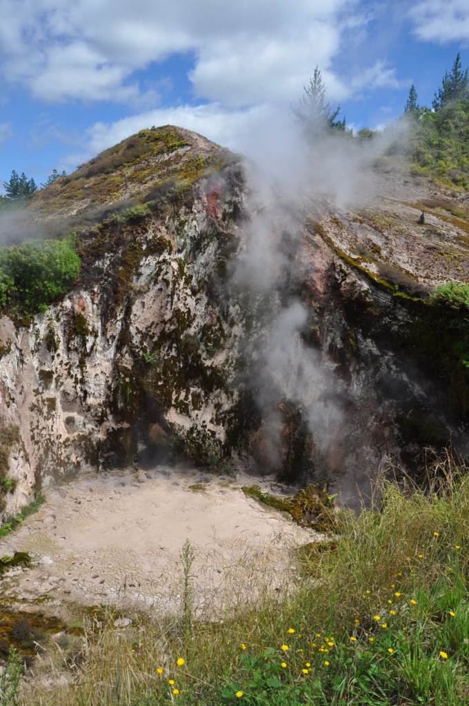
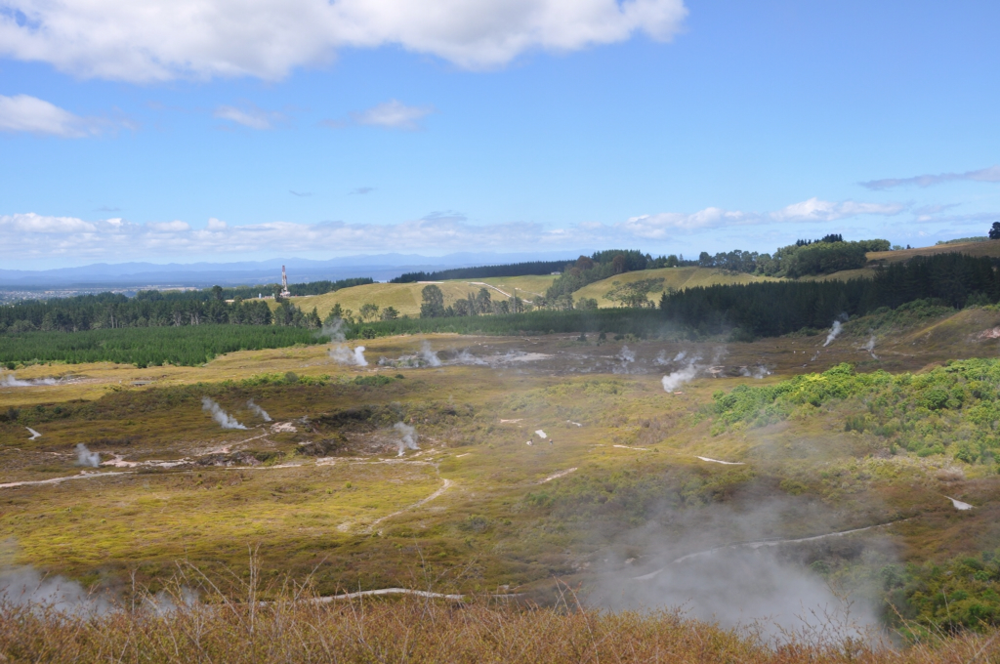
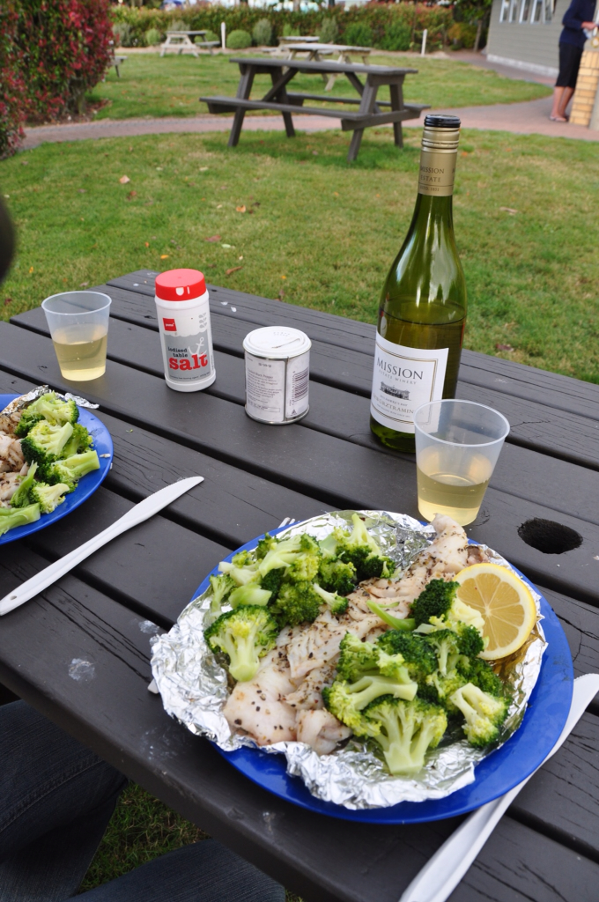
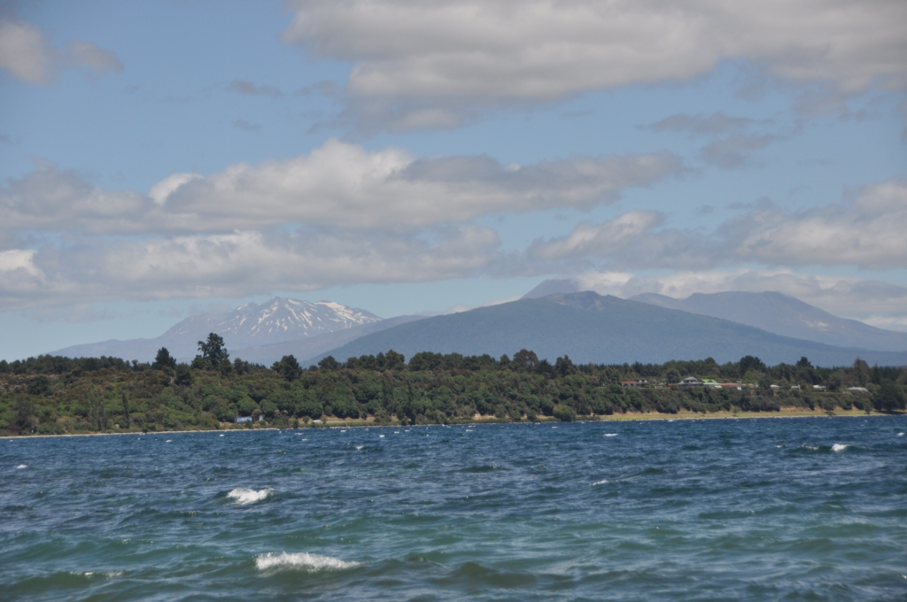

מניפייר נסענו לטאופו שנמצאת קרוב לשמורת הטבע טונגרירו לקראת מסלול שאנחנו רוצים לעשות בשמורה. טאופו המנומנמת נחה על שפת אגם טאופו - האגם הגדול ביותר בניו זילנד שהוא בעצם לוע עצום של הר געש עתיק. טאופו היא עיירה שליווה, אך מתחת לפני השטח הלבה מבעבעת והאיזור מפורסם בפעילות הגיאותרמית שבו. את היום הראשון בטאפו העברנו בעיקר בתוך האוטו מכיוון שירד גשם חזק כמעט כל היום. פתחנו באוטו בית קולנוע פרטי בן שני מקומות והכרטיסים אזלו במהרה.

בקרבת טאופו ביקרנו במפלי הוקה - מפלים שהמקומיים מכנים מפלי הניאגרה של ניו זילנד. המפלים לא גבוהים במיוחד, אבל עצמת הזרימה בהם בהחלט מסבירה את הכינוי.

בתור מבוא לפעילות גיאותרמית ששיאה יהיה ברוטורואה שמצפון לכאן, ביקרנו בפארק שנקרא ״מכתשי הירח״ בו ראינו בריכות בוץ ומכתשים מבעבעים שיצרו אדי המים הרותחים שמתחת לאדמה. חלקים מהאתר מוגבהים מהקרקע מפאת הטמפרטורה הגבוהה. מכל חור הארץ פולטת קיטור רותח ומאיימת לחלוט אותך חי בשניה - ממש כמו לובסטר במסעדה יוקרתית.

לא שכחתי את פינת הבישולים הקבועה וכן - אני מודע לכך שבפוסטים האחרונים יש יותר תמונות של אוכל מאשר של טיולים... הגענו לשלב כזה בו הטיול הוא כבר שגרה - אז אנחנו פחות ממהרים בין האטרקציות ופשוט נהנים מהחיים. חישוב גס שעשינו גילה שבטיול הזה נהיה ביחד ערים יותר זמן מאשר כל הזמן בו הכרנו עד עכשיו - ועוד ברצף! זה מבחן לא קטן שבינתיים אנחנו עוברים לא רע. אם להיון כן אז זה מבחן ממש לא קטן ליעל - אם היא תסכים לסבול אותי עד שנחזור, אז כנראה שהיא באמת האחת ונוכל להמשיך לחיות יחד לנצח :) יופי, עכשיו חלה עוד הידרדרות בבלוג - מבלוג טיולים אתגריים לבלוג אוכל ועכשיו התחלתי לכתוב על זוגיות! איפה זה ייגמר?! בכל מקרה, המשכנו בפרויקט טעימת הדגה של ניו זילנד והפעם - דג קוד אדום - שזה בעצם סוג של בקלה. בתאבון!

סוף סוף נראה שיש תחזית מזג אויר אי-שלילית לשמורת הטונגרירו שנמצאת מעברו השני של אגם טאופו - אנחנו בדרך! בתקווה בפוסט הבא אחזור לסורי ואספר שוב על טיפוסים והרפתקאות בטבע!

