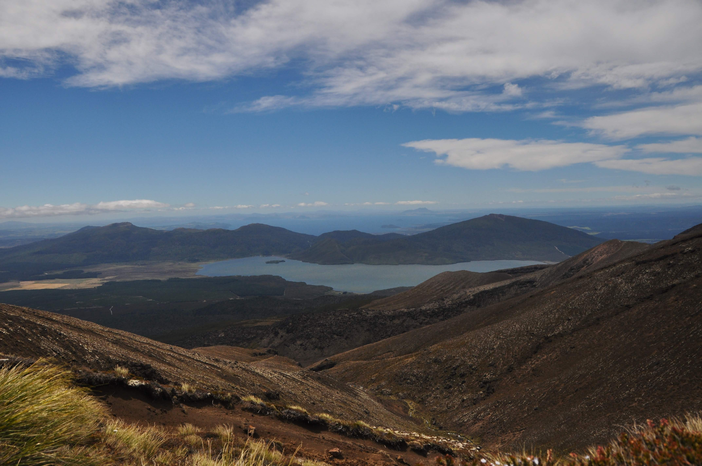

הטיול בשמורת הטונגרירו היה כנראה היום הכי המשוגע ועמוס החוויות שהיה לנו עד כה בטיול. השמורה שימשה בצילומי סדרת סרטי ״שר הטבעות״ בתור מורדור - ממלכת האופל שורצת האורקים המעוותים (Orcs) ומקום מושבו של סאורון - הלורד האפל בכבודו ובעצמו. בשמורה שלושה הרי געש פעילים וגבוהים ובה עובר מה שנחשב לטיול-היום היפה ביותר בניו זילנד - הטונגרירו קרוסינג: מסלול לא-מעגלי בן כ20 קילומטרים (טיפוס וירידה של קילומטר, 6-8 שעות) בו ניתן להתרשם מאתרי פעילות געשית ומנופים מרהיבים של הרי הגעש שבשמורה. אך הולכנו שולל, ולממלכת האופל היו תוכניות אחרות עבורינו. עוד לפני שהתחלנו את המסלול, כוחה האפל של הטבעת תיעתע במזג האויר כך שבפחות מ24 השעות לפני שיצאנו למסלול השתנתה תחזית מזג האויר באתר האמין והמקצועי ביותר פה 3 פעמים מן הקצה אל הקצה.

באתר הקמפינג המשונה בו לנו התארחה גם חבורה גדולה של יפנים שהציפה את המטבח בריחות בישולים יפנים מסורתיים. הם בילו במטבח שעות רבות - הברשת הבשר, קציצת הבצל הירוק והטיפול באצות המשונות נעשו בטקסיות מסורה והיוו רק תירוץ למפגש חברתי בניחוח מעושן. בזמן ארוחת הערב, בין ריחות של אצות ובשר צלוי, חיכתה הטבעת האפלה לרגע המתאים ובדיוק כשבאתי לנגוס בתבשיל הסיטה את לשוני ממקומה ו... ״צ׳לאאק״ - דם ניגר וחתיכת לשון מחוברת למחצה התנופפה בתוך פי המוכתם בדם. השתעשענו במחשבה של דחיית הטיול וחיפוש רופא שיתפור את החתך - אבל כל מי שקרא ספר של טולקין יודע שליבו של האדם חלש - ותאוות הכח שלו תוביל אותו אל הטבעת ואל הטונגרירו קרוסינג. חוץ מזה עד כמה שחוט ומחט בלשון נשמע מפתה - אולי עדיף שהטבע יעשה את שלו.

בבוקר יצאנו למסלול כשתחזית מזג האויר השתנתה לטובה "mainly fine" ו ״הרוחות נחלשות״. בזמן ארוחת הבוקר חזינו במכונה משומנת של יפנים שהכינו לעצמם כמות מטורפת של סושי וארזו אותו לטיול. יפנית אחת הדביקה אורז על אצות, יפני אחר הניח דג, אחרת ירקות, אחד גילגל אחת חתכה את הרול ולסיום היתה יפנית שעטפה בנייר כסף והוסיפה לערימה. הכל יעיל ומדויק - מדהים! בדרך כלל, לא משנה מאיפה אתה בעולם - בטיול כולם כמעט שולפים סנדוויץ׳ - יפה לראות איך הם דובקים במסורת האוכל שלהם בכל מחיר. אני דחפתי את ארוחת הבוקר מבלי להשתמש בלשון - מהלך שדרש אקרובטיקה לא פשוטה. על אף התחזית האופטימית מזג האויר בממלכת האופל נראה אפל במיוחד, אבל הטבעת משכה אותנו באפנו ויצאנו לדרך.

הראות היתה איומה אבל יכולנו לפחות לראות את הסלעים הבזלתיים שיצרו צבעים וצורות מעניינות בקרקע. בשלב מסויים התחיל טפטוף קל והראות הדרדרה עד שקשה היה לראות לאן ממשיך המסלול. הקור התחיל להתגבר ככל שטיפסנו והתחלנו להוסיף שכבות לבוש.

אחרי ששרדנו יפה את הערפל, שיסה בנו שר האופל את הרוח. רוחות של 60 קמ״ש החלו נושבות והקשו עלינו את הדרך עוד יותר. במקום נופים מרהיבים ראינו רק מטר אחד קדימה ולא יכולנו אפילו לדבר אחד עם השני בגלל עוצמתה של רוח. בנקודת התצפית ממנה אמורים לראות את הר הגעש המפורסם שגילם בסרט את Mount. Doom האפל, העזתי להוציא את הידיים מהכפפות ואת המצלמה מהתיק וביקשתי ממישהו שיצלם אותנו. בשניה שהבחור המסכן לחץ על הכפתור עף לו הכובע מהראש אל תוך הערפל :) אם כבר איבדתי תחושה ביד - כבר תיעדתי את אוירת האופל בסרטון...

")


*ברררר*

מאוכזבים ממזג האויר השקרן ומהנופים המופלאים ששמענו עליהם כל כך הרבה, המשכנו בטיפוס האחרון לעבר התצפית על ״המכתש האדום״. אבל בדיוק שם, בנקודה הגבוהה ביותר, על אוכף הר צר שמשני עבריו תהום עמוקה החליט שר האופל להוציא את ״התותחים הכבדים״. הרוח התגברה מאד ואבנים קטנות החלו להתעופף ולהכנס לנו בכל חור. בשלב מסויים התחלתי ללכת לצד יעל כדי לחסום לה את הרוח - ממש כמו רוכב משני ב״טור דה פראנס״. הלכנו מחובקים כדי לא ליפול עד שפשוט כבר לא יכולנו להרים את הרגליים מהקרקע מבלי לעוף. פתאום שמענו יבבה - הרמנו את הראש וראינו מספר אנשים על הרצפה - חלקם זוחלים וחלקם שוכבים מאחורי סלע - מתגוננים מפני הרוח והאבנים המצליפות. הפלנו את עצמנו על הרצפה ושכבנו ליד סלע כמה דקות. לראשונה בטיול ממש פחדתי... הרצועה של המצלמה הצליפה בי עם הרוח וכמעט ניקרה לי עין - עם לשון שסועה ובלי עין אולי היו חושבים שאני אורק או לפחות גובלין ומקבלים אותי יפה יותר - אבל הרצועה החטיאה והרוח המשיכה בשלה. את 50 המטרים הארוכים ביותר בטיול העברנו בזחילה עד שהגענו לנקודה בה הרוח חזרה להיות רק ממש חזקה. יותר לא היינו מאוכזבים ממזג האויר - היינו פשוט שמחים - שמחים שעברנו את זה בחיים :) כל כך הייתי שמח לתמונות מהחלק הזה - אבל אין - אבל אני בטוח שלא נשכח את החוויה הזאת בחיים.

עם שאר הניצולים התחלנו בירידה התלולה של המסלול. לפתע למשך שניה אחת ראינו הבלחה של נוף, ואז שוב עננים. עם הרוח החזקה ממש אפשר היה לראות את הענן שהיינו בתוכו נוסע על ההר במהירות מופרזת - הוצאנו את המצלמה וישבנו באמצע הירידה התלולה צופים בעננים חולפים אותנו כמו מיהרו למקום אחר. לפתע נגלו לעינינו שני אגמים ועוד אנשים שהיו כלואים על ההר יחד איתנו. התמונות הבאות צולמו בהפרש של 2-3 דקות.

מהר מאד גם השמש יצאה ופתאום התגלה מאחורינו המכתש האדום של הר הגעש אותו היינו אמורים לראות מהתצפית בה זחלנו. שקלנו אפילו לחזור לתצפית אבל טיפוס קצר הזכיר לנו שלמרות השמש הרוחות עדיין כאן. ואז שוב הכל התכסה בלבן. אחרי כמה דקות שוב השתפר ואחרי שירדנו כ100 מטר נוספים כבר היינו מחוץ לגובה העננים עד סוף המסלול.

בנוסף לכל הצרות לקחנו מים רק בשקיות שתיה - ועם הלשון המעוותת שלי לא הצלחתי לשתות, כך שיעל השקתה אותי כמו אם שמשקה את גוזליה. בשאר הדרך היה נוף יפה של הר הגעש ממנו ירדנו ושל אגם טאופו. ״שמנו גז״, הספקנו להגיע לאוטובוס המוקדם ונסענו רחוק ככל שיכולנו מממלכת האופל ומהטבעת צרופת הרשע.

בלילה בצל החשכה כשעצמתי את עיני, לחישות ממזריות לא הפסיקו להתרוצץ בתוך ראשי. רשמתי במחברת את מה ששמעתי. זה נשמע כמו:

Ash nazg durbatulûk, ash nazg gimbatul, ash nazg thrakatulûk agh burzum-ishi krimpatul
