רוטורואה היא אחת הערים התיירותיות ביותר בניו זילנד וזאת בזכות שבאזורה מתרחשת פעילות גיאותרמית מוגברת שניחוחה הבייצתי מורגש היטב בכל מקום בעיר. הסיבה לריח האיום היא הגופרית, או ליתר דיוק מימן גופרי (H2S) - אותו הגז שאחראי על ריחן של ביצים סרוחות. מלבד הריח, בכל פינת רחוב יש נביעה מוקפת גדר, אבל לא צריך להתאמץ - יצא לנו לראות גזים נפלטים בעצמה ממכסי ביוב ושלוליות על המדרכה שפשוט מבעבעות! בסביבת רוטורואה יש הרבה מקומות בהם ניתן לחזות בתופעות הטבע המעניינות. הגייזר ״ליידי נוקס״ מתפרץ אחת ליום ופולט גזים ומים מסריחים לגובה של 20 מטר.

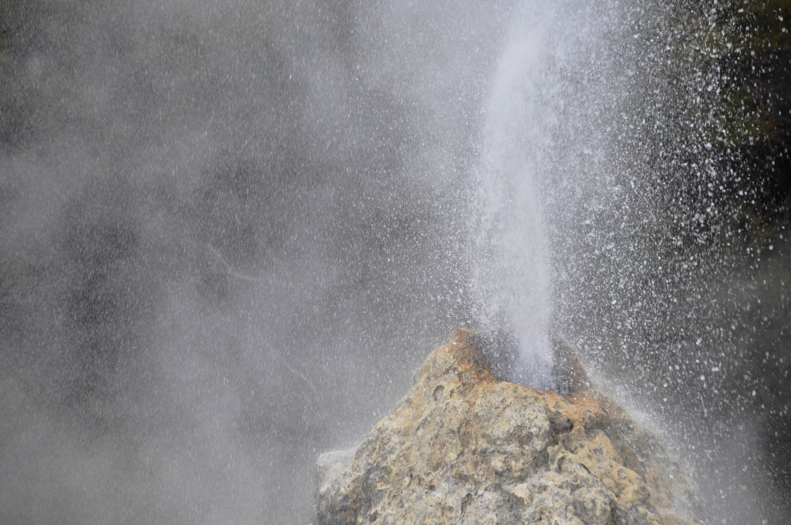

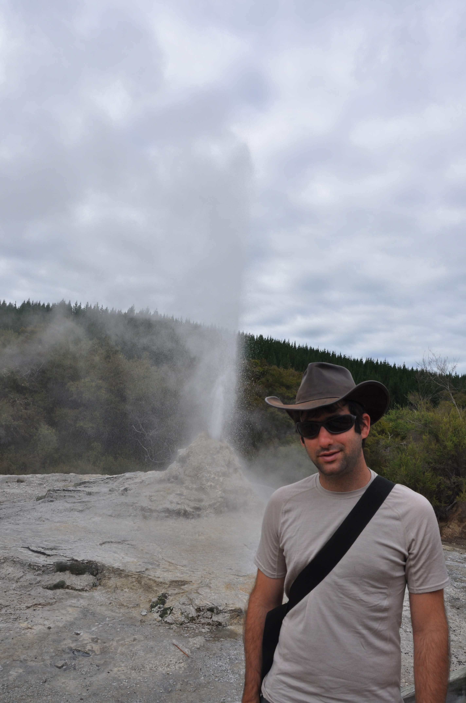
בשמורה שנקראת Wai-o-tapu - Geothermal wonderland ראינו בריכות בוץ מבעבעות, בריכות בכל מיני צבעים פסיכיים, את ״בריכת השמפניה״ המפורסמת וכל מיני פירים מהם נדמה שהשטן עלול לצאת בכל רגע ולגבות את נשמתך.

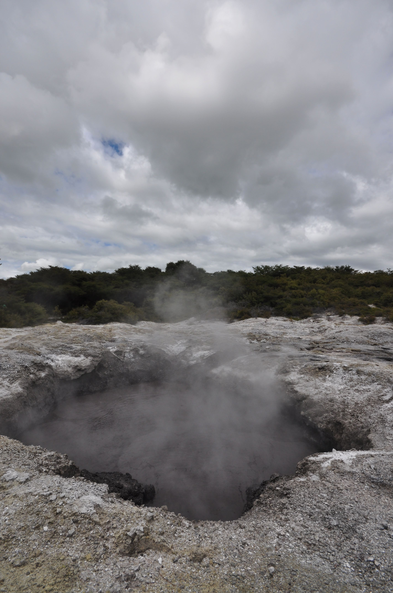
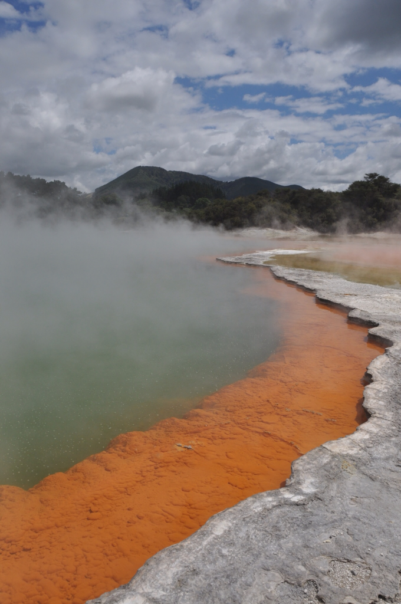

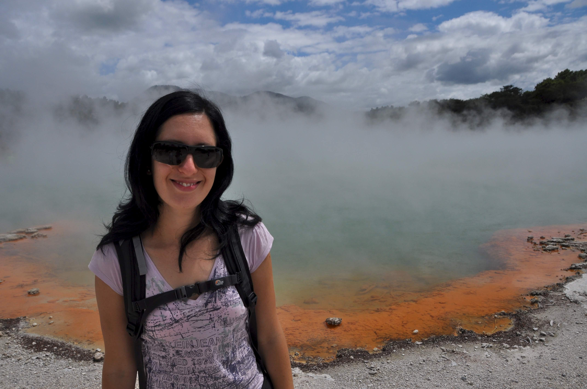

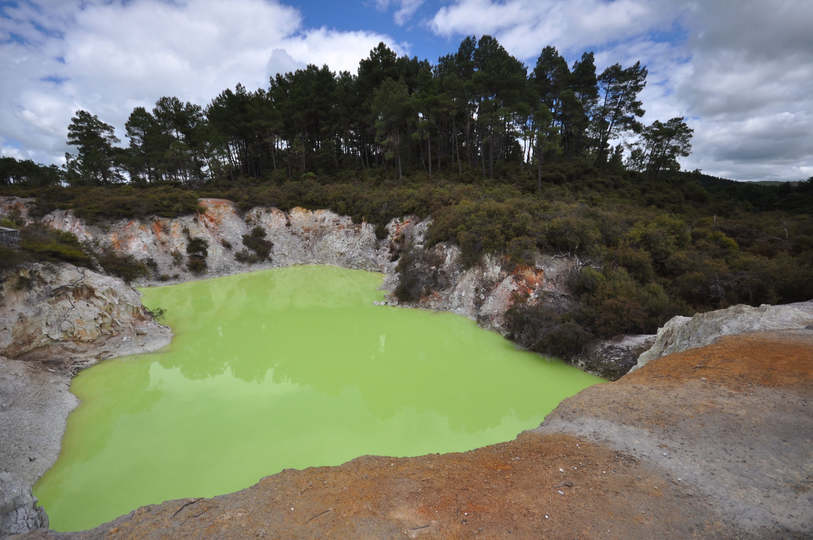

ההיסטוריה התיירותית של רוטורואה מעניינת מאד. עד 1886 בקרבת רוטורואה היה מוקד תיירות לעשירים מופלגים בשם Pink and White Terraces. מערכת טרסות מסועפת עשויות סיליקה (צורן דו חמצני) שבתוכן נבעו מעיינות חמים. האטרקציה המרהיבה נוצרה על ידי 50 גייזרים והיוותה מוקד משיכה לכל מי שארנקו עמוק מספיק ומוכן להשקיע יותר מחודש במסע לניו זילנד שהייתה אז מאד לא נגישה. ב1886 התפרץ הר הגעש Mount Tarawera וקבר תחת הלבה את הטרסות כמו גם יותר מ100 בני אדם. לפני חודשים בודדים בעת מיפוי תת קרקעי של אגם באזור, הופתעו לגלות החוקרים חלק מאותו מבנה מופלא מוצף בעומק 60 מטר מתחת לפני המים. בקיצור - יש לי הרגשה שיום אחד עוד נשמע שוב על אותן טרסות מפורסמות. התמונות ששרדו של אותן טרסות הינן נדירות ורובן שייכות לבריטים עשירים שנראים טובלים במימיהן החמים יחד עם פרצופיהם האדישים. טרסות דומות - בגובה של מילימטרים בלבד ניתן למצוא כאן בכל חור.

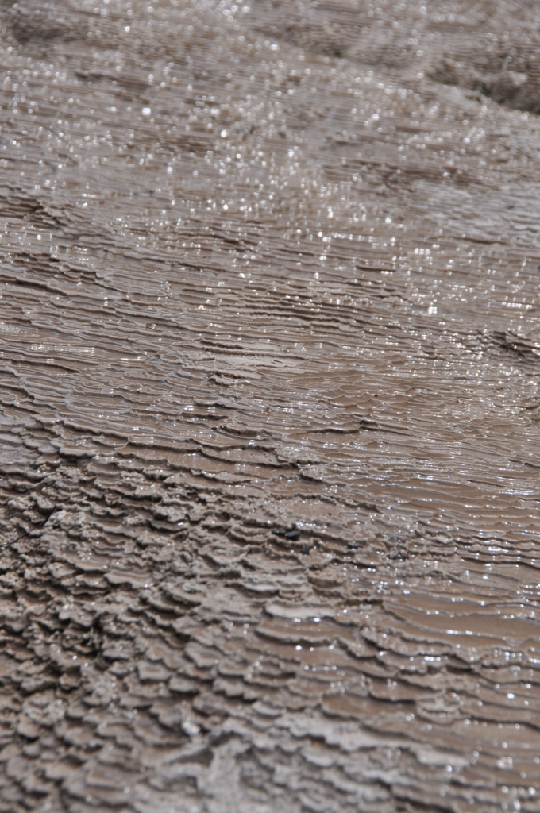
תגובתם של תושבי רוטורואה לאסון בענף תיירות-העשירים עליו התבססה לא איחרה לבוא. התשובה - בניולוגיה?! המוח היהודי מצא דרך חדשה לדוג תיירים. בתחילת המאה ה20 ״מדע״ הבניולוגיה היה מאד פופולרי - בניולוגיה: הקשר בין מים לגוף האדם. בהעדר הפיתוחים הרפואיים של המאה האחרונה, ובזכות ריבוי המלחמות והפציעות המשונות של האירופאים ממלחמת החפירות, קיבל בניולוג יהודי-גרמני מפוקפק מימון לבניית Rotorua bath house או כמו שהוא כונה בפרסומות דאז "Great south seas spa". בעלות גבוהה למדי הוקם ארמון קטן מעל נביעה טבעית של מי גופרית רעילים. אל המבנה המפואר נהרו עשירי העולם ופצועי מלחמה כדי לעבור עינויים בעזרת הטכנולוגיה המודרנית ביותר שהייתה קיימת אז.

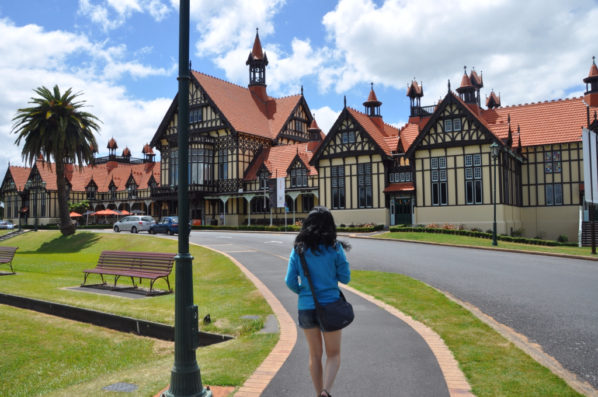

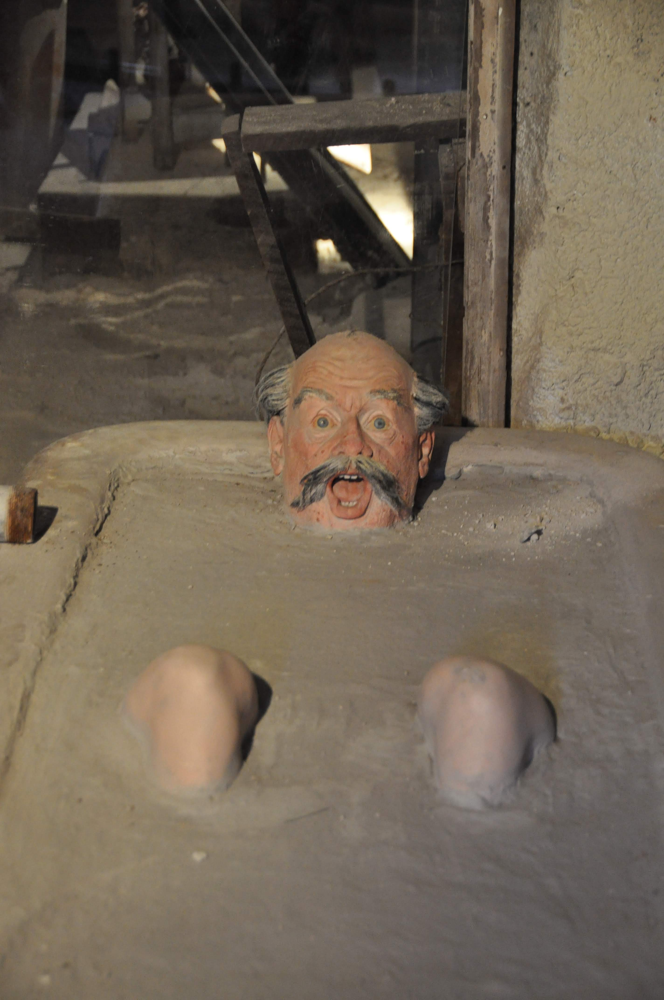

בעקבות השפל הכלכלי שעבר על אירופה אחרי מלחה״ע השניה וההתפקחות של עולם הרפואה החל המקום לאבד שוב את התיירים. במשך שנים המשיך לשמש המקום מועדון יוקרתי ומסעדה לבוהמיה האליטיסטית של ניו זילנד אך לבסוף הפך למוזיאון. המוזיאון מומלץ - ובעיקר מומלץ הסרטון האינטראקטיבי בן 20 הדקות שמוקרן בו. טבילה במים עם מינרלים הוא חובה למבקרים ברוטורואה. לשמחתנו, באתר הקמפינג בו לנו בדיוק סיימו לבנות אמבט כזה.

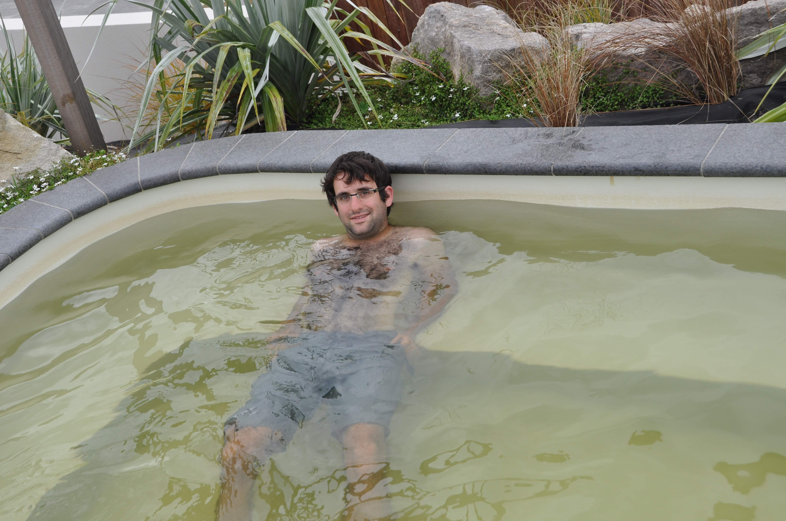

בפינת הבישולים, לא התחדש הרבה - כדי להפיג את ריח הביצה המשכנו לעמול על שיפור מתכון ריזוטו הטיולים. הלשון הפצועה שלי מתחילה להשתפר ואני יכול אפילו לאכול! בתאבון.

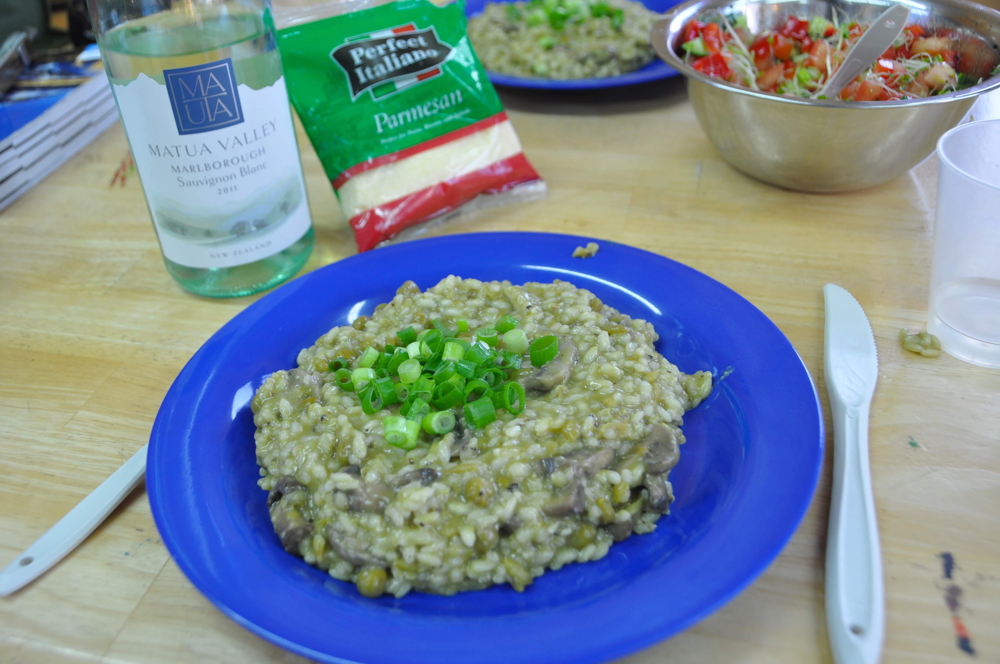
