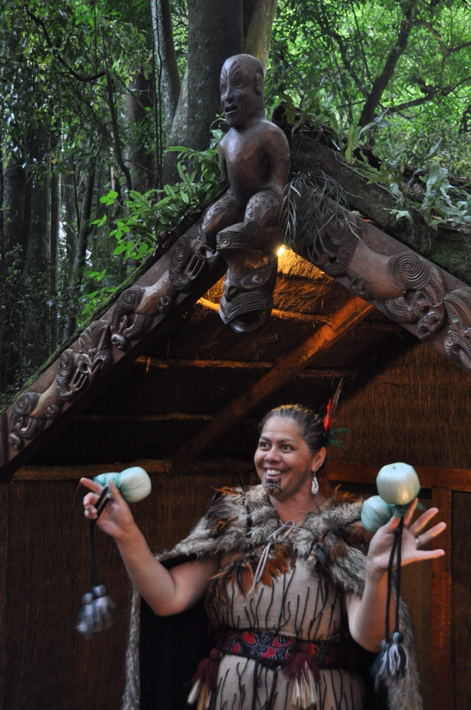

מרוטורואה קפצנו לביקור בכפר המאורי טמאקי (Tamaki). כבר הרבה זמן שאנחנו שומעים וקוראים על המאורים כך שהגיע סוף סוף הזמן לפגוש אותם. מן הסתם הסיור בכפר הוא תיירותי ורחוק מלהיות אותנטי, אבל האווירה, המקצועיות וההבנה כמה המאורים באמת שומרים על חלקים במסורת שלהם הפכה את הסיור לחוויה מאד עשירה. עוד לפני שהגענו לכפר התחלנו להכנס לאווירה - נהג האוטובוס, מאורי מבוגר ונלהב, לימד אותנו מילים במאורית ואף הצליח לשלהב את הנוסעים בכדי לחתור במשוטים דמיוניים ולנהום לפי הקצב. השפה המאורית לא התחדשה מספיק ומשתמשים במילה שמתארת כלי רכב - סירה גם עבור אוטובוס. כשהweka שלנו עגנה בכפר קיבלו אותנו יושבי הכפר כפי שנהוג היה לקבל שבט אורח בכפר באלף השנים האחרונות. לוחמי השבט יצאו לבחון את הקבוצה ומה הביא אותה לכאן והניחו בפנינו ״הצעת שלום״.

אחרי שהורשנו להכנס אשה מאורית זימרה את הpōwhiri המפורסם בו מברכים את הבאים לכפר. משם הסתובבנו בין המבנים האותנטיים של הכפר, עשינו תרגילים של לוחמים מאורים ולמדנו על בעלי המלאכה והכלים שלהם בכפר. יעל אפילו השתתפה בריקוד מאורי מסורתי עם כדורים מצחיקים בשם ״פוי״. צפו ביעל המרקדת בסרטון הבא:


גם אני לא ישבתי בחיבוק ידיים והתנסיתי בריקוד שאולי הכי מוכר ומזוהה עם המאורים - ה״האקה״. הריקוד הקבוצתי הפשוט הזה יחד עם השירה והצעקות שצועקים במהלכו מכניס את המשתתפים בו לאקסטזה. הריקוד התפרסם בעיקר משום שנבחרת הרוגבי המעולה של ניו זילנד ה-All blacks, אימצו אותו ומשתמשים בו כדי להלהיט את השחקנים לפני המשחק ולא פחות כדי להפחיד את היריב. לא פלא שניו זילנד זכו השנה באליפות העולם ברוגבי. חפשו בyoutube את מילים All Blacks Haka. במהלך הריקוד נוהגים להוציא את הלשון תוך הרחבת העיניים - אני קצת היססתי עם הוצאת הלשון המצולקת והצבעונית שלי מהפחד שיעשו ממני כאן נביא או קמע :) 



בהמשך נערכה סעודת מלכים בסגנון מאורי. המאורים בדומה ללא מעט תרבויות קדומות, בישלו את המזון שלהם קבור מתחת לאדמה. חזינו בארוחה שלנו נשלפת מבור באדמה מעל אבנים לוהטות. בתפריט עוף, בשר עגל, צדפות וכל מיני ירקות. האוכל היה לא רע ושנינו היינו תמימי דעים שהמנה המוצלחת ביותר שנשלפה מהאדמה היתה עיסה לא מובנת שמזכירה עיסה לא מובנת אחרת מצ׳ולנט אשכנזי.

את הערב המוצלח סיימנו בעוד שירה וריקודים וכמובן האקה לפרידה שרקד נהג האוטובוס שלנו עם הטבחים. יפה לראות את הדינמיקה בין המבוגרים לצעירים ואת הזיקה שלהם למסורת. המאורים קיבלו מימון ממשלתי להקמת בתי ספר בהם לומדים את המסורת המאורית, ואת השפה המאורית  ניתן ללמוד בכל בית ספר ניו זילנדי כמו ערבית או צרפתית אצלנו. ממש לא ראינו איזשהו כעס של המאורים על המתיישבים הלבנים - זאת בעיקר בשל אמנה שנחתמה מול מלכת אנגליה בזמנו ומומשה בעשורים האחרונים כך שאדמות רבות הושבו לשבטים המאורים. דבר אחד מאחד כל קיווי (כינוי לניו זילנדי) באשר הוא - שנאה לאוסטרלים. ההיסטוריה מראה שאין דרך קלה יותר לאחד עם מאשר שנאה לגורם צד ג׳. לא הייתי אומר שמדובר בשנאה של ממש, בעיקר בגלל שהאוסטרלים באמת לא עשו שום דבר רע, אבל נחמד לשמוע אל העקיצות הרבות על חשבון האוסטרלים.למשל, בברכות המאוריות בירכו את האורחים מכל העולם - וגם מאוסטרליה, וכמעט בכל הבדיחות כאן מעורב אוסטרלי אומלל - אם בעניין הרוגבי, המאכלים או האפוסומים.



עוד כמה סרטונים של ריקודים ו״האקה״ מאורים שצילמנו בכפר תוכלו למצוא ב״ערוץ״ שלי ב youtube [כאן](http://www.youtube.com/user/shpandrak "שפנדרק ביוטיוב")
