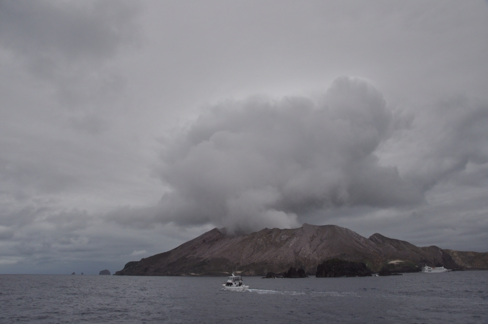
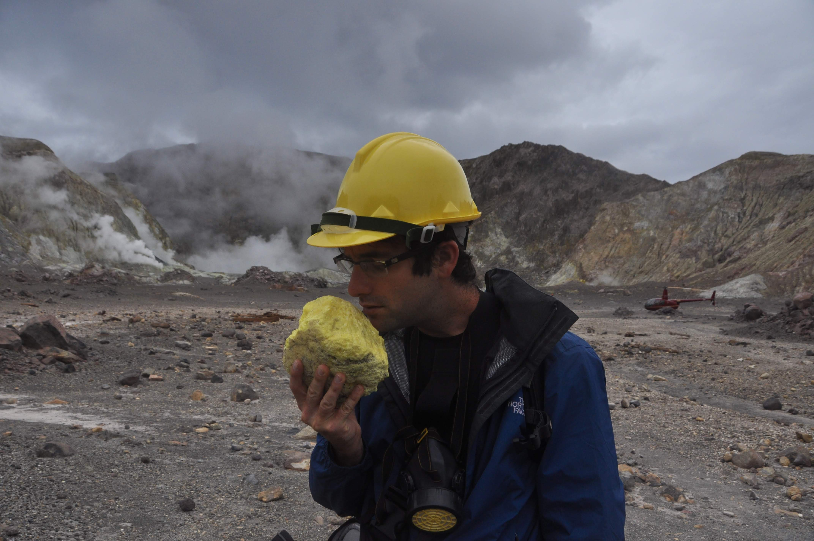

בלב ים, כחמישים קילומטר מצפון לחופה של העיר פאקטנה נמצא הר געש ימי פעיל היחיד מסוגו בניו זילנד. לוע הר הגעש מתנשא כ300 מטר מעל פני הים אך זהו כמובן רק קצה המפלצת. ההר הוא חלק משורת הרי געש שיושבים על שבר הלוח החל מאיזור טאופו וניתן לראותו מרחוק בזכות הגזים הלבנים אותם הוא פולט דרך קבע. אל ההר ניתן להגיע רק עם אישור מיוחד אותו מסדרות חברות התיירות. הכי נוח (ויפה) להגיע לאי במסוק אבל מי שבגינתו לא גדלים עצי דולר פוריים במיוחד יבחר בסירה.

אחרי הפלגה של כשעה וחצי בים פתוח הגענו אל היעד. בסירת גומי הורידו אותנו אל האי המעשן בו קיבלנו תדריך בטיחות והתחלנו במסע הקצר אל לועו של הר הגעש. לא ברורה ההחלטה לקרוא למכתש של הר געש דווקא לוע - אם כבר להשתמש בדימוי מגוף האדם אז לפי הגזים הריחניים והחמים שהוא פולט הייתי חושב דווקא על הקצה הפחות פופולרי של מערכת העיכול...

הקרקע של האי צבועה בצבעים שונים ומשונים ומכל עבר פזורות ארובות קטנות פולטות עשן, בריכות בוץ מבעבעות וניתן לשמוע את ההר כולו נוהם. כדי להקל על הרגשת המחנק על ההר ציידו אותנו במסכות גז קטנות שהעלו זכרונות ישנים של סדאם ושל פדי גאזה. את עצם קיומו של הסיור אישרו רק בבוקר היציאה בגלל שחייבים לוודא שהפעילות של ההר לא מוגזמת ושמצב הגלים מאפשר להתקרב אל ההר מבלי להתנפץ עליו.



הלוע הראשי של האי גדול וירוק. דרך מקורית במיוחד מצא לעצמו פועל במכרה גופרית להתאבד כאשר קפץ היישר לתוך הלוע המבעבע. הלוע הלוהט מעכל בשניות כל מה שיזרק לתוכו ואם עוצרים רגע לחשוב - אז אם כבר להתאבד, קפיצה לתוך לוע הר געש בלב ים היא בהחלט דרך ראויה. באיזור המכתש לא היה אפשר להשאר זמן רב - האדים הרעילים מזיקים לנשימה וגם לעדשת המצלמה...

קרוב לנקודה בה פרקו אותנו מהסירה יכולנו לחזות במפעל גופרית נטוש. הר הגעש מצידו, כנראה אהב את הגופרית שלו דווקא היכן שהיא היתה ואחרי שהתחילו לחפור הוא קבר את כל עשרת הפועלים שעבדו במפעל בהתפרצות לא צפויה. כיום נעזרים בהר למחקרים מדעיים וגם בתור חוזה רעידות אדמה די מדוייק. על ההר נמצא ססמוגרף שכמעט ואינו מפספס שום רעידת אדמה ולו הקטנה ביותר באיזור כולו.

אחרי הביקור החזירו אותנו בשלום לפאקטנה, ובדרך ליוו אותנו עשרות דולפינים סקרנים. צוות הספינה ניסה לאתר גם חבורת לווייתנים מקומית בדרך אך ללא הועיל. יצא לנו לראות בדרך גם ״דג מעופף״ שזה דבר די פסיכי כשלעצמו. מגוון החיות שאנחנו רואים בטיול הזה נראה בלתי נדלה.



תודה מיוחדת ל״חבר האנונימי״ ולשני על ההמלצה החמה על האי המיוחד הזה. מפתיע שלא הרבה אנשים מטיילים כאן - אחרי הכל, כמה פעמים בחיים יש לאדם הזדמנות לעמוד על לועו של הר געש פעיל בלב ים...
