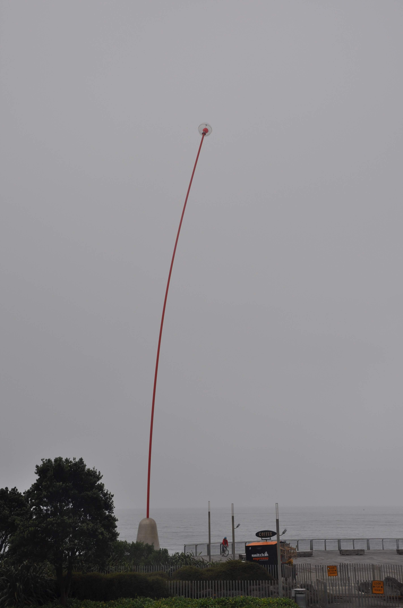
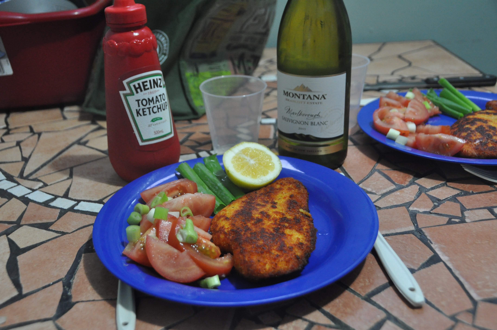

הטראנקי הוא הר געש גבוה ובעל צורת חרוט קלאסית. כדי להגיע לפסגתו יש לטפס במסלול שעולה 1.6 קילומטר ואז לרדת חזרה באותו היום בהרפתקה מאומצת שעורכת כ10 שעות. אך לא כך רצה הגורל: על פסגתו של הטראנקי לא דרכנו, ואפילו את צורתו החרוטית לא ראינו. על מרגלות הטראנקי ישבנו וחיכינו 3 ימים לוטים בערפל כאשר התחזית מבטיחה התבהרות למחרת ומשקרת בעזות מצח. את הימים העברנו בניו פלימות׳, בה אין ממש מה לעשות כך שרוב הזמן בילינו בספריה - התחלנו לתכנן את המשך הטיול באוסטרליה ובארה״ב ולפחות ניצלנו את הזמן בצורה פרודוקטיבית. בניו פלימות׳ מאד מתגאים בפסל הקינטי שבטיילת. הפסל מתנועע בכיוון בה נושבת הרוח וכשלרגע הפסיק הגשם יצאנו לעשות פיקניק למרגלותיו.

כל כך הרבה סיפורים איומים שמענו על מזג האויר בניו זילנד בעיקר באי הדרומי - מטיילים סיפרו לנו שבמשך חודש לא הפסיק לרדת גשם כך שאין לנו ממש על מה להתלונן... על הטראנקי נאלץ לטפס בפעם אחרת - אולי בטיול בר המצווה של הכלב שלנו בבוא היום...

לראשונה בטיול הכנו שניצל. אין כמו שניצל טוב כדי לגרום לך להרגיש בבית. בתאבון!

