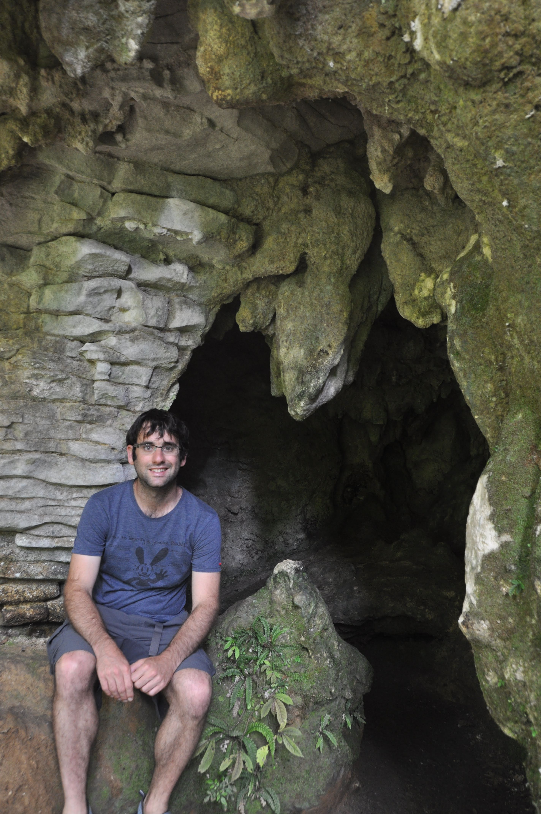

מערות וואיטומו (Waitomo) הן אחד ממוקדי המשיכה הגדולים באי הצפוני ואי אפשר לומר שלא בצדק. מערכת של יותר מ300 מערות תת קרקעיות מאבן גיר (סלע משקע ימי) שהתפתחו בתקופה בה האיזור כולו היה מתחת לפני הים עד לפני כ30 מליון שנה. במערות השונות זורמים נחלים גועשים ומוצעות אינספור פעילויות שונות ומשונות בתוכן.

אחת מחוויות החובה במערות היא צפיה בחרקים מיוחדים במינם - התולעים הזוהרות. התולעים הזוהרות הן בעצם לא ממש תולעים - בבגרותן הן דומות יותר לזבובים ומבחינה ביולוגית הן בכלל שייכות למשפחת העכבישים. ה״תולעים״ מתחילות את מחזור חייהן בתור גלמים שגדלים על תקרות מערות. הגלמים זוהרים בחשיכה ובכך מושכים אליהם חרקים שנמשכים אל תוך קורים דביקים שמשתלשלים מהגולם הרעבתן. אחרי כמה חודשים בוקע מתוך הגולם יצור משונה הדומה לזבוב בלי פה ובלי מערכת עיכול. הזבוב המוזר חי כיומיים שלושה במהלכן כל מה שהוא עושה זה להזדווג במשך 24 שעות ואז למות מרעב. לא מן הנמנע שהזבוב יכלא במלכודת של תולעת זוהרת אחרת ויהפוך ארוחה של בן דודו הצעיר - אכן חיה משונה. בתוך מערה חשוכה ניתן לראות את התולעים זוהרות על התקרה בהמוניהן. קשה לצלם את התולעים זוהרות בחשיכה - אך הנה הקורים אותם הן טוות.

לצפות בתולעים זוהרות זה טוב ויפה, אך הדרך האמיתית לחוות את המערות וגם את התולעים היא ראפטינג במים שחורים (black water rafting). ראפטינג במים שחורים זהו ספורט שהומצא ממש כאן ומשמעותו בקצרה - משליכים אותך בתוך אבוב לתוך מערה חשוכה ומקווים שתצא מהצד השני :) לכבוד המאורע הולבשנו בחליפות צלילה מרופדות היטב סביב עמוד השדרה, הברכיים והמרפקים כדי לשמור על הגוף מן הסלעים ומהקור - טמפרטורת המים היא 12 מעלות בלבד בתוך המערות.

שיא החוויה (או שיא הפחד - תלוי את מי שואלים) הוא מפל בגובה 2 מטר שנמצא בתוך המערות ואותו חייבים לקפוץ כדי להמשיך במסלול. כדי שלא יהיו צרות מתחת לאדמה לקחו אותנו לפני לקפיצת אימון לתוך המים הקפואים. הנמלה, שכידוע נמנית עם היצורים היותר הפחדניים בטבע נענתה לאתגר ברגשות מעורבים. המדריך קרא: שלוש ארבע ו... אין תגובה. שלוש ארבע ו... המים ריקים מנמלה. שלוש ארבע ו- דחיפה קלה, יש נמלה באוויר - ובלופ - בתוך המים! :)

")

אין ספק שהחוויה היתה ייחודית ומהנה - אנחנו ממליצים לא לפספס את הרפטינג לכל מי שמתקרב לניו זילנד. המערות המעוצבות בצורות אותן יצרה זרימת המים כאילו עוצבו במיוחד בשבילנו, והמדריכים היו מקצועיים ומשעשעים. בחלקים הצרים של המערה המדריכים צעקו ״eel up״ - או בעברית - התצלפחו - ואנחנו כמו בתרגול היבש התעצבנו בצורת צלופח ארוך וחלקלק.

באחד הקטעים הצרים בהם הזרימה לא היתה חזקה ביקשו המדריכים מכולנו לכבות את הפנסים. אחרי שתי שניות, כשעיניינו התרגלו לחושך המוחלט התחלנו לראות המוני כוכבים! כוכבים? לא! היו אלה מאות תולעים זוהרות שהאירו את תקרת המערה - מדהים. במשך מספר דקות שכבנו ושטנו בשקט כשכל מה שאנחנו רואים זה ניצוצות תולעים עד שאחת מהקבוצה פצחה בשיר קיטשי במיוחד. הצטרפנו כולנו לשירה בחשיכה ולרגע נדמה כאילו אין שום צרות בעולם - אולי חוץ מהמפל הממשמש ובא :)

הנמלה קפצה את המפל בגבורה מסויימת על אף שהמדריכה מאנה לעזור שוב בדחיפה. אחרי שעברנו עוד מפל, הפעם קטן יותר - התקרבנו כבר לסוף המסלול. כפות הידיים - החלק היחיד בגוף שלא היה מוגן מהקור התחילו לקפוא בעודן מנווטות את האבוב - והמרק שהוגש לנו ביציאה מהמים בהחלט היה במקום. נפרדנו מחברי הקבוצה מלאי חוויות.

למחרת לקחנו סיור ״יבש״ במערות בו יכולנו לשמוע קצת יותר הסברים ולראות גם מערות נוספות בהן המים פיסלו שלל נטיפים וזקיפים. למרות הגודל העצום של המערות והתשתיות המעולות שהכינו כאן - מבחינת הנטיפים עצמם למערת הנטיפים שלנו בישראל בהחלט אין במה להתבייש. מידי פעם הזכירה המדריכה את המקומות בהם עברנו בראפטינג - ״אתם שומעים את המפל השוצף הזה״? - פרצופים סינים מהנהנים - ״שני החברה האלה אתמול קפצו ממנו״ :)

מכאן אנו מתחילים במסע לקראת אוקלנד וסיום פרק הטיול שלנו בניו זילנד מתקרב. התחלנו לפרסם מודעות בדבר מכירתו של לאקי תומפסון רכבנו האהוב. קצת עצוב, אבל היו לנו רגעים יפים ביחד....

