בשנות השלושים, אי שם באוניברסיטת אוקספורד ישב פרופסור משועמם וחובב שפות ובדק בחינות של סטודנטים כשלפתע בבחינה אחת נתקל בדף ריק. בלי שום הסבר מניח את הדעת תפס הפרופסור  את העט והתחיל לשרבט מספר פעמים על הדף את המשפט - ״בתוך חור באדמה גר הוביט״. פרופסור טולקין, כמו שאר בני האדם, לא ידע אז מהו הוביט ומדוע לעזאזל הוא גר בתוך חור באדמה?! בניסיונו לתהות על קנקנו של היצור המשונה כתב טולקין את ״ההוביט״ על מסע ההרפתקאות של בילבו באגינס וחבורת הגמדים להשבת אוצרם האבוד. מאז - הכל היסטוריה - שלא לומר היסטריה. אני בטוח שטולקין לא דמיין לעצמו שיהיה מושג כמו - ״תיירות שר הטבעות״ שתגולל כל כך הרבה כסף.

בדרך לאוקלנד עצרנו בסט הצילומים של הshire או בעברית ״הפלך״. אתר הצילומים נקרא הוביטון והוא ממוקם לייד העיירה מאטאמאטה. האתר שימש בצילומי טרילוגיית שר הטבעות וממש לפני חודשיים סיימו לצלם כאן את שני סרטי ״ההוביט״ שנמצאים כרגע בקנה ההוליוודי של פיטר ג׳קסון. לצערי עד שייצא הסרט הראשון בדצמבר לא אוכל לפרסם כאן שום תמונות של הביקור מכיוון שהוחתמנו על מסמך דרקוני לפני שהרשו לנו להכנס ולצלם. עמכם הסליחה...

אחרי טקס החתימה נכנסנו לאתר מושקע באופן מוגזם ועצום שעל כל גבעה בו שפכו הר של דולרים. האתר שייך לחווה שוממת שכל מה שראו בה עד לשנת 2008 היו כבשים ופרות. צוות ה-location casting של פיטר ג׳קסון איתרו את החווה מהאוויר. מקום מבודד שהקידמה פסחה עליו וכאילו בהזמנה מוקם עץ ענקי על שפת אגם - מה שעתיד להיות ״עץ יום ההולדת״ של בילבו מהסרט fellowship of the ring. בעלי החווה לא יכלו לדעת מה מצפה להם. כשהגיעו לראשונה אנשי ההפקה לשאול אם יוכלו לצלם סרט בחווה ביקשו מהם שיחזרו למחרת כי בדיוק משודר עכשיו משחק רוגבי. כשחזרו, הסכימו לספר לבעל החווה מה שם הסרט רק לאחר שיחתום איתם על החוזה. כשסיפרו לחוואי הסקרן על הסרט הוא הגיב: ״lord of the who"?! בעלי החווה וכל הילדים שלהם כבר לא יצטרכו לעבוד יותר בחייהם. 

הפקת הסרט הקימו כאן את סט הצילומים הגדול ביותר שהוקם אי פעם. במשך תשעה חודשים חפרו מערות הוביטים, בנו גשר, פאב, גלגל מים והכל בהשקעה חסרת פשרות עד הפרט הקטן. על כל עץ שמוזכר בספר הטיסו לכאן עץ שפורק ומוספר והורכב כאן מחדש. את עלי עץ האלון ייבאו מטאיוון והדביקו אותם אחד אחד(!) בחווה היו במקור המון כבשים אבל בהפקה הוחלט שזהו לא הזן הנכון והביאו לסט מאות כבשים אחרות מאזורים אחרים. נוהל כאן גן חיות שלם עם צוות של כ500 אנשים שחיו כאן מספר חודשים. מדהים לראות את רמת ההשקעה שהגיעו אליה.

התמונות: פורסמו אחרי שחרור הסרט הראשון של ההוביט

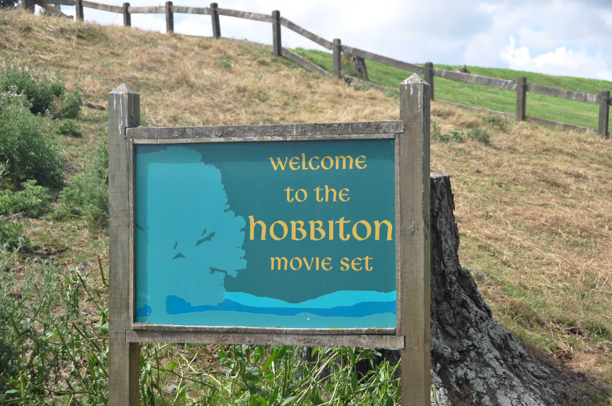
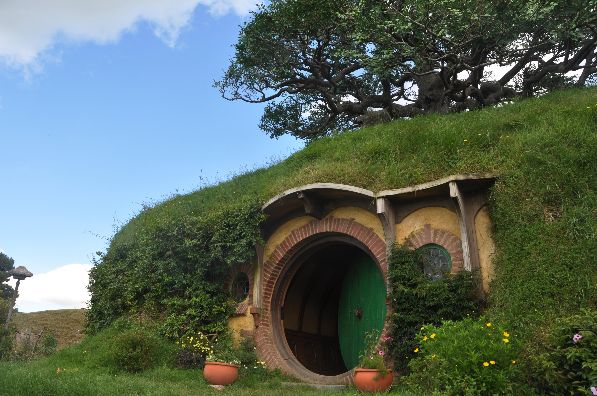
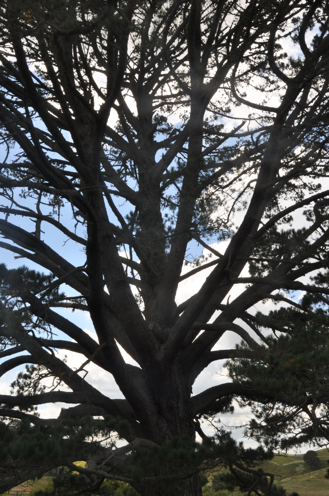
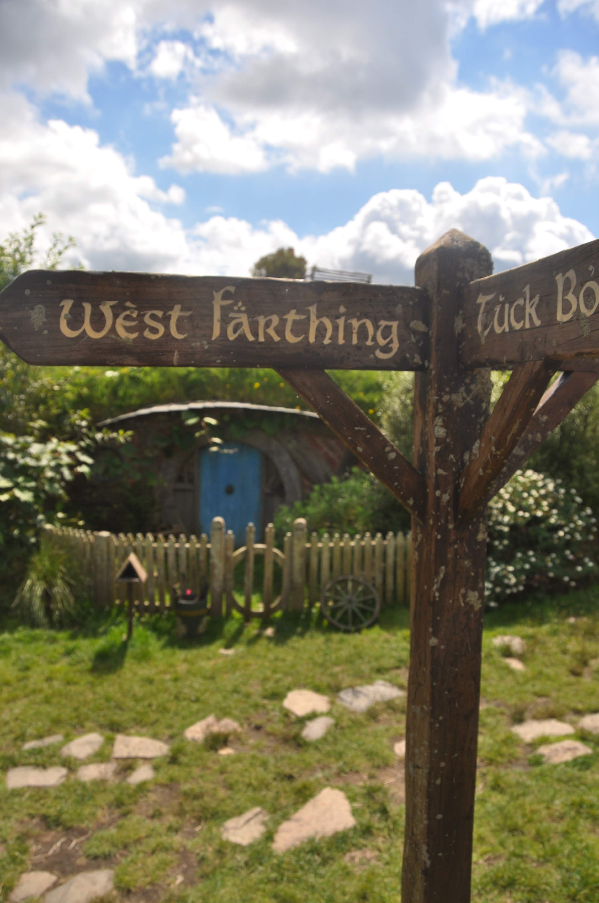
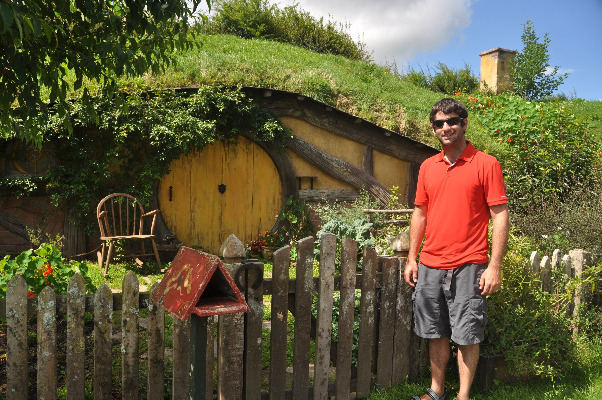
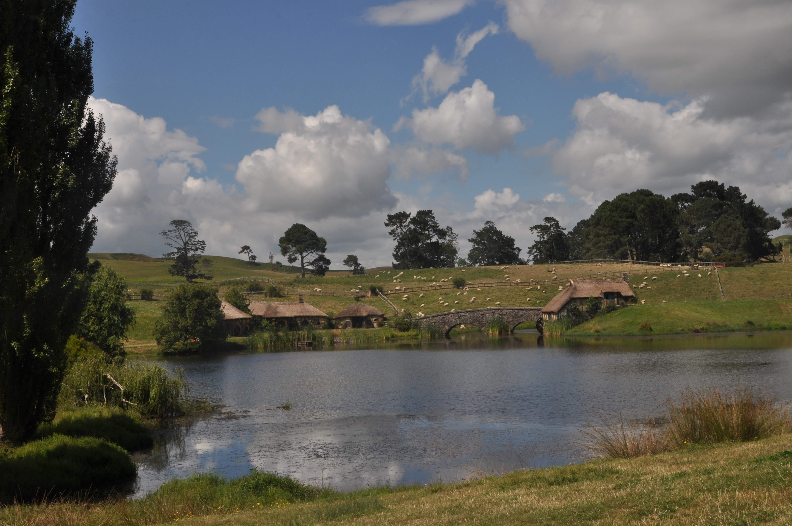
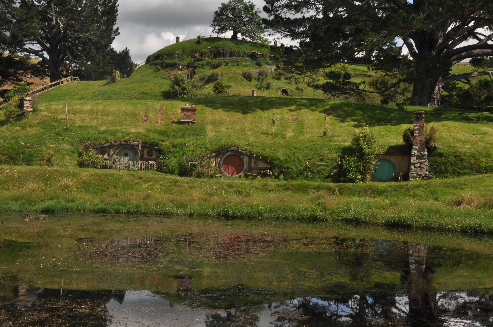
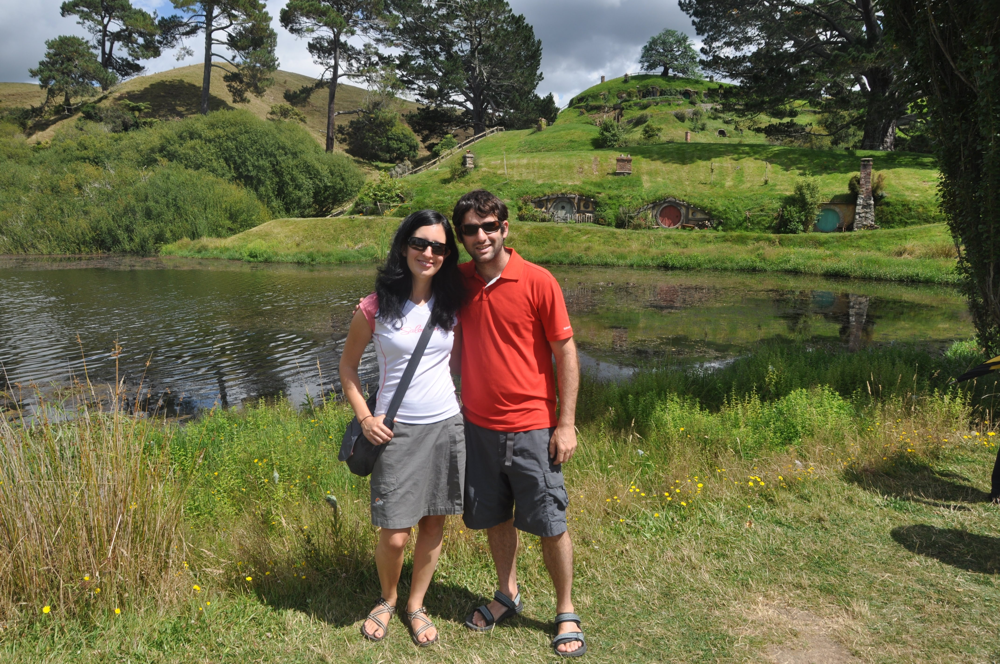
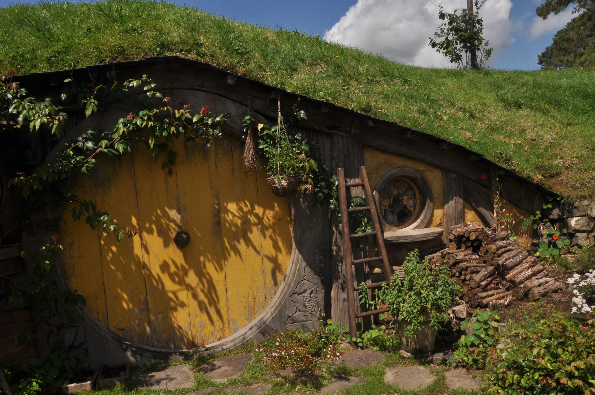
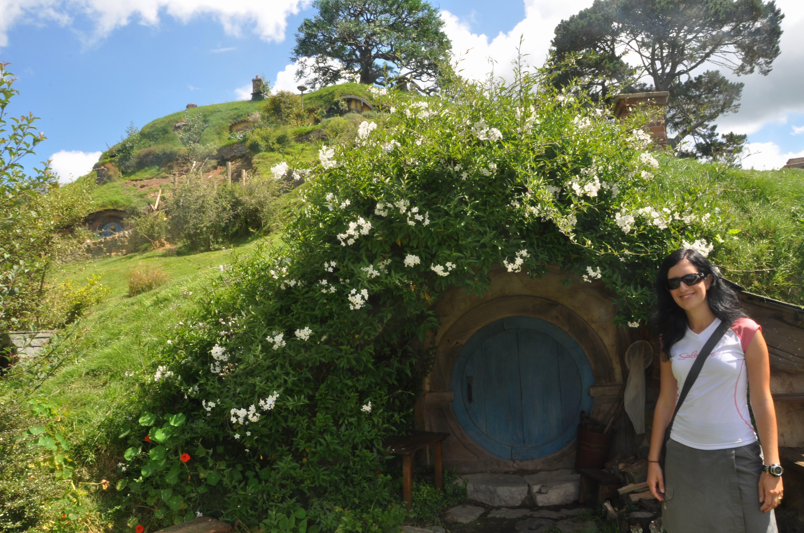

לסט הצילומים מגיעים אנשים שונים ומשונים בכל הגילאים. חוץ ממי שעוצר כאן בדרך לאוקלנד, מגיעות לכאן גם קבוצות פסיכים מחופשות להוביטים ואלפים. כשהמדריכה ראתה את כפות הרגליים השעירות שלי היא חייכה ואמרה - או! יש לנו כאן הוביט :) המדריכה סיפרה לנו שלפני כמה שבועות הגיעה מישהי וקנתה מחנות המזכרות שלהם את טבעת הזהב היקרה עם הכיתוב של the one ring, ואז שכרה מסוק בעוד כמה אלפי דולרים שיקח אותה מעל mount doom רק כדי שהיא תוכל להשליך את הטבעת אל תוך לועו! אם היינו יודעים את זה כשטיילנו שם לפני כשבוע... היינו לכל הפחות מחפשים משהו נוצץ על האדמה באמצע הטונגרירו קרוסינג. 

אחרי הסיור, בחור משונה במיוחד לקח אותנו לראות איך גוזזים צמר של כבשה בחווה. לא ברור לנו מה הוא רצה מאיתנו, אבל מסתבר שזה משום מה חלק מהסיור בסט. האיש המשונה הסביר לנו על סוגי הצמר של הכבשים השונות ואז שלף כבשה מסכנה והתחיל לגזום אותה במהירות מטורפת. המחזה הדי איום ומיותר נמשך שניות בודדות מכיוון שמסתבר שאיכות של גוזז נמדדת אך ורק במהירות שלו (כבשים לדקה) ונראה שאותו איש משונה היה מאד טוב בזה ורצה להשוויץ. בסוף מופע האיימים הלא צפוי קיבלתי לפחות בקבוק חלב ואפשרות להשקות קצת כבשים מסכנות.

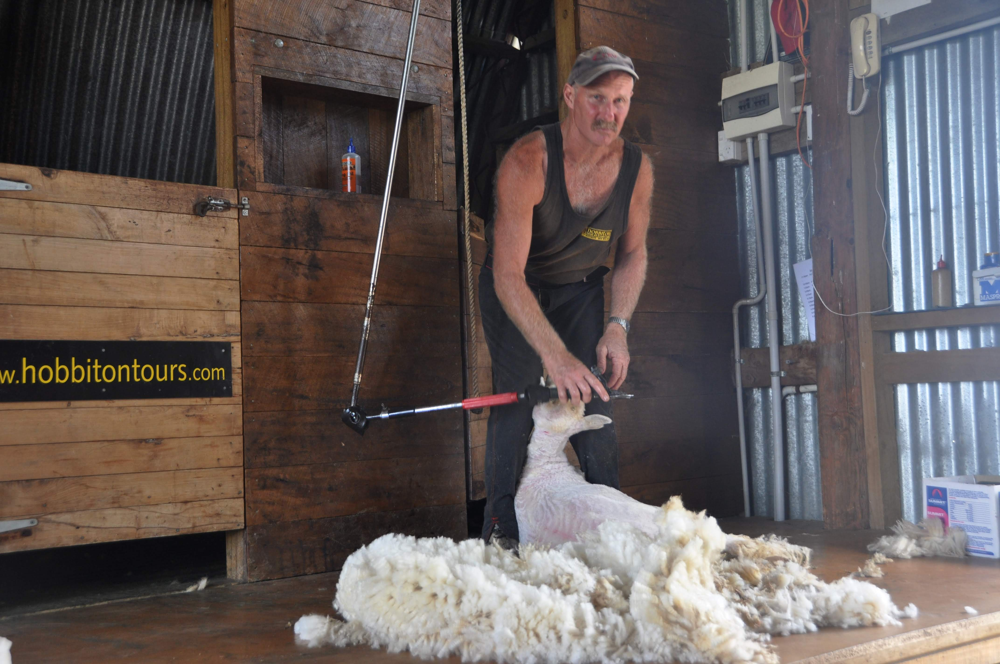

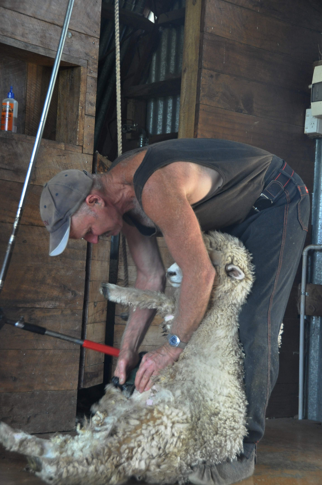

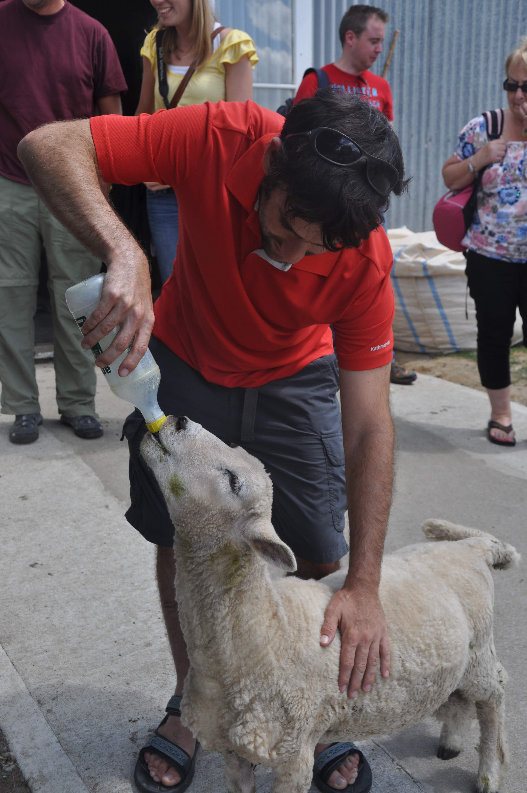

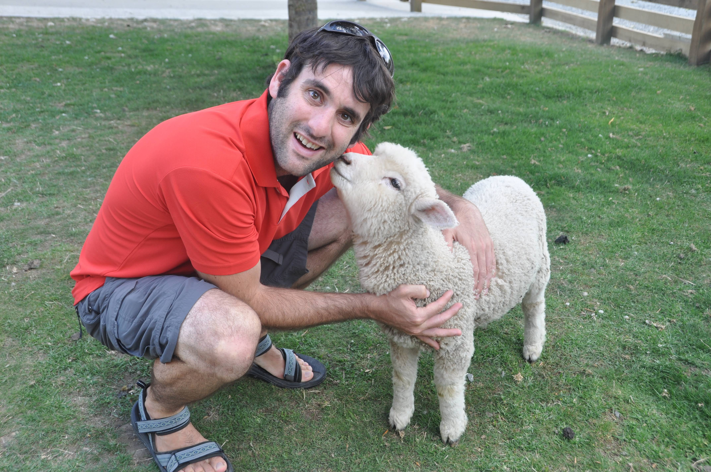
