חצי האי קורומנדל לא רחוק מאוקלנד הגדולה והסואנת ומהווה מקום מפלט למקומיים שרוצים לנפוש קצת בטבע. כמו המקומיים, ברחנו גם אנחנו מהמולת העיר לסיבוב קצר ואחרון בטבע הניו זילנדי לפני שפרק ניו זילנד בטיול שלנו מסתיים. מחצי האי נשקפים נופים יפים ועל רכס ההרים שבמרכזו יש מספר מסלולי הליכה קצרים כמו גם המון אתרי קמפינג בטבע.

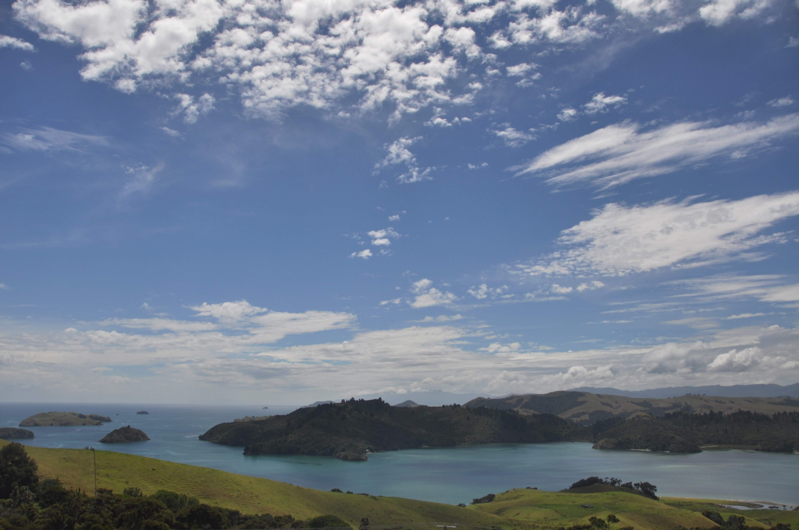

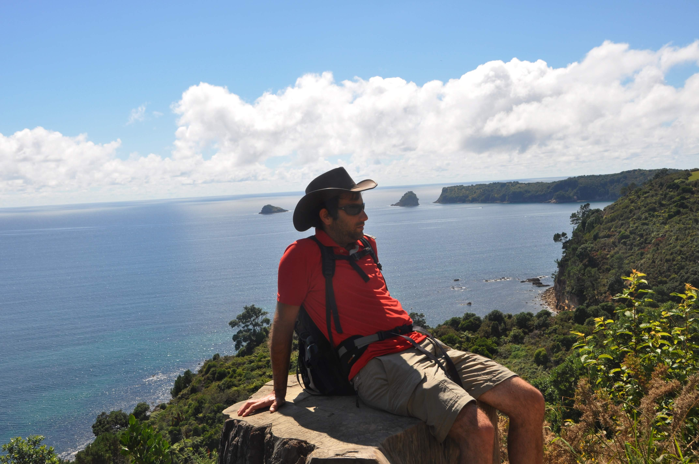

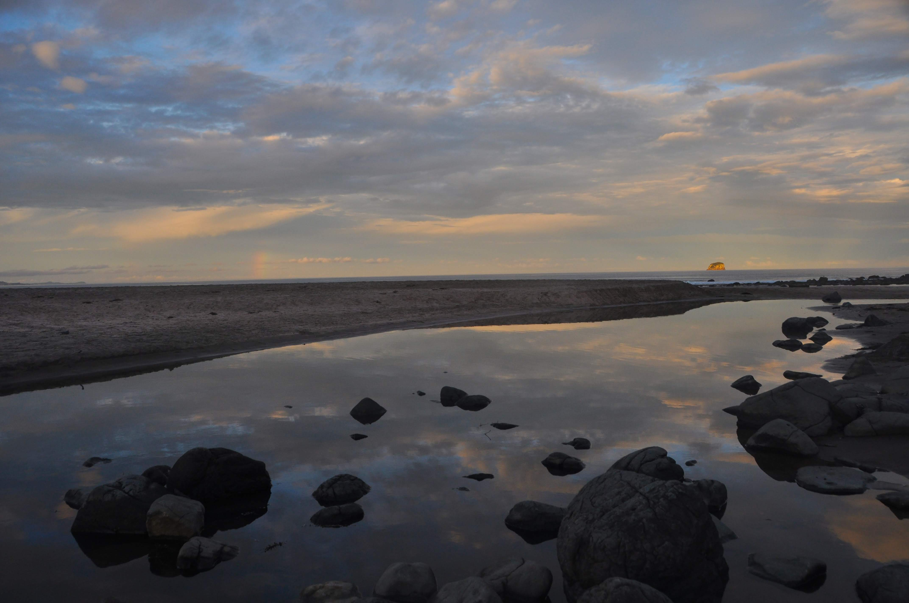
על אף הקרבה היחסית לאוקלנד, העיירות כאן קטנות וחלק מהכבישים אפילו לא סלולים. עיירות רבות כאן הופכות לעיירות רפאים בחורף מכיוון שרוב הבתים הם בתי נופש של מקומיים. העיירה קורומנדל מפורסמת בצדפות המעושנות שלה. בביתן משונה מאחורי תחנת הדלק בכניסה לעיירה מעשנים את הצדפות וכדאי לקנות אותן שם ולקחת לפיקניק על החוף.

אין ספק שהאטרקציה המגניבה ביותר בחצי האי היא ה-hot water beach. החוף הוא חוף ים תמים למראה ומסוכן לרחצה, אך מתחת לאדמה המים בוערים! כשעתיים לכל כיוון סביב שעת השפל, כשהים קצת נסוג לאחור ניתן להתקרב לחוף ולחפור לעצמך ג׳אקוזי פרטי באדיבות אמא אדמה. לקחנו את חפירה מאתר הקמפינג בו ישנו וירדנו לחוף לנסות את מזלנו. בור ראשון - ושום דבר מיוחד לא קורה... הלכנו עוד כמה צעדים ואז כבר אי אפשר היה לטעות - החול היה רותח, זה המקום לחפור! החוף התמלא בעוד ועוד אנשים ככל שהתקרבה שעת השפל ועוד ועוד בורות הקיפו אותנו עד שהחוף נראה כמו מרחצאות ענק מהבילות. יש מקומות בהם הנביעה חזקה יותר ואנשים לא זהירים קצת נכוו. קרוב לים היה ממש נחמד כי מידי פעם מגיע גל ומצנן את המים החמים בבור שלך.

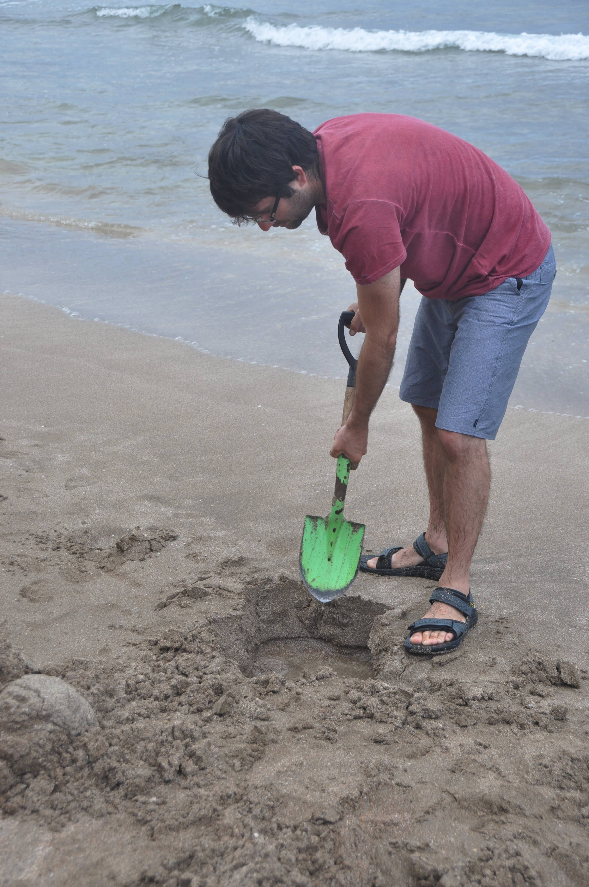

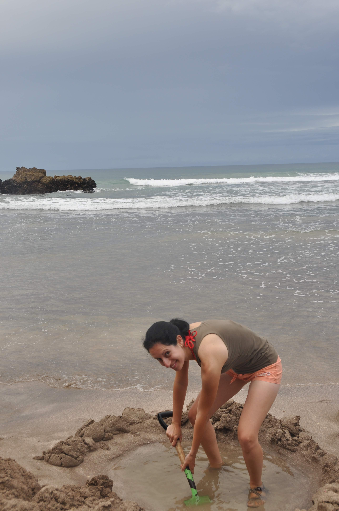

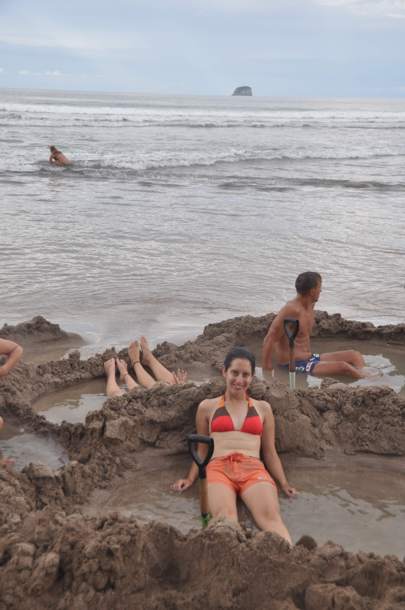

למחרת ביקרנו באזור הcathedral cove בטיול שכלל עצירות חופים, שיזוף והסתיים בפיקניק מפנק. הנופים כאן נחמדים ומהווים קינוח טוב לפרק הטבע שלנו בניו זילנד. מכאן חוזרים לאוקלנד לבירוקרטיות אחרונות ואגירת כוחות לקראת ההרפתקה הבאה.

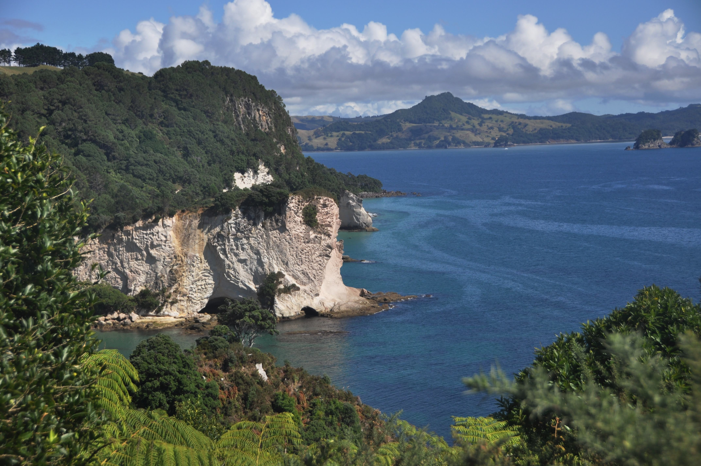

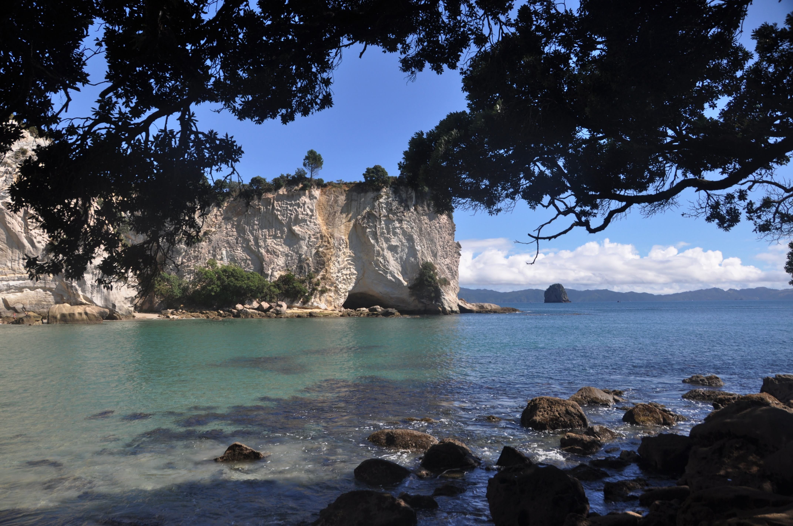

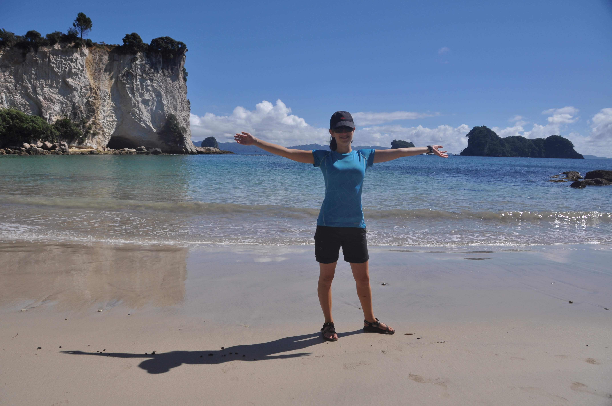

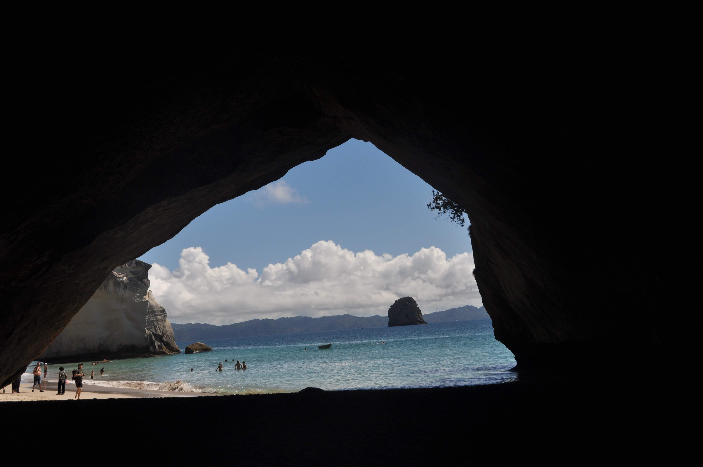

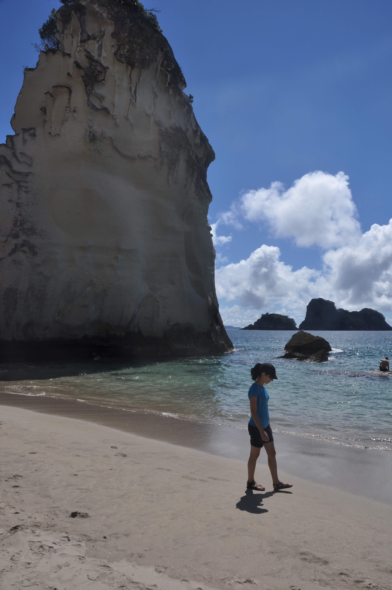

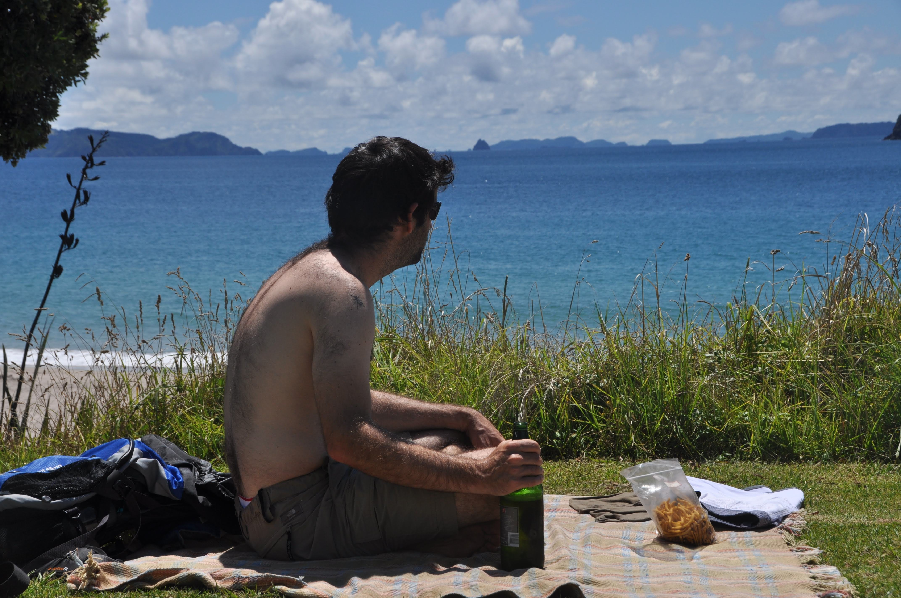
