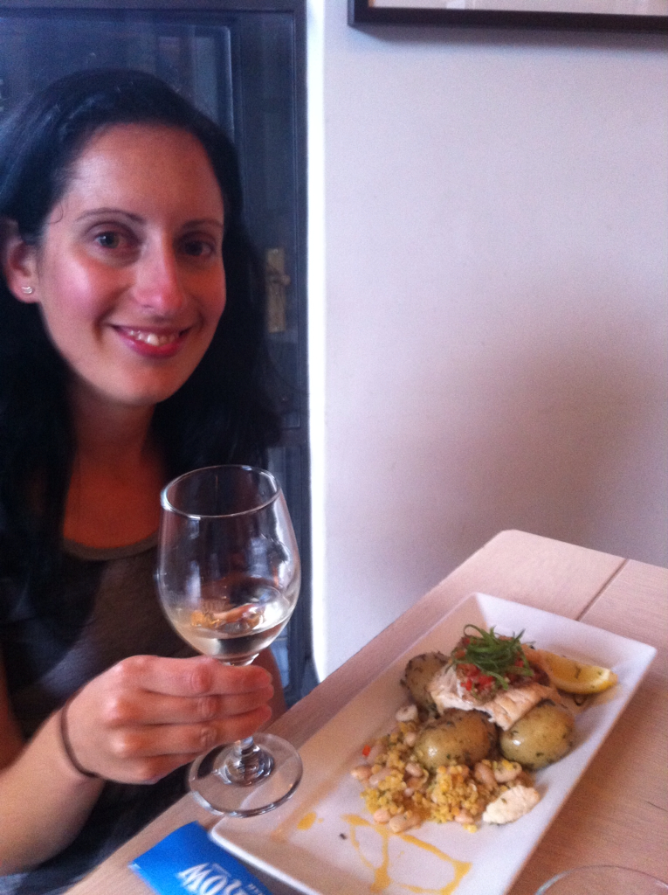

קשה להאמין שכל זה עבר כל כך מהר. אחרי שלושה חודשים של טיול בניו זילנד הגיע הזמן להמשיך הלאה. את הימים האחרונים כאן העברנו באוקלנד - העיר הגדולה ביותר בניו זילנד. זה הזמן למכור את לאקי - אבל לפני זה... מקלחת!

אחרי שלא הצלחנו למכור את הרכב בשני שווקי מכוניות למרות המקלחת ולמרות שנשאר לנו עוד שבוע, החלטנו לא להתעקש וללכת בדרך הקלה. מצאנו שני סוחרי מכוניות מתחילים שגרים בעיירה קטנה מחוץ לאוקלנד והחליטו לנסות להשלים הכנסה בעסקי התיירות באמצעות קניית מכוניות במחירי סוף עונה ומכירתן בתחילת העונה הבאה. הזוג היה נחמד מאד, הציעו מחיר הוגן למדי ואפילו הציעו לנו ללון אצלם ולהעביר את הזמן בחופים הסמוכים עד הטיסה. זאת הרגשה ממש מוזרה להסתובב פתאום בלי מכונית במיוחד כשהאוטובוסים כאן די מחורבנים. כשרצינו לחזור לאוקלנד אחרי שנפרדנו מלאקי בנשיקות, הזמנו אוטובוס מראש וקצת התפלאנו לגלות שהתחנה לא מסומנת ובאתר חברת האוטובוסים רשום - לחכות מול מלון. הנהג הדביל פשוט שכח את התחנה שלנו ומצאנו את עצמנו תקועים באמצע שום מקום וכמעט בלי כלום עד האוטובוס הבא בעוד 3 שעות. אחרי שיטוט קל בשיממון גילינו תגלית מופלאה - חנות גבינות קטנה עם גבינות מיובאות נהדרות - הגבינות הטובות שטעמנו בטיול כולו. ישבנו בשמש ועשינו חאפלת גבינות לתפארת מדינת הולנד. הניו זילנדים למרבה הפלא אמנם טובים בגידול כבשים אבל לא ממש טובים בגבינות... כשהגיע האוטובוס הבא נעמדתי באמצע הכביש כדי לא להותיר לנהג שום ספקות...

את הזמן באוקלנד העברנו בעיקר בתכנון המשך הטיול, אך גם הסתובבנו קצת בעיר הנחמדה. עד כמה שזה נשמע מוזר, העיר נבנתה על גבי כמה עשרות הרי געש קטנים שכבר אינם פעילים והם מהווים חלק בלתי נפרד מהנוף של העיר. את הר הגעש הגבוה שבשכונה שלנו ניצלנו ל״טיפוס שמירה על כושר״ והתפלאנו לגלות את המכתש שבפסגתו ואת הנוף הפנורמי שנשקף ממנו.

למרות היותה עיר גדולה, רוב הבתים באוקלנד פרטיים ואיכות החיים טובה מאד. ניצלנו גם את מגוון המסעדות העצום ומצאנו מסעדת מאכלי ים מעולה "Squid Row" בה זללנו צדפות ומנת דג מעולה מדג גדול בשם ״סנאפר״.

משונה לישון בbackpackers אחרי כל כך הרבה זמן עם האוטו - למרות שהמקום נחמד, אנחנו מתגעגעים ללאקי ולצורת הטיול העצמאית יותר. זהו - מכאן אופי הטיול הולך להשתנות: האזורים בהם נהיה באוסטרליה הרבה יותר תיירותיים וגם בשל מגבלות הזמן, הטיול יהיה קצת פחות ספונטאני והרבה יותר מתוקתק. מקווה שיהיה לי זמן לעדכן את הבלוג בתדירות סבירה אם בכלל... מה שבטוח - פינת הבישולים תעבור קיצוץ - אחרי בקרת נזקים - מתחילים דיאטת טיולים :)

עצוב לעזוב את המדינה שכבר הפכה לבית השני שלנו. אין ספק שבחרנו נכון - ניו זילנד התאימה כמו כפפה לטיול בו חשקנו - טבע מדהים עם תופעות ונופים שפשוט אי אפשר להאמין שקיימים. פרישת אתרי קמפינג מדהימה שמאפשרת לשלב אורח חיים טוב מאד בתקציב מוגבל. התאהבנו במדינה הזאת, למדנו המון (כולל על עצמנו) עם חוויות שונות ומשונות בין קניית אוטו בן 20 ומגורים בו, דרך הצצה ללועות של הרי געש פעילים וכלה בריקוד עם מאורים שיכורים. בהחלט לא מן הנמנע שעוד נשוב לכאן יום אחד לביקור נוסטלגי. להתראות לאקי, להתראות ניו זילנד!
