נחתנו במדינה חדשה או יבשת חדשה אם תרצו, וזה מרגיש קצת כמו עולם חדש. ההבדלים בין המדינות קיצוניים - במיוחד בסידני המפלצתית. חוץ מזה שהבדיחות כאן הן על ניו זילנדים במקום על אוסטרלים, אוסטרליה הרבה יותר מפותחת. אוקלנד שנראתה לנו כמו עיר גדולה נראית עכשיו מול סידני כמו קצרין מול תל אביב. קצת קשה להשוות את סידני לערים אחרות בעולם, אך אם היו מכריחים אותי הייתי אומר שסידני היא שילוב של 3 ערים. מנהטן - עם גורדי השחקים והרחובות הסואנים, לונדון - בשל הבניה האנגלית, הפאבים וכמובן הנאמנות למלכה, ובואנוס איירס - בגלל הריח שלה, העליבות המסויימת שלה (לפחות של חלק מהשכונות) ובגלל שהגיעו לכאן אותו סוג אנשים שברחו מאירופה למקום הכי רחוק שיכלו למצוא. אין ספק שאם יש משהו בסידני שאין בשום מקום אחר בעולם הוא בית האופרה שלה - אחד המבנים המפורסמים בעולם. אפילו אני, שארכיטקטורה היא ממני והלאה ותמיד אעדיף לראות יצירה של הטבע מאשר כמה לבנים שהונחו אחת על השניה בידי אדם, חייב להודות שזה המבנה הכי מרשים שיצא לי לראות. המבנה שמכל כיוון נראה אחרת לגמרי, תוכנן על ידי ארכיטקט שבדי כשהשראתו היא מפרשי ספינות שבאות לעגון בנמל סידני - הנמל הראשון באוסטרליה שיושב על ידי הקולוניאליזם המערבי.

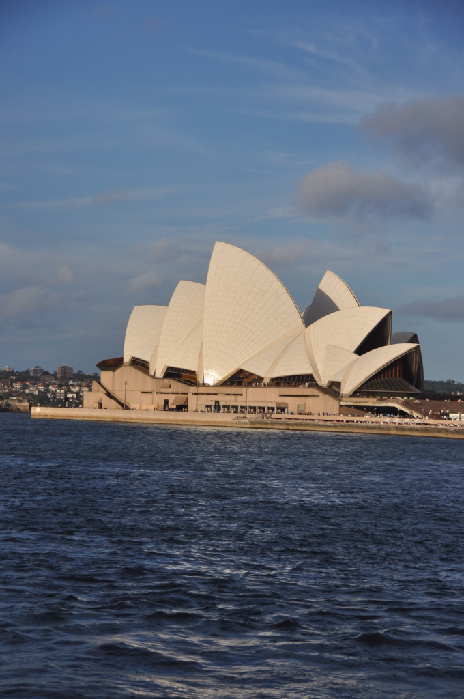

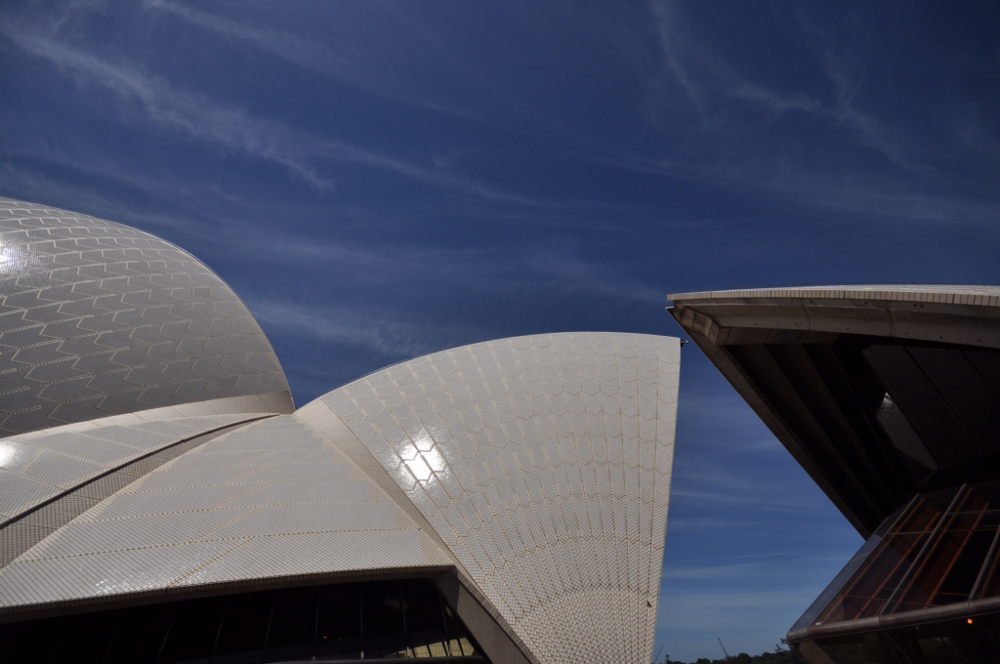

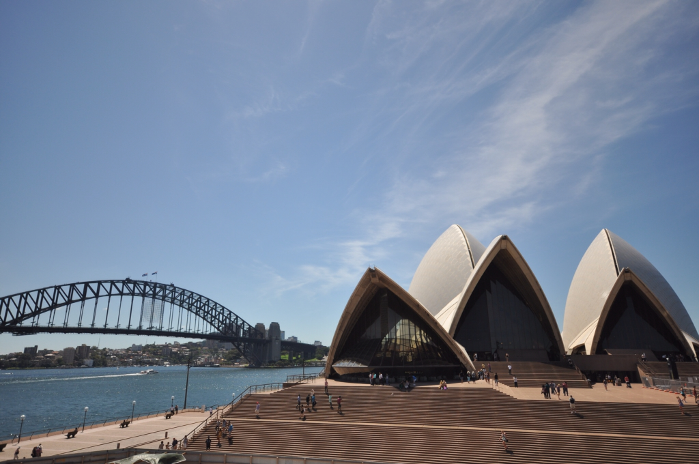

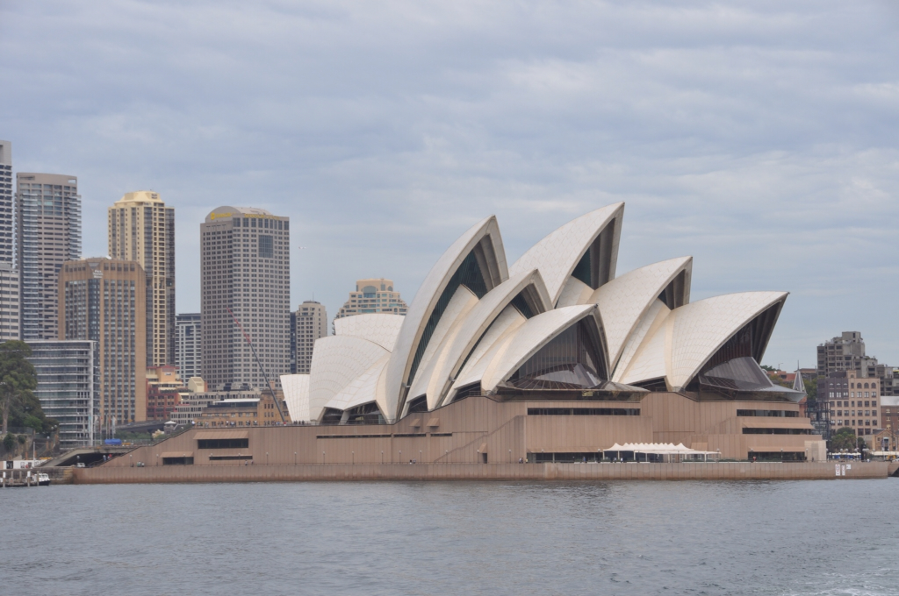

המבנה היקר נבנה בסידני במטרה להתעלות על יריבתה המקומית - מלבורן. הסיפור המפורסם ביותר על היריבות בין הערים הוא על הכרזת עיר הבירה של אוסטרליה - לא סידני ולא מלבורן יכלו לסבול שהשניה תוכרז כבירה מה שגרר את הקמתה של עיר הבירה קאנברה באמצע שומקום לצורך הפשרה בלבד. לאורך כל ההיסטוריה בני האדם ידעו להוציא מעצמם את הטוב ביותר למטרות יריבות או סתם כדי ״לעשות דווקא״, ולכן זכינו במבנה היפה הזה שבכל ערב מתמלא תיירים שבאים לראות את השקיעה ולהצטלם בפוזות משונות.

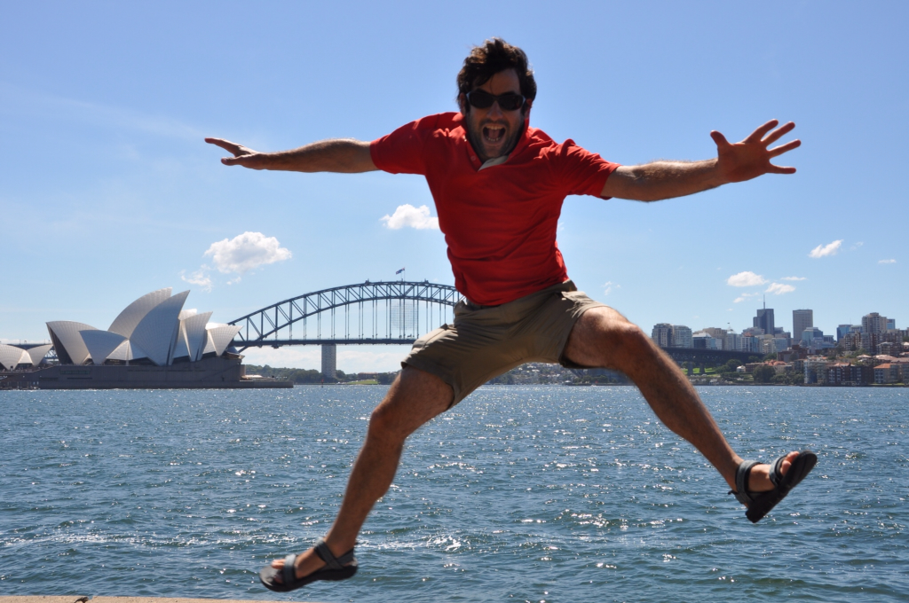

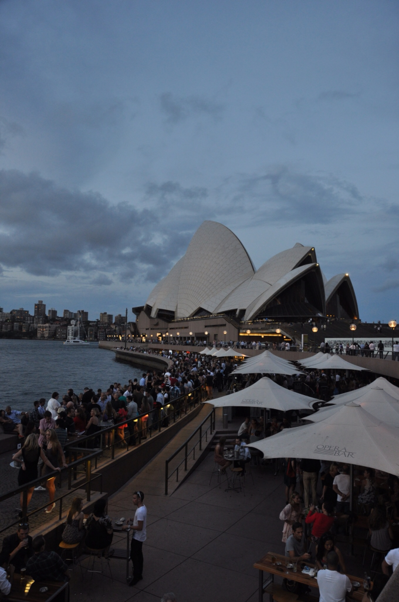

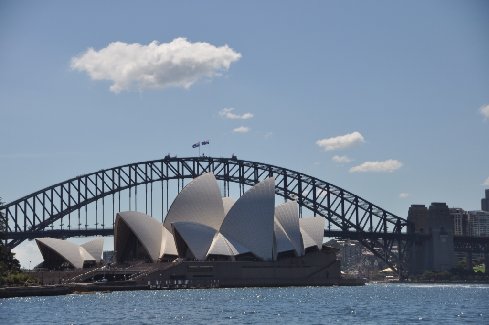

חוץ מבית האופרה יש בסידני לא מעט מה לראות. ולא - אני ממש לא מדבר על הגשר המכוער שלה שנראה כמו קולב מגוחך - פרק הארכיטקטורה המורחב בפוסט התחיל ותם בבית האופרה :) בסידני יש גנים בוטניים נחמדים, שלל שווקים נהדרים וכמה מוזיאונים נסבלים בהחלט. מיד כשמתחילים להסתובב ברחובות העיר מבחינים ב״חתול הרחוב״ המקומי. את החתול המוכר לנו מפחי הזבל של תל אביב מחליף כאן הibis - ציפור מכוערת עם מקור ארוך שעושה עבודה לא רעה בחטיפת מזון אך בלי טיפת אלגנטיות חתולית. באחד הרחובות במרכז העיר מוקדשת פינת כלובים לכל הציפורים שחיו כאן לפני שהופיעה כאן עיר ענקית ומזוהמת.

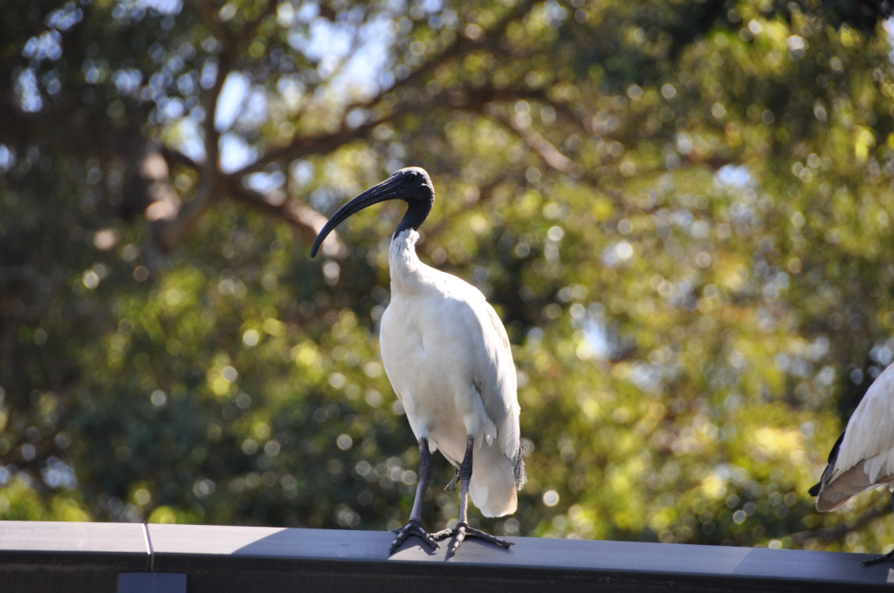
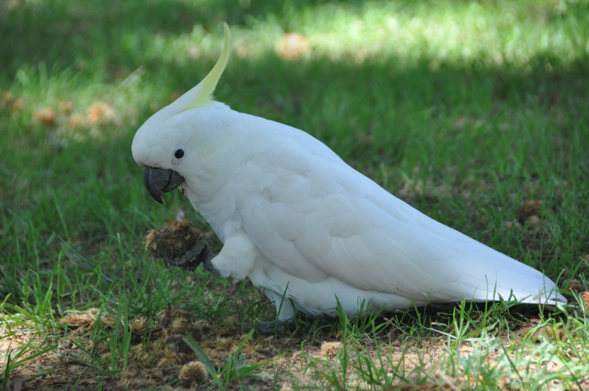
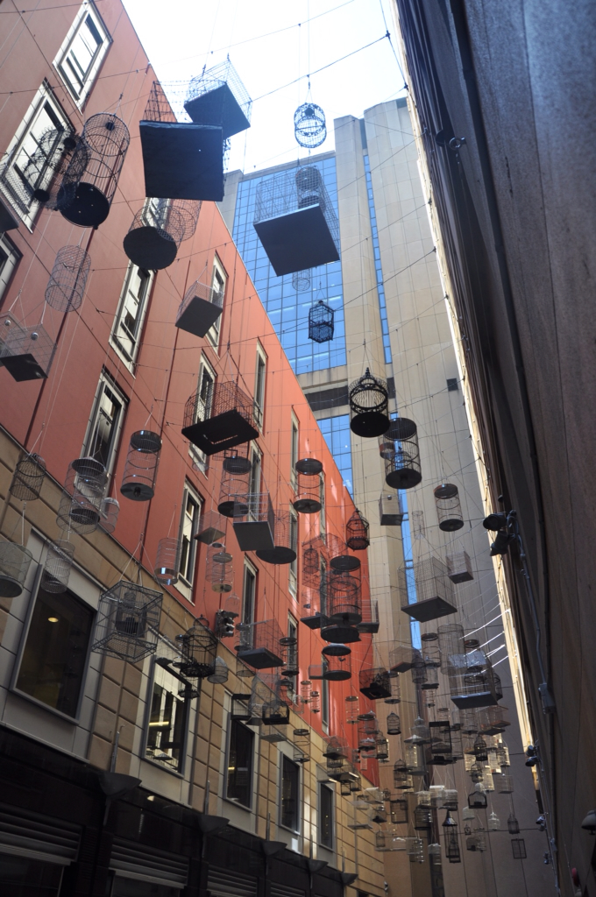

מוזיאון ששווה להזכיר הוא ה-Australian museum. במוזיאון ביקרנו בתערוכת צילום מתחלפת ״Wildlife Photographer of the Year״, ששייכת ל Natural History Museum שבלונדון. התערוכה היתה פשוט מדהימה והחלטנו שספר התמונות ממנה ראוי בהחלט להיות הcoffee table book הראשון בדירתנו החדשה. במוזיאון היתה גם תצוגה יפה של שלדים של דינוזאורים וחיות אוסטרליות שונות ומשונות. שילדון אוסטרלי חוצפן התחיל לקרוא לי בשמות ונאלצתי להשפילו בתחרות רכיבה על אופניים.

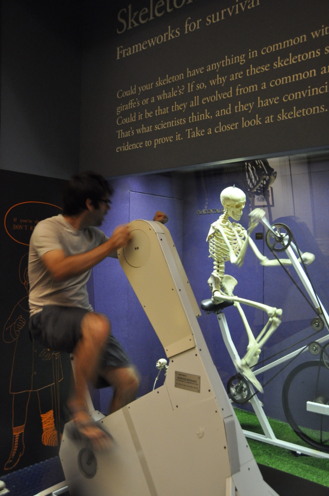

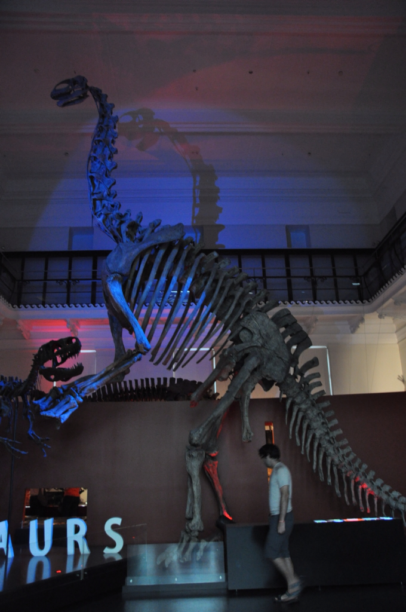

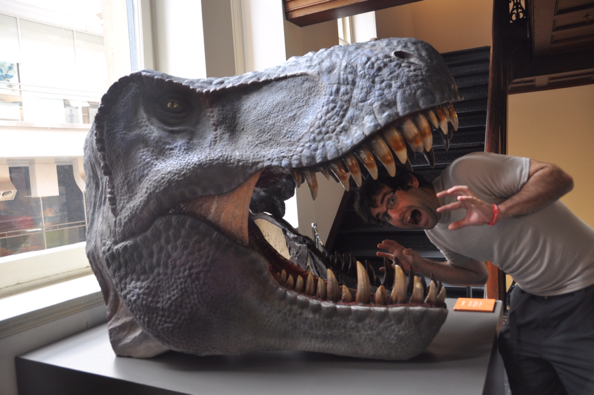

אגף שלם במוזיאון הוקדש לחיות הקטלניות שאוסטרליה כל כך ידועה בהן לשמצה. אוסטרליה היא ביתם של שמונה מתוך עשרת הנחשים הארסיים ביותר בעולם, כמה מהעכבישים הקטלניים ביותר, קרוקודילים שיכולים לאכול פרה בביס אחד וכמובן הכרישים שאוסטרליה כל כך מפורסמת בהם. על מסך ענק זחלו להם נחשים מפחידים ועכבישים וכשנוגעים במסך באיזור שלהם הם מכישים אותך ואז מוצגת הודעה בסגנון - ננשכת על ידי x, יש לך y שעות להגיע לבית חולים. עבור חלק מהנחשים שעבור הרעל שלהם עדיין לא פותח נוגדן פשוט מתים... אני בתור פחדן נחשים גדול הולך לישון מעכשיו עם חריץ בחלון פתוח לא יותר מקוטר של שלושת רבעי הנחש. בתצוגת הכרישים מנסים להרגיע את המבקרים שהמים בטוחים לרחצה ורק 1.2 אנשים בשנה נהרגים על ידי כרישים (השאר נשארים בלי יד או רגל...) ושמתים הרבה יותר מתאונות דרכים. בסידני עצמה לא איבדו את הראש וסגרו את הנמל לרחצה וצלילה אחרי שלא מעט אנשים דווקא כן איבדו כאן את הראש. החופים האחרים בסידני מוגנים רובם על ידי רשת כרישים שרוב הזמן עושה את העבודה ובהם טבלנו לראשונה בים האוסטרלי. כמעט בכל יום החופים קוג׳י ובונדאי מתמלאים במקומיים ששוכבים לקרוא ספר אחרי העבודה.

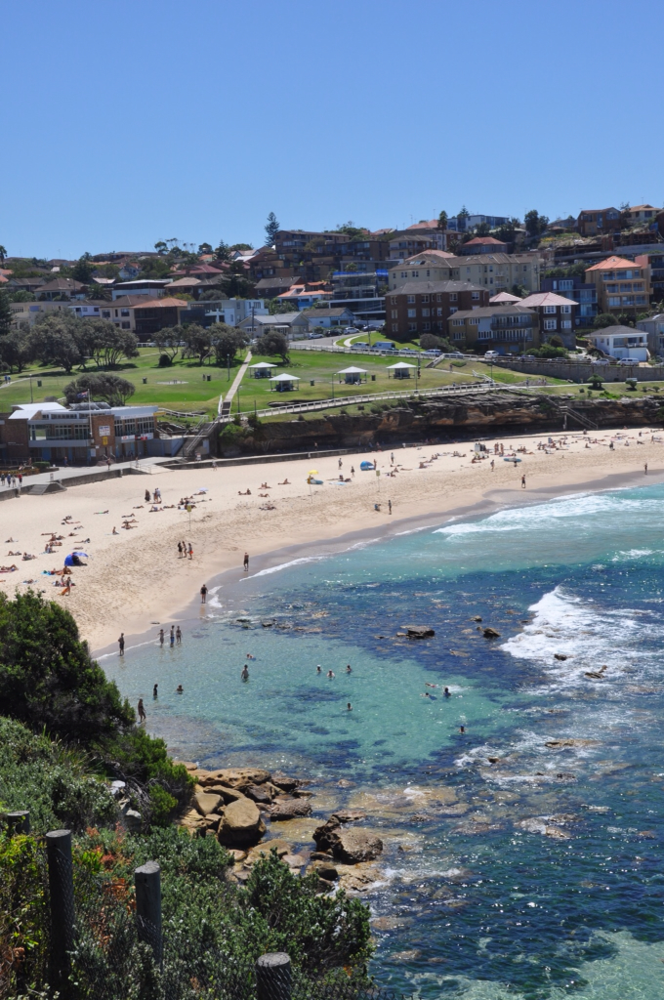

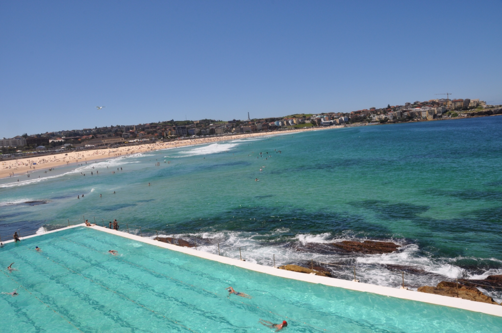

בשביל שינוי אווירת הטרקים של ניו זילנד וכניסה למצב רוח החופים של אוסטרליה, רכשה הנמלה בגד ים חדש וכל מיני סחבות פרחוניות. קבלו תמונות פפרצי של בגדיה החדשים של הנמלה:

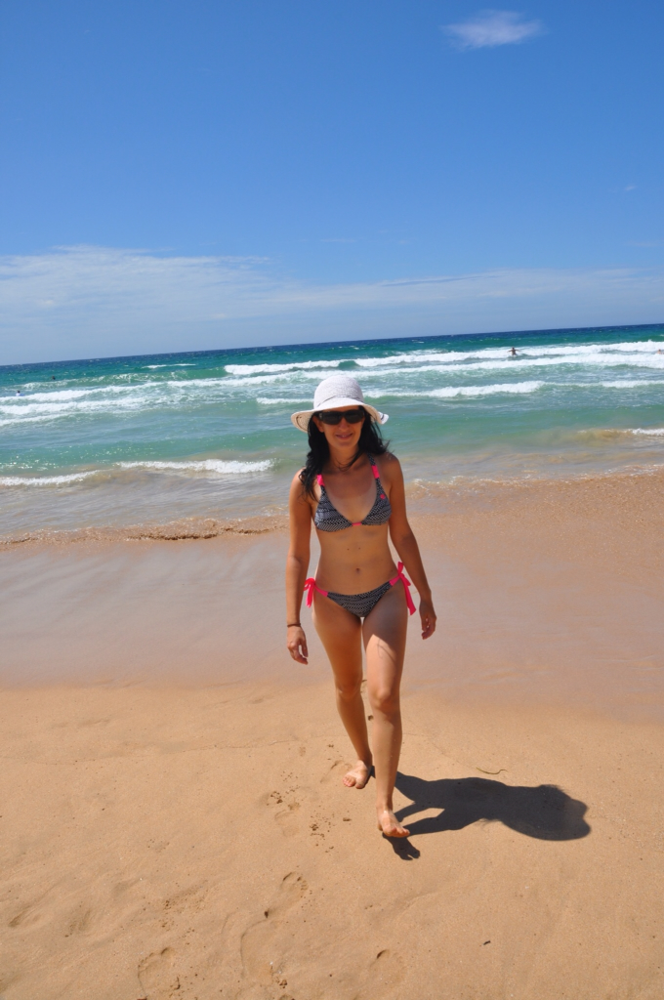

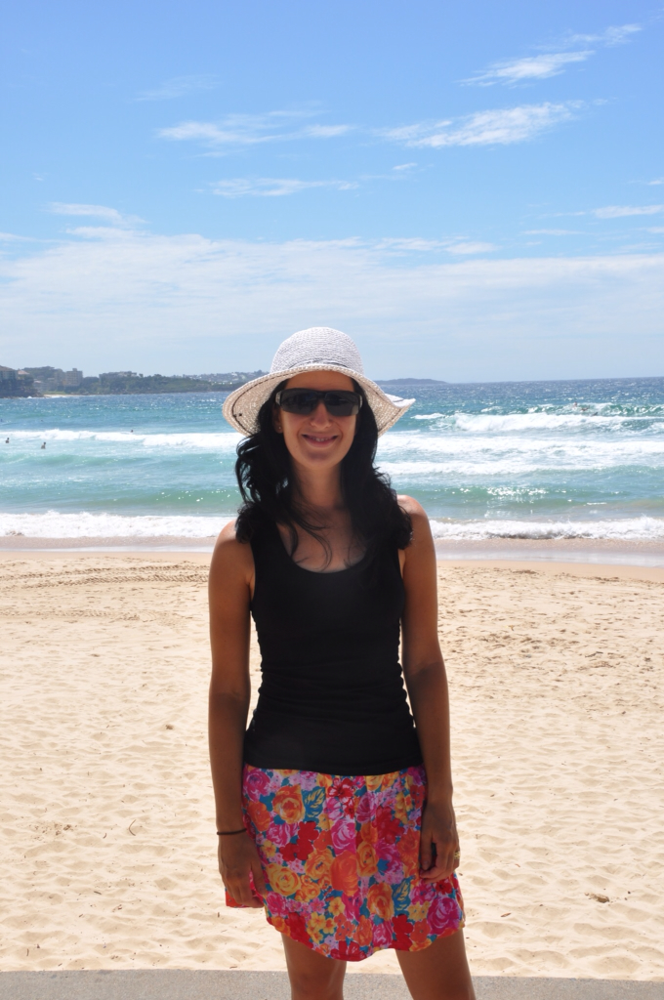

אם חשבתם שהנמלה העמלנית תסתפק בהחלפת המלתחה אז אתם לא בכיוון. נפלתי קורבן לשינויים שהוכתבו מלמעלה ונאלצתי להפרד ממחלפות ראשי שכבר הפליאו באורכן הפראי. חלום ה״קוקו״ שלי נגנז עד לפנסיה (או אולי בטיול הבא ?!). בשכונה ״לא טובה״ מצאתי מספרה מפוקפקת עם ספר מהסוג שלא היית רוצה לחתן עם הבת שלך. כדי לא להתחכם כשנשאלתי איך הייתי רוצה להסתפר ביקשתי normal men's haircut please - good old 'round the ears. הספר עשה פרצוף נעלב וניגש לעבודה.

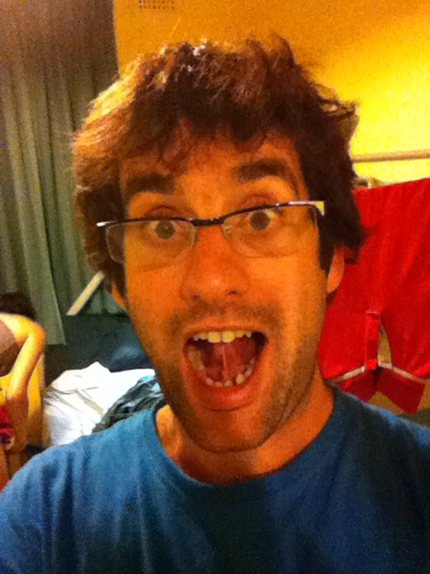
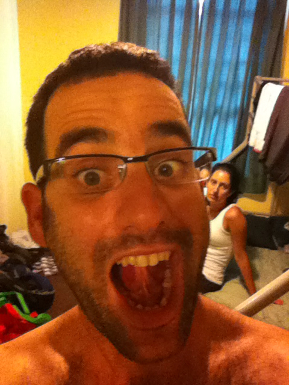
נסיים עם קורטוב של ״החיים טובים״. כאילו כדי לברך אותנו לשלום, בדיוק כשהגענו לסידני התקיים פסטיבל היין של new south wales. בדיוק מה שהיינו צריכים כמבוא ליינות האוסטרלים אותם אנחנו בקושי מכירים... חוץ מהשיראז האוסטרלי המפורסם יש פה לא מעט מיני ענבים וכמות יקבים ע-צ-ו-מ-ה (אוסטרליה היא יצואנית היין מספר ארבע בעולם). הפסטיבל היה מאורגן למופת. הצטיידנו בכוסות יין ובקופונים ויצאנו לשדוד את הדוכנים. האוסטרלים בניגוד לניו זילנדים יודעים לעשות גבינות כך שאת ארוחת הצהריים העברנו בפסטיבל על הדשא מול הופעה חיה עם גבינות ויין משובח.

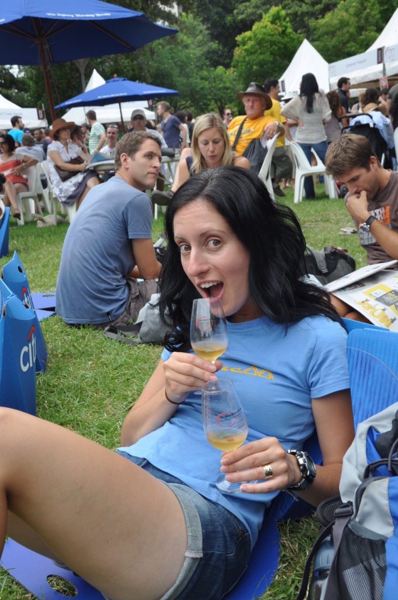

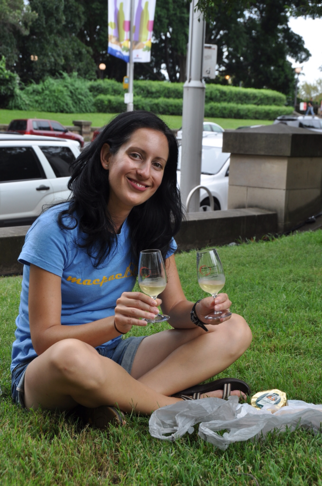

גם בגזרת הקולינרית יש חדשות! מאגר הנשמות שאני מכיל בתוכי גדל בסוג חדש של חיה - קנגורו! מזכיר משהו בין פרה לג׳ירפה - אבל לא בדיוק... מה שבטוח זה שיכולת הניתור שלי השתפרה פלאים! אוכלים כאן גם קרוקודילים וכרישים, אבל פרה פרה (או בשפה המקומית קנגורו קנגורו). ביקרנו בדוכן המיתולוגי של הארי שכבר כמעט מאה שנה מוכר פאי למלחים שמגיעים מהים וגם לא פסחנו על ארוחה סינית בצ׳יינה טאון. מאכלי ים טריים אנחנו ממליצים לקנות בשוק הדגים של סידני - מכינים לך אותם במקום לבקשתך טריים ישר מהים!

.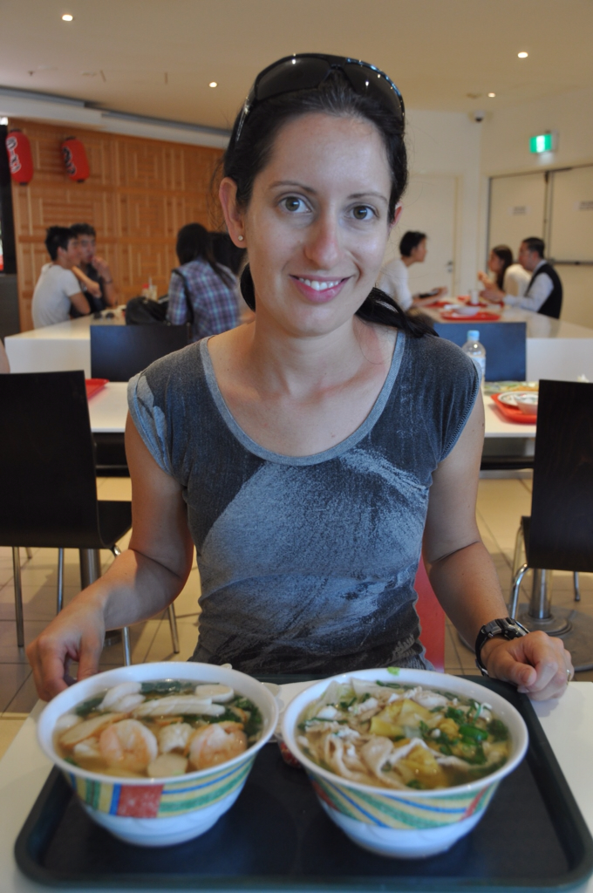

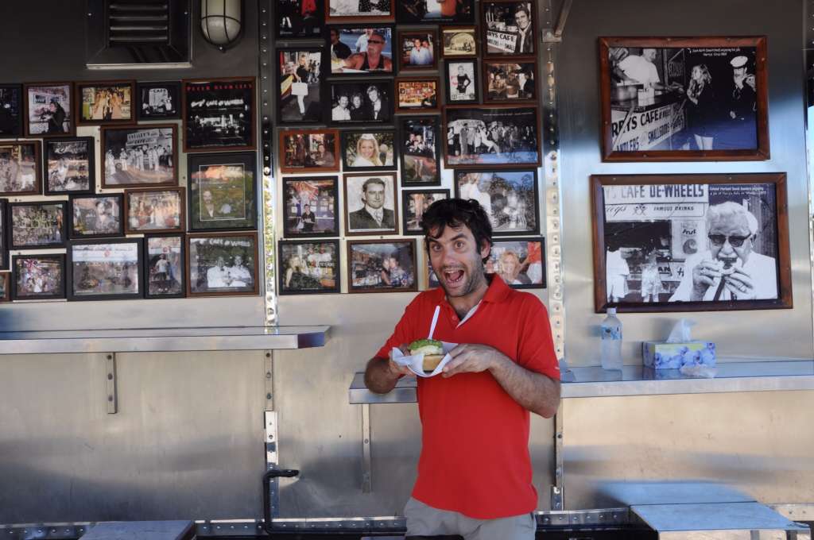
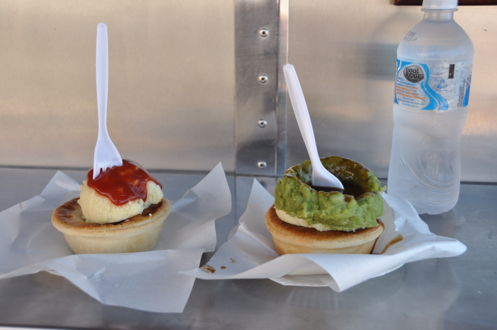

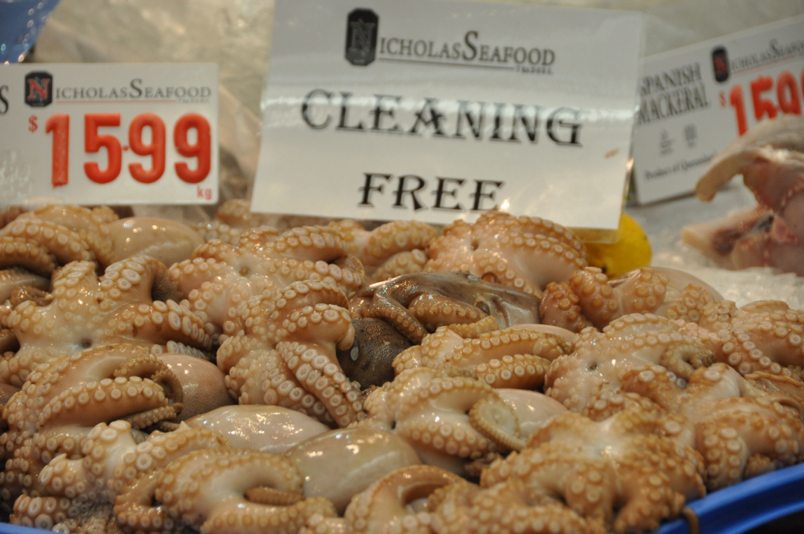

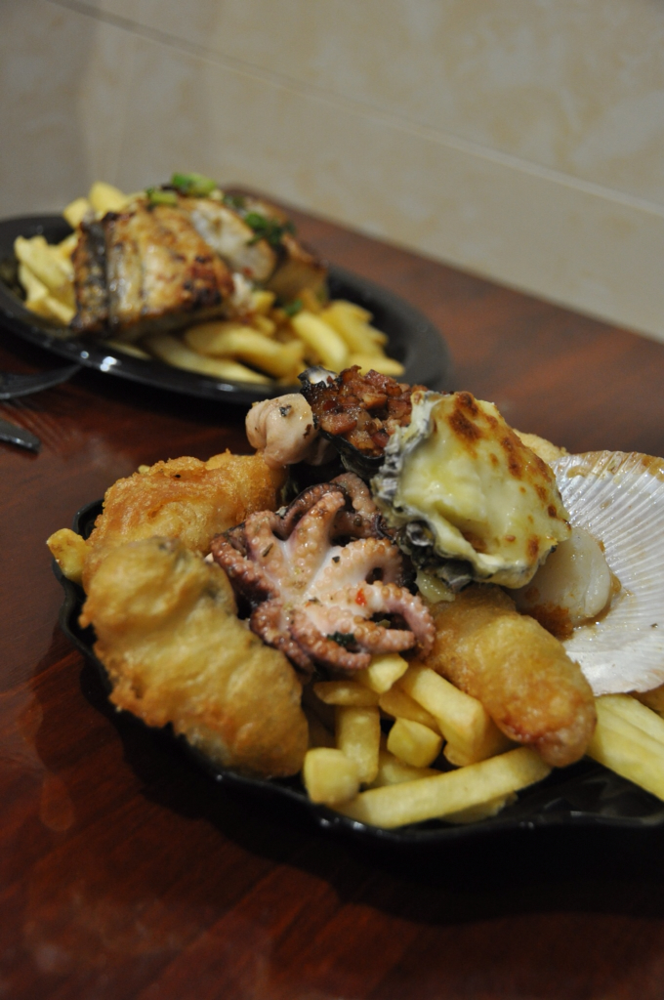
זהו לבינתיים. מחר בבוקר שוב מתחילה הרפתקה חדשה - נעזוב את סידני ונתחיל לנסוע צפונה. אוסטרליה - הנה אנחנו באים!

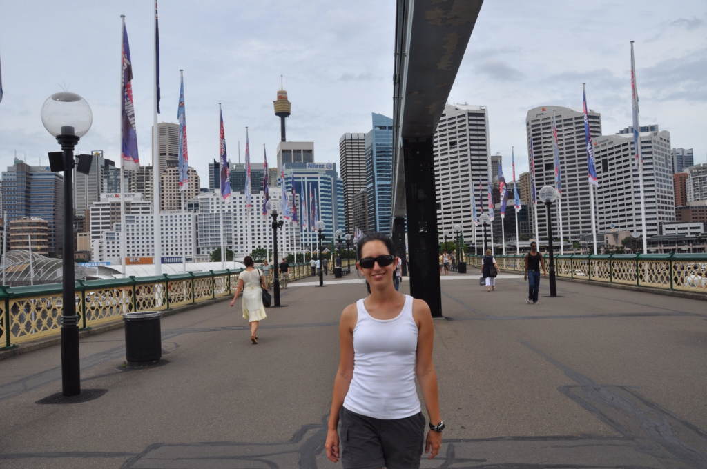

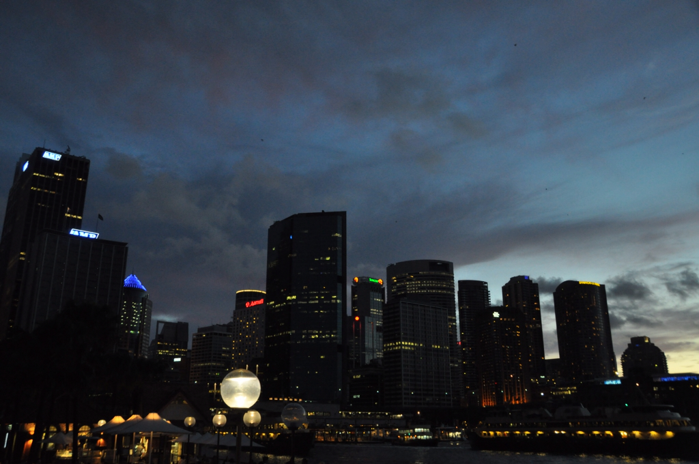
