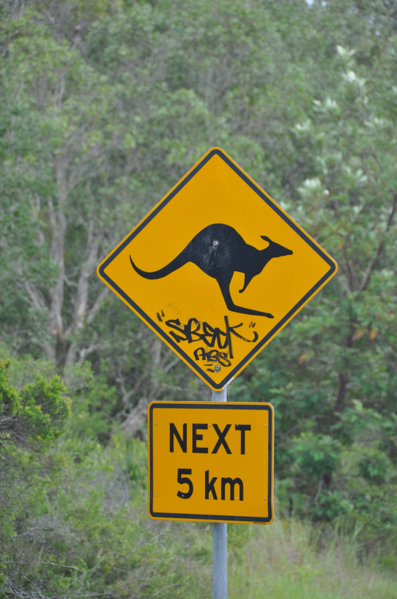
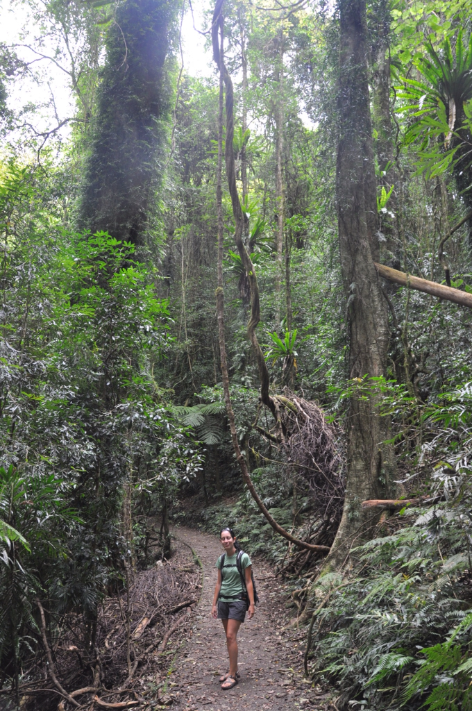

הטיול שלנו באוסטרליה שונה באופן מהותי מהטיול בניו זילנד. הקצב הרבה יותר איטי והרביצה תופסת את מקומו של הטיפוס בתור העיסוק העיקרי שלנו. את הכבישים המפותלים שזורי הכבשים מחליפות אוטוסטראדות מפלצתיות ומתוחזקות היטב שנמתחות על פני מאות קילומטרים. רוב אתרי הקמפינג פה ואפילו הפאבים גדולים יותר וכתוצאה מכך פחות ״אישיים״. הכל כל כך גדול אפילו הבננות - ואני מדבר על בננות באמת גדולות. אני יודע מה אתם מדמיינים, ואתם לא בכיוון -גדול יותר! מה, בננה באורך מטר? גדוווווווול יותר! משהו כמו 12 מטר! מה הוא דפוק? אולי קצת, אבל האוסטרלים דפוקים לגמרי. בשנות השישים, עיירות היושבות על צירי תיירות ראשיים החלו לנסות למשוך אליהן תיירים באמצעות בניית "big things". פסל של אננס עצום, שרימפס בגובה עשרה מטר, קואלה, גיטרה ואפילו בננה. מאז השיגעון האוסטרלי לא נפסק וברחבי המדינה ניתן למצוא מעל מאה big things שכבר מזמן הפכו לסמל אוסטרלי - משונה ביותר. כששאלתי אוסטרלי מה הסיפור הוא נתן לי תשובה כנה ובנאלית "We like big things"...

עוד על ״דברים גדולים״ - חפשו [כאן](http://www.bigthings.com.au/)

אז מיהם בכלל אותם ״אוסטרלים״? מה לעזאזל הם עושים כאן?! על ההיסטוריה של אוסטרליה בקליפת האגוז: באוסטרליה יש כיום קצת מעל עשרים מליון תושבים כאשר הצפיפות בה (אדם לקמ"ר) היא מהנמוכות בעולם. המתיישבים הראשונים באוסטרליה היו האובוריג׳ינים לפני כ50 אלף שנה (הרבה לפני המאורים הניו זילנדים) והיבשת נתגלתה על ידי האירופאים במאה השבע עשרה. פלישת האירופאים לאי החלה בשליחה מאסיבית של אסירים בריטים לסידני בסוף המאה השמונה עשרה, ובמשך עשרות שנים המשיכו לשלוח לערים האוסטרליות החדשות עוד ועוד אסירים - ומכאן בדיחות ה״פושעים״ שמתקשרות כל כך עם האוסטרלים. את הזרמת האסירים הפסיקו כשהבהלה לזהב התחילה למשוך לכאן אנשים שחלקם היו מפוקפקים עוד יותר מהאסירים. מה שהיה בעבר מקור לבושה, הפך בשנים האחרונות ל״קול״ - כאשר אנשים מתרברבים בכל אסיר שהם מצליחים למצוא בעץ המשפחה שלהם.

כבר בלילה הראשון מחוץ לעיר ניסינו את כוחנו בקמפינג בטבע הפראי של אוסטרליה. העברנו לילה באמצע פארק לאומי ״מיול לייקס״ - חנינו צמוד לחופו של אגם צלול ומשרה שלווה כשלפתע התחילו לקפץ לידנו קנגרואים סקרנים. מאושרים מהחיים רבצנו עם הקנגורואים בנקודה שכאילו נלקחה מסרט בלי שום דאגות. האמנם?

אבל תפאורה באור יום של יער נטוש עם אגם - יכולה להיות תפאורה של סרט אימה בלילה... האידיליה המושלמת נקטעה מהרגע ששמעתי את יעל אומרת בטון שאנחנו לא מצליחים לשחזר עד עכשיו ״יש פה תנין!״ אחרי בערך דקה בה שנינו יושבים באוטו משותקים ובוהים ב...תנין, עזר לנו חברנו החדש לקטוע את השקט שהרגיש כנצח כשפתאום הוא קם, ברח במהירות וטיפס במיומנות על עץ לגובה של כחמישה מטרים. זה נכון שלא ממש הקשבתי בשיעורי ״טבע״ בבית הספר, אבל אפילו אני יודע - תנינים לא אמורים לעשות את זה... אחרי בדיקה באינטרנט גילינו שמדובר ב״לטאת כח תנינית״. ללטאה שיכולה להגיע לגודל של תנין יש אב קדמון משותף עם הנחש מה שאומר שבנוסף לכל הצרות - היא ארסית... מאותו הרגע נהיה פחות ופחות נעים וככל שהערב נמשך ראינו עוד ועוד יצורים שהיינו מעדיפים לראות בגן חיות - עכביש בגודל של ציפור קטנה ומיני חרקים שונים ומשונים - נשבענו שמעכשיו במדינה הזאת נישן אך ורק באתרי קמפינג יותר מסודרים. הרכב שהשכרנו כאן אמנם יותר משופצר - עם כיור קטן וגז מובנה, אנחנו עדיין מתגעגעים ללאקי אליו כל כך התרגלנו.

מממ.. טים טאם... להפתעתינו את הממתק האוסטרלי המפורסם מעדיפים המקומיים לשתות דווקא עם תה (ולא קפה). משונה לא פחות העובדה שמספר עוגיות הטים טאם באריזה הוא ראשוני (11) כך שלא משנה עם כמה אנשים תחלוק את החבילה תמיד זה יגמר בריב :)

חוץ מבטים טאם, אוסטרליה גם מפורסמת בחיות הכיס שלה - קנגרואים, וואלאבי, קואלות וכו. חוץ מלאכול אותן מידי פעם, האוסטרלים מתגאים בחיות הייחודיות הללו ומנסים לשמר אותן. בפורט ביקרנו בבית חולים לקואלות. ביוזמה הממומנת מתרומות בלבד הוקם בית חולים ייחודי זה אליו מגיעים קואלות שנדרסו, שנפלו מעצים וסתם קואלות שרוצים לקבל אישור לחדר כושר. בסיור בבית החולים יצא לנו לראות האכלה של קואלות בשיקום ופיזיותרפיה לקואלות לפני החזרתם לטבע - מאד מרשימה העבודה שעושים כאן - והקואלות מתוקים!

אבל הדבר האמיתי כאן באוסטרליה הוא החופים - שמש אוסטרלית קטלנית וים צלול. בחופים אנחנו משתזפים, רובצים וקוראים. הנמלה הפכה עורה ובמקום נמלה לבקנית ועמלנית היא עכשיו תולעת ספרים חומה. חוץ מעורה השזוף היא כבר קוראת באנגלית מהר יותר משאני קורא בעברית! הטיולים שעשינו בפארקים הלאומיים כאן בינתיים היו נחמדים - יש כאן ג׳ונגלים עבותים וגדולים אבל האמת היא שאחרי ניו זילנד, קשה להתלהב מהנופים פה ואנחנו בדך כלל מעדיפים פשוט לשכב בחוף.

עוד חוף אוסטרלי

״חתולי הרחוב״ של האזור בו אנו ישנים עכשיו הם ״התורכים״ תרנגולי הודו גדולים ואניני טעם - הם אוהבים לחטוף אוכל בעיקר מהצרפתים... חוץ מזה כל המדינה הזאת גדושה בחיות וכשיוצאים לעשות פיפי בלילה כדאי מאד לקחת פנס כדי לא לדרוך על שום דבר נוראי.

 

 

 

