ביירון ביי (Byron Bay) היא אחת העיירות המתוירות ביותר בחוף המזרחי של אוסטרליה. העיירה מלאה בהיפים מכל הגילאים ששורצים בעיר כשהם מסטולים מגראס אורגני. גם אם תתאמצו לא תצליחו להשיג כאן קפה שאינו ״אורגני״, לאתר מקומי שבבעלותו נעליים או לעבור בלוק אחד מבלי להשבע שראיתם את בוב מארלי. בעיירה יש כמובן גם חוף רחצה יפה והרבה אפשרויות בילוי ליליות.

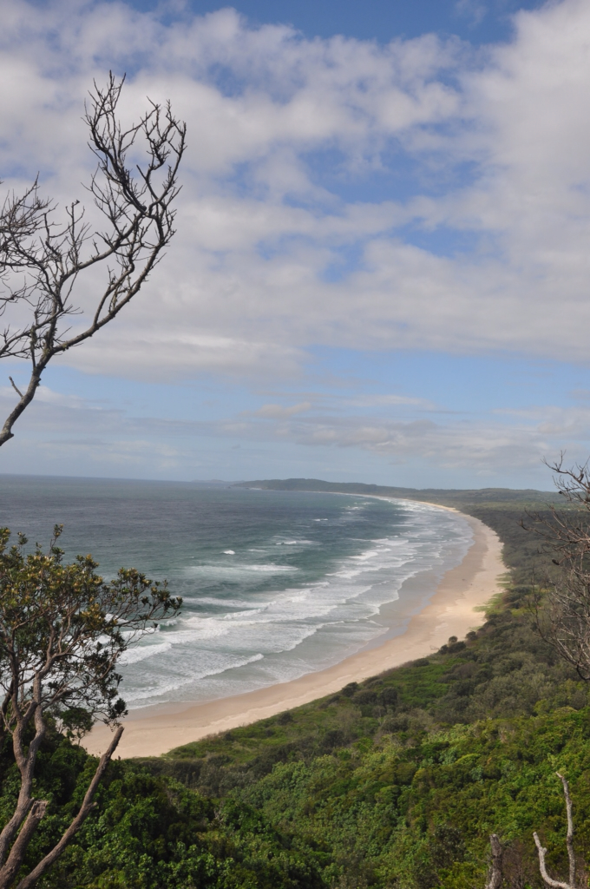
בביירון ביי חגגנו את יום הולדתי - בבוקר אשתי היקרה הכינה ארוחת בוקר אנגלית מלאה ומוגזמת כמו שמותר רק בימי הולדת. בהמשך ביקרנו במבשלת בירה מקומית (אורגנית כמובן) והמשכנו בסבב פאבים עד הלילה. באחד הפאבים הרשנו לעצמנו לאכול בחוץ - הדולר האוסטרלי התחזק מאד לאחרונה והכל - ובפרט האוכל - יקר בצורה מוגזמת!

 

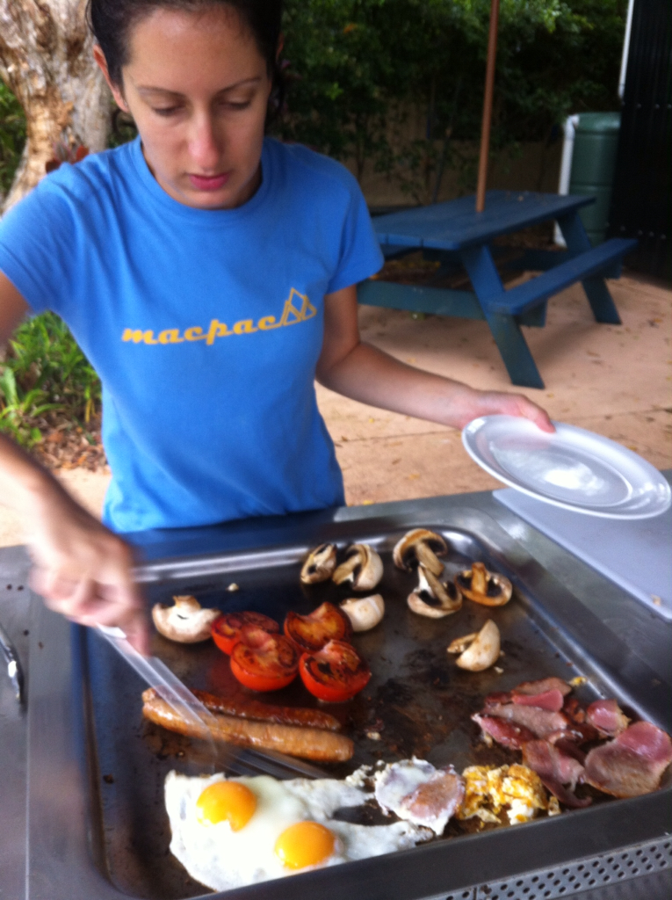

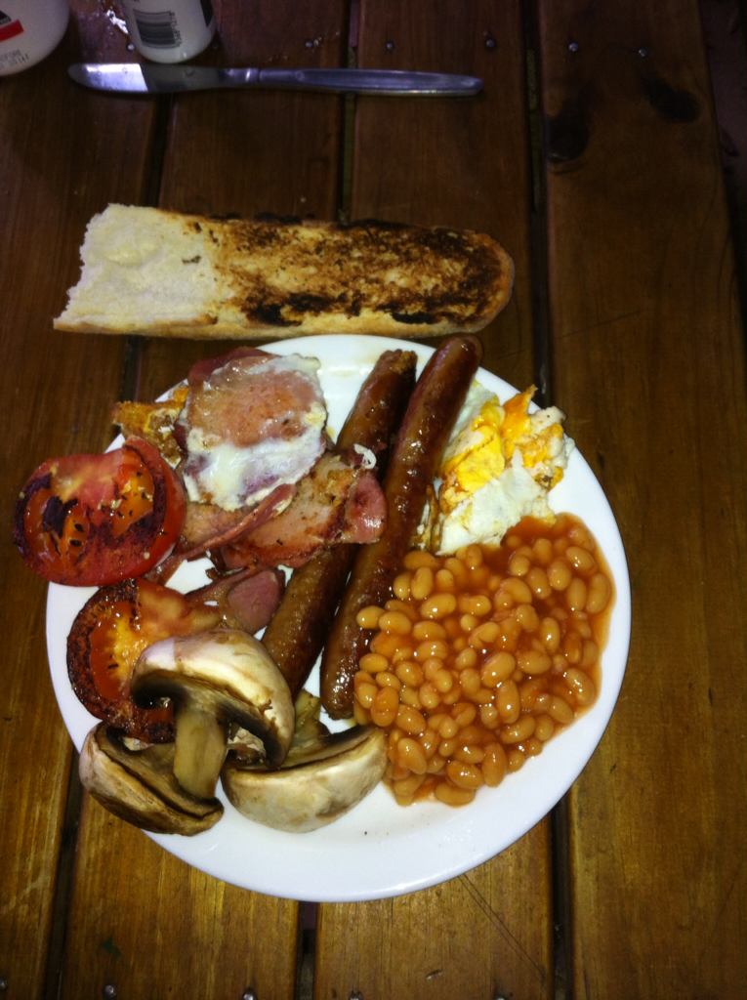
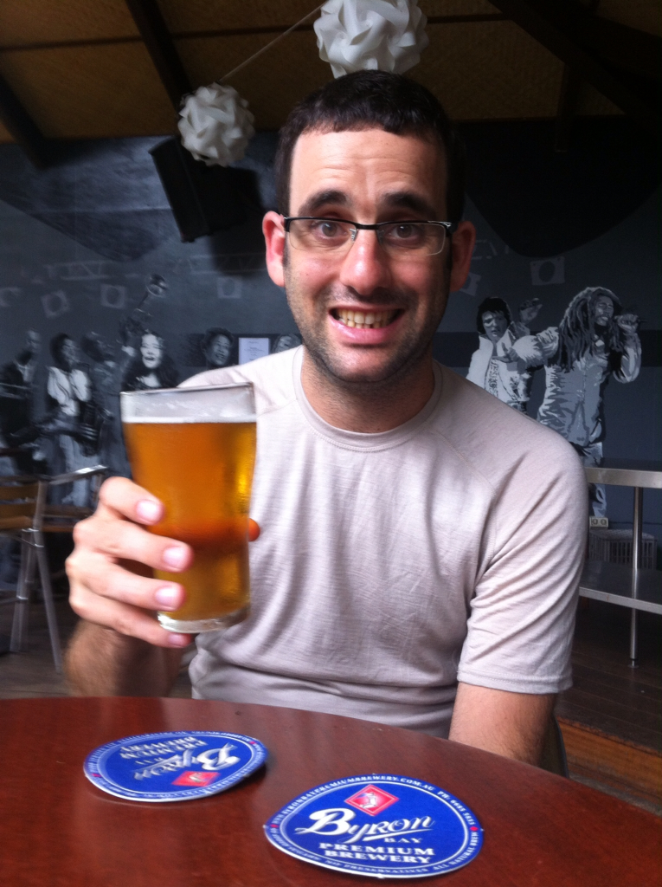

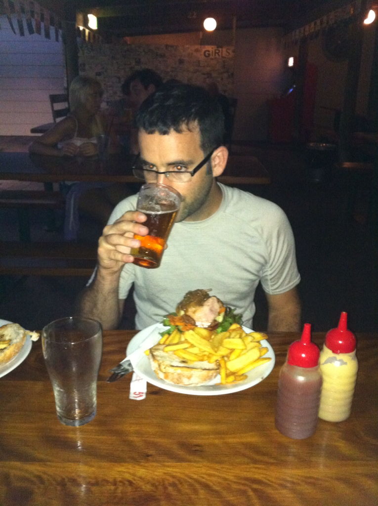
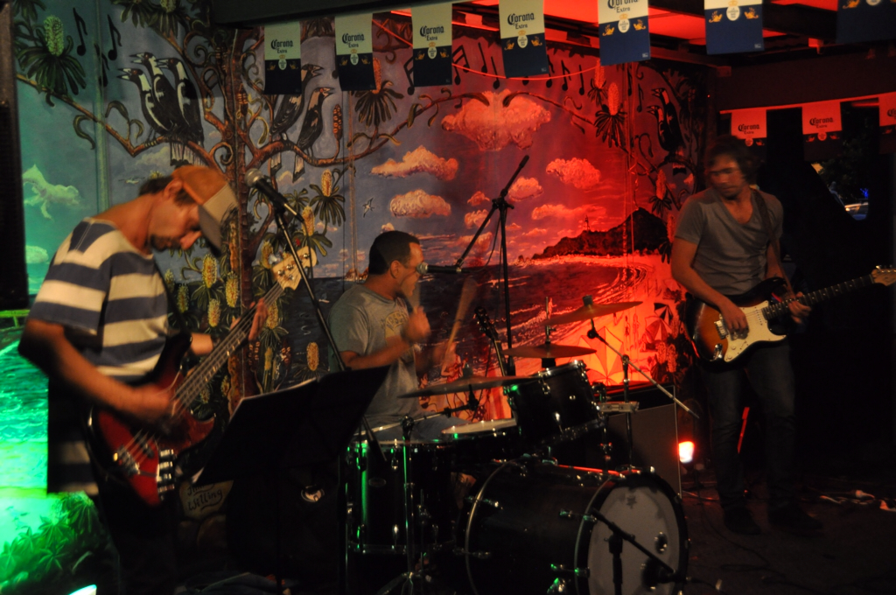
״אוי לי! אוי לי! אני כבר מאחר״ - אמר הארנבון, החזיר את השעון לכיס האפוד, זינק ממקומו ופתח בריצה. נמליסה עקבה אחריו עד שגם מצאה סוף סוף את דרכה אל ארץ הפלאות - דרך נימבין. נימבין היא האמסטרדם הלא רשמית של אוסטרליה - כלומר חוץ מהבית של אנה פרנק... למרות שזה לא חוקי בעליל - סוחרים מקיימים פה תעשיה שלמה ברחובות צדדיים ומוכרים קנאביס על כל מוצריו. בעיירה הפצפונת הוקם מוזיאון החשיש (שגם בתוכו לחשנים ינסו לדחוף לך ספייס קוקיז) ונדמה שהעיירה כולה מתבשמת בענן אחד גדול ומאושר. אל העיירה הגענו באוטובוס צבוע בצבעי הקשת המנוהל בידי היפים הזויים שגם הם מנסים למכור לך בדרך עקיפה את סחורתם. בדרך עוצרים בכל מיני מקומות שהיפה מביניהם הוא מפל גדול הנשפך לבריכה רחבת ידיים. הביקור בנימבין היה חוויה משונה ומיוחדת במינה. קשה להגיד אם העיירה ההזויה הזאת היא תחנה בדרך לגן עדן, גיהינום - או אולי לשניהם...

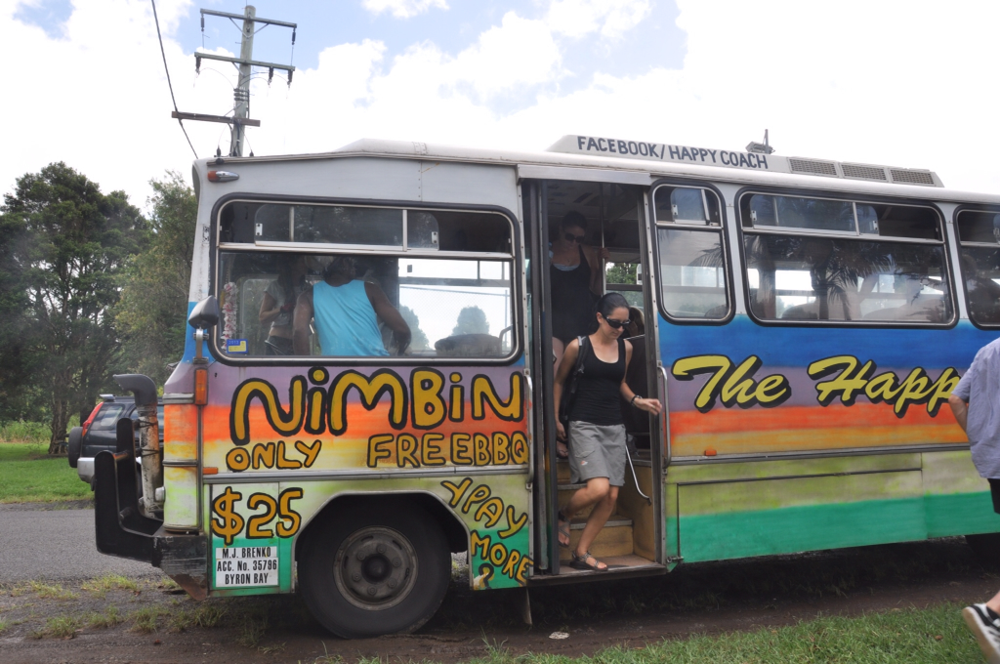
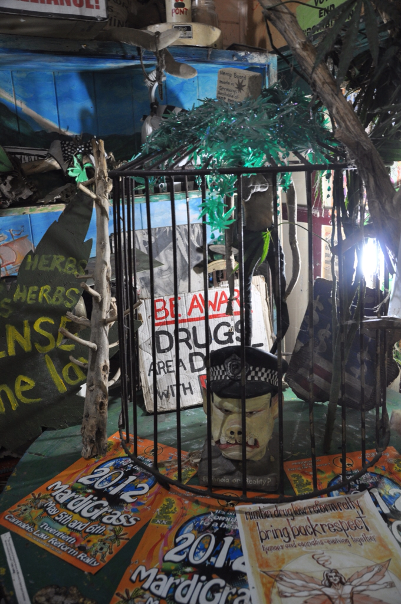

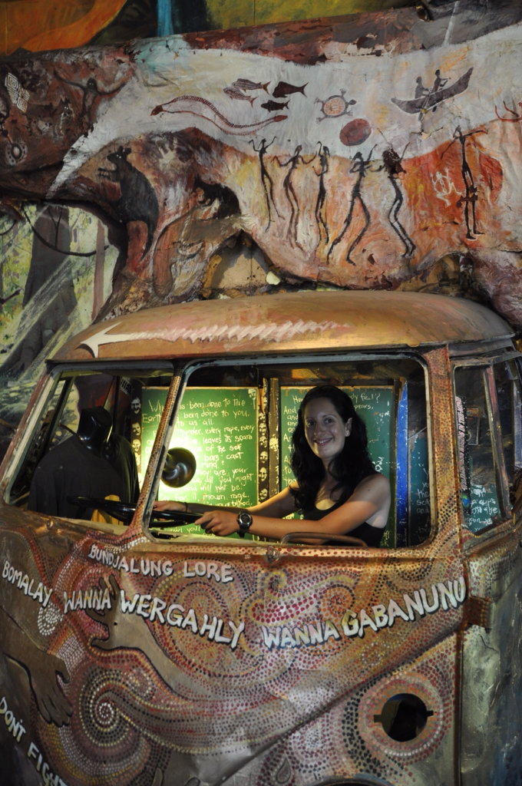
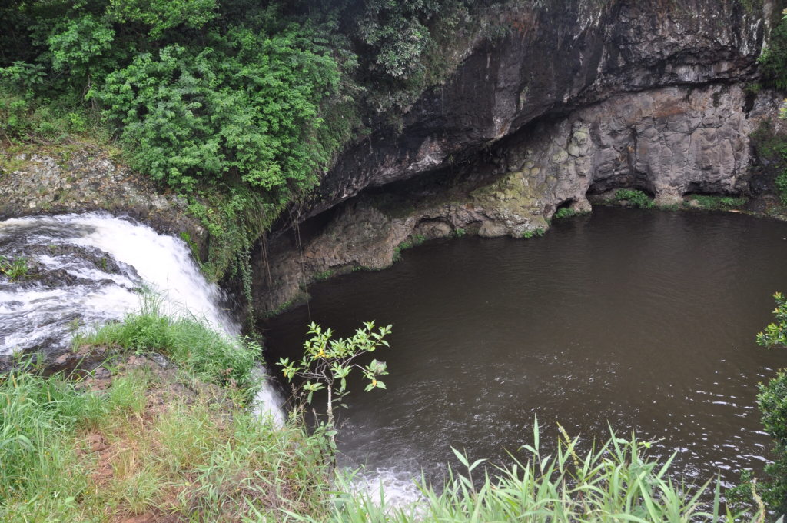
מביירון נסענו לאזור הGold Coast - רצועת חוף באורך 70 קילומטר שמלאה בחופים נהדרים, אתרי גלישה מפורסמים ומלונות מפוארים. את גורדי השחקים (מלונות ודירות נופש) של העיירה התוססת Surfers Paradise ניתן לראות ממרחק והיא נוצצת ממש כמו לאס וגאס קטנה. מזג האויר היה מושלם וגם הפיש אנד צ׳יפס שהוגש בכל מקום. הדבר היחיד שחרק במקום היפה הזה הוא המצלמה שלנו שהתחילה להתלונן שבזמן שאנחנו בחופשה כל כך ארוכה - היא צריכה לעבוד שעות נוספות. התמונות מהחופים היפים הללו ישארו רק בזיכרננו ובמעט שהצלחנו לסחוט מהמצלמה או מהטלפון - עמכם הסליחה.

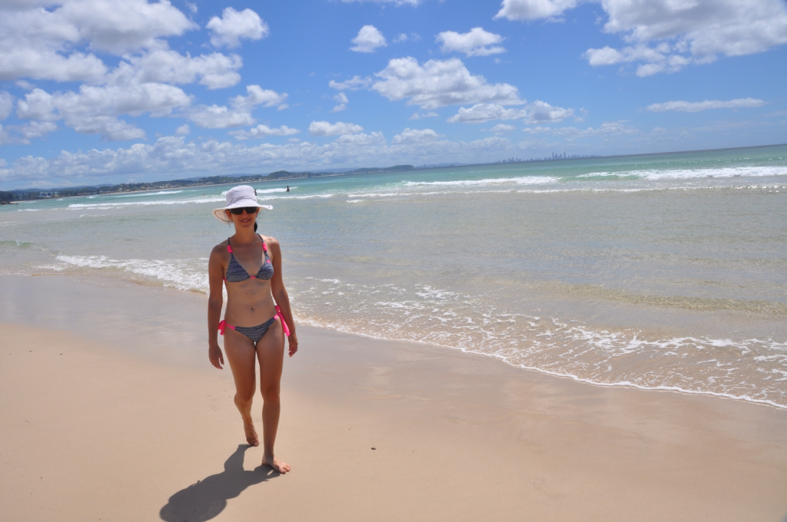
אחרי שנמאס לי לקנא באלפי הגולשים שאנחנו פוגשים בכל פינה, החלטתי להצטרף לחגיגה. לקחתי שעור למתחילים בבית הספר לגלישה של אלוף העולם לשעבר שיין הוראן. המטרה של השיעור הראשון היא לנסות לגרום לך להצליח להעמד על הגלשן ולהרגיש איך זה לגלוש בים האוסטרלי ביחד עם עשרות מיני כרישים וגולשים מקועקעים. משונים הם סדרי עולם - למרות שאני גר במדינה שהיא חוף אחד ארוך הייתי צריך לנסוע לצד השני של העולם כדי להתנסות בגלישת גלים. אחרי כמה נסיונות מביכים, טיפים משיין עצמו ושתיית כמה ליטרים טובים של מי ים עמדתי במשימת השיעור הראשון. איכות התמונות - ללא אחריות :(



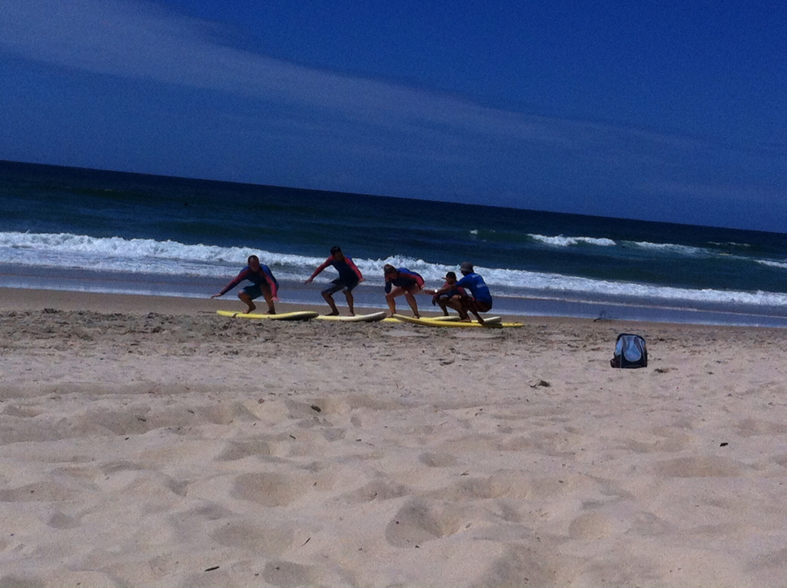

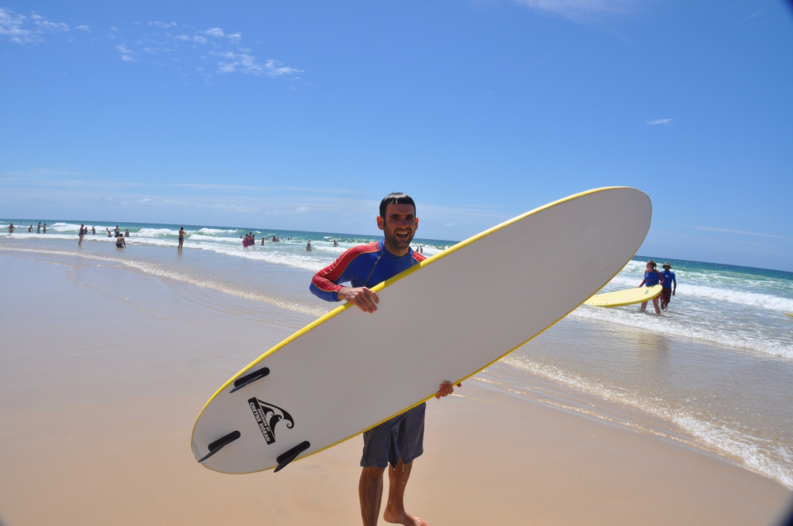

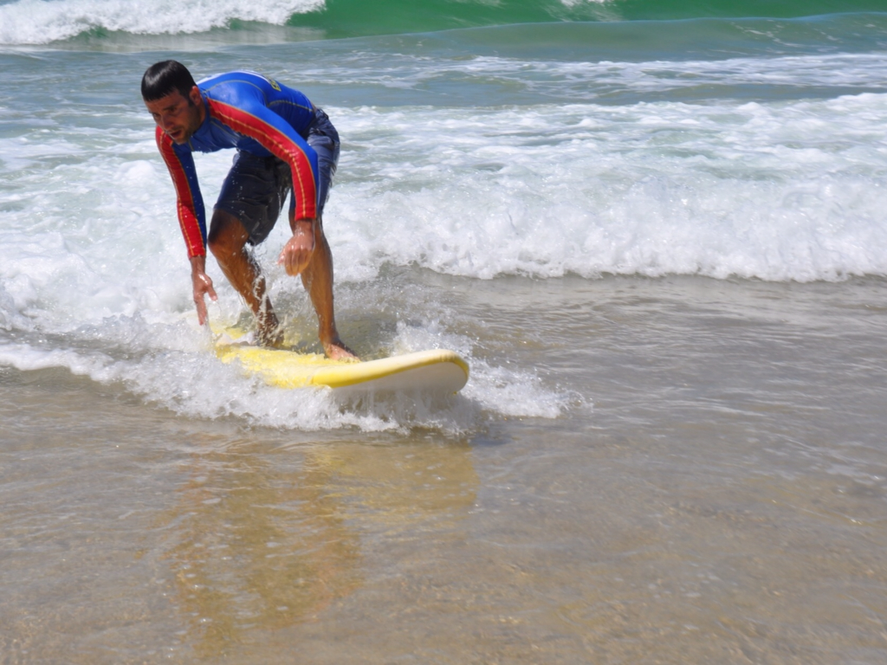
