באזור בריזבן התארחנו אצל ברט שעובד איתי בחברה והפתיע אותנו בהזמנה נדיבה להתארח עם משפחתו הצעירה. כיף אחרי כל כך הרבה זמן לגור בבית אמיתי, לישון במיטה אמיתית ולהתקלח בלי כפכפים. מעניין מאד להשוות את סגנון החיים של זוגות צעירים במדינות השונות. בעוד אצלנו ״מרוץ החיים״ מכתיב קצב חיים פסיכי לגמרי, החיים כאן נראים הרבה יותר רגועים. הבתים כאן ענקיים וכמעט בכל חצר יש בריכה! בדומה לארה״ב, המרחקים העצומים כאן גורמים לך לחשוב פעמיים לפני שאתה מוציא את התחת מהבריכה. לא פלא שWynter התינוקת המקסימה אף פעם לא בוכה ואדי אף פעם לא נובח.

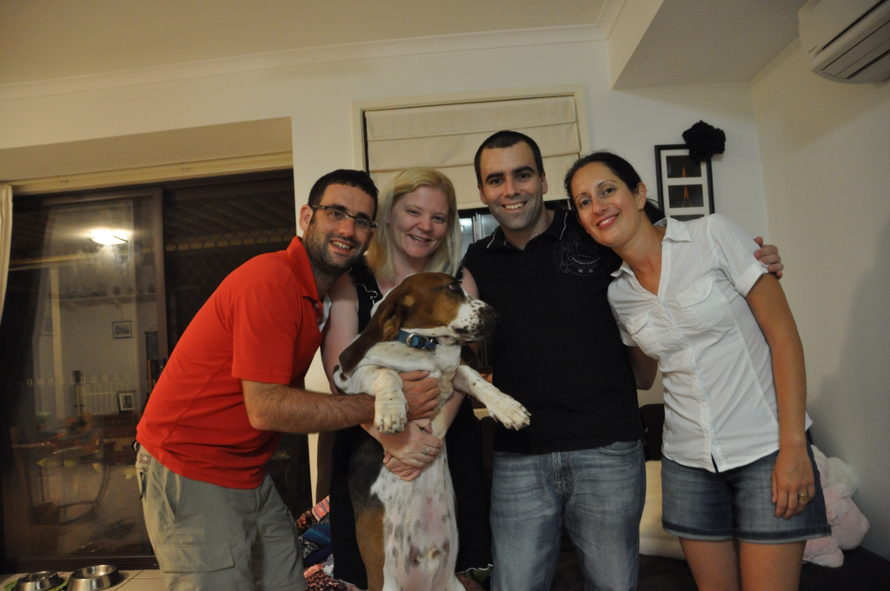
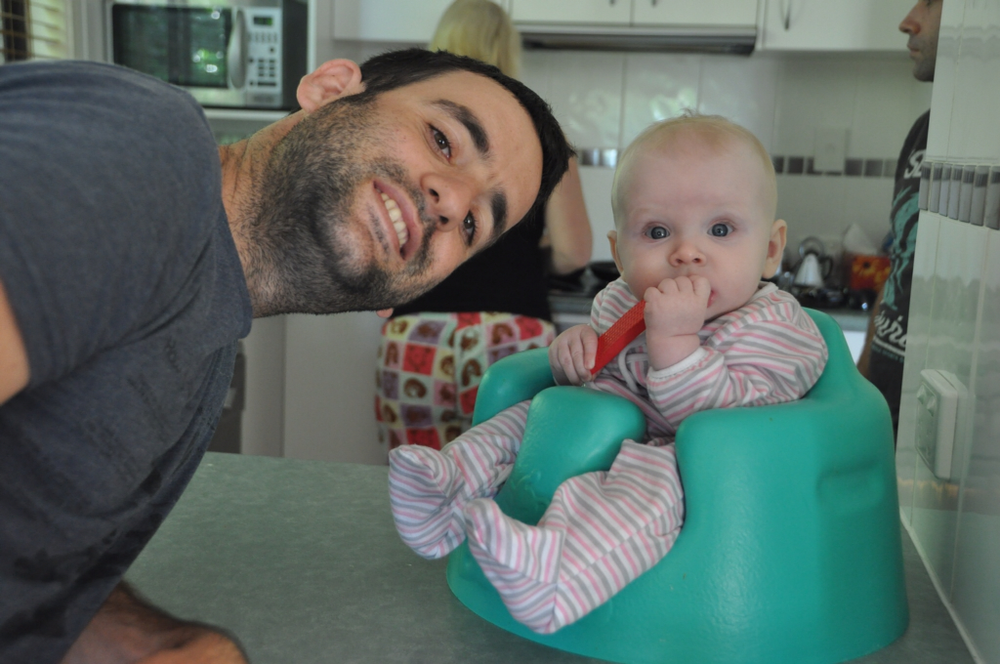
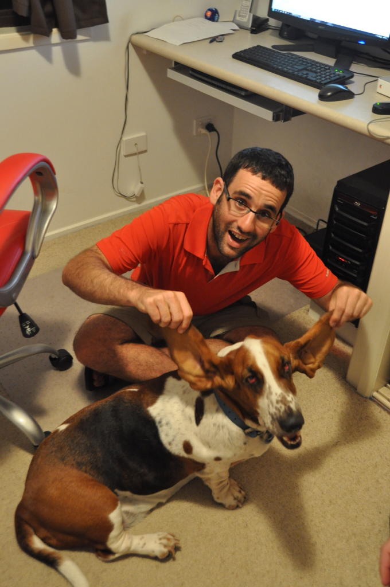
ברט היה שגריר אוסטרלי למופת ודאג שנטעם את כל האוכל האוסטרלי הקלאסי וכשלא יכולנו לנסות מהכל - צייד אותנו לדרך. בין היתר טעמנו משחת נעליים סגולה ומלוחה בשם Vegymite, שמיוצרת מתוצרי לוואי של בישול בירה, ואוסטרלים מחוספסים נוהגים למרוח על טוסט. בערב שתינו כמה כוסות של קולה עם הרום המקומי Bundaberg שלדעתי מזכיר קצת טעם של אגבה כחולה מקסיקנית והלך מעולה עם ברביקיו אוסטרלי בחצר. ערב אחד יצאנו למסעדה תוך כדי שיעל ממלמלת כל הזמן שהיא מתגעגעת לבגדים שלה בבית ולרגע הרגשנו קצת כאילו אנחנו לא בטיול, אלא בבית.

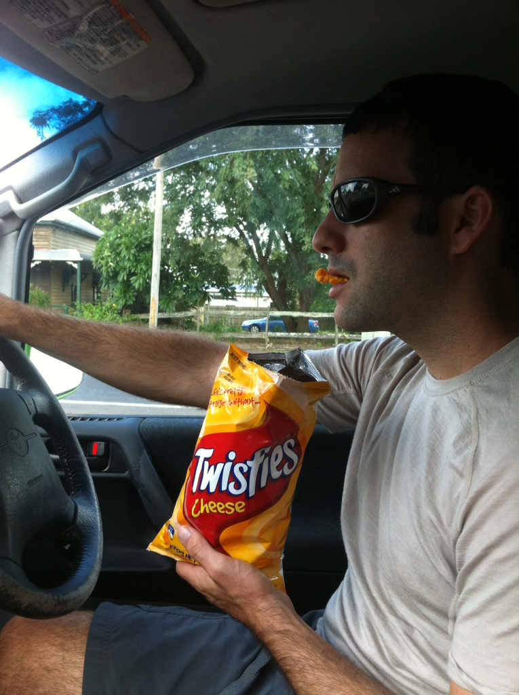
אחרי שהתלוננו קצת על הבירות האוסטרליות הבינוניות קיבלנו המלצה לבקר במבשלה של הבירה הרצינית היחידה שטרם טעמנו כאן (fourx (xxxx ולא התאכזבנו. היינו במבשלה כמעט יום שלם! בתום הסיור מקבל כל אחד 4 כוסות בירה מלאות. ישבנו בפאב של המבשלה, זללנו ושמענו מוזיקה איכותית. אפילו התמזל מזלנו והגענו ביום היחיד בשבוע בו ניתן לטעום בירה הישר מחביות עץ. בעיר מצאנו גם טכנאי Nikon רשמי שתיקן לנו את המצלמה ואפילו עשה את זה בחינם. לא סתם אומרים שבבריזבן יש את איכות החיים הגבוהה באוסטרליה - כולם נחמדים אליך ושותים בירה כל היום.

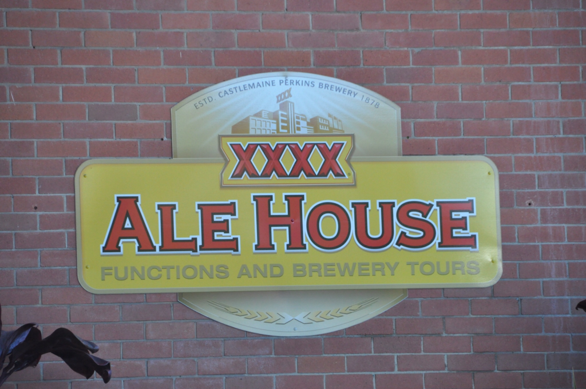

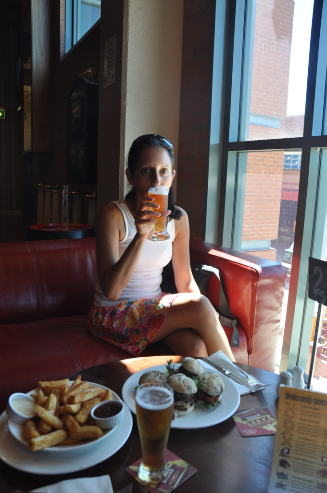

באיזור בריזבן נמצא ״גן החיות האוסטרלי״ בבעלותו לשעבר של סטיב אירווין הלוא הוא ה-Crocodile hunter האגדי. סטיב נהרג ב2006 במהלך צילומים לסרט טבע כשאיזה דג-מפלצת דקר אותו ישר בלב. סטיב, שהיה סמל אוסטרלי אהוד השאיר אחריו גן חיות מדהים שמכיל הרבה מהחיות שהוא עצמו הציל. כמעט ליד כל כלוב מוצגים תצלומים של סטיב כשהוא לוכד את אותה החיה - לא משנה כמה גדולות השיניים שלה. בכל פינה יש שלט ענק עם תמונה ענקית של סטיב עושה פרצופים מצחיקים. קצת הגזימו עם סחיטת זכרו של סטיב עד שכבר דאגתי שעוד נמצא אותו מפוחלץ ומוצג לראווה בחנות המזכרות.

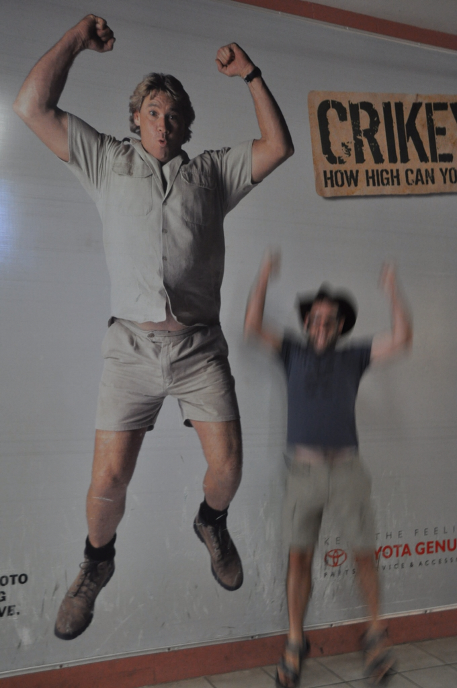
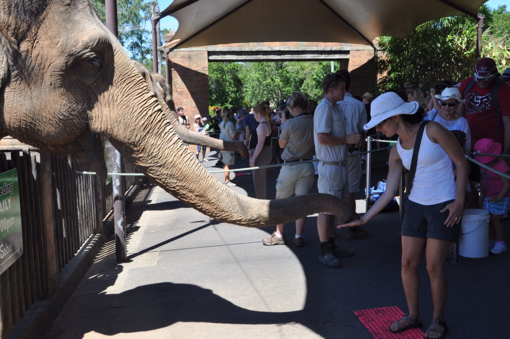

יעל לפני חיטוי ידיים יסודי ביותר

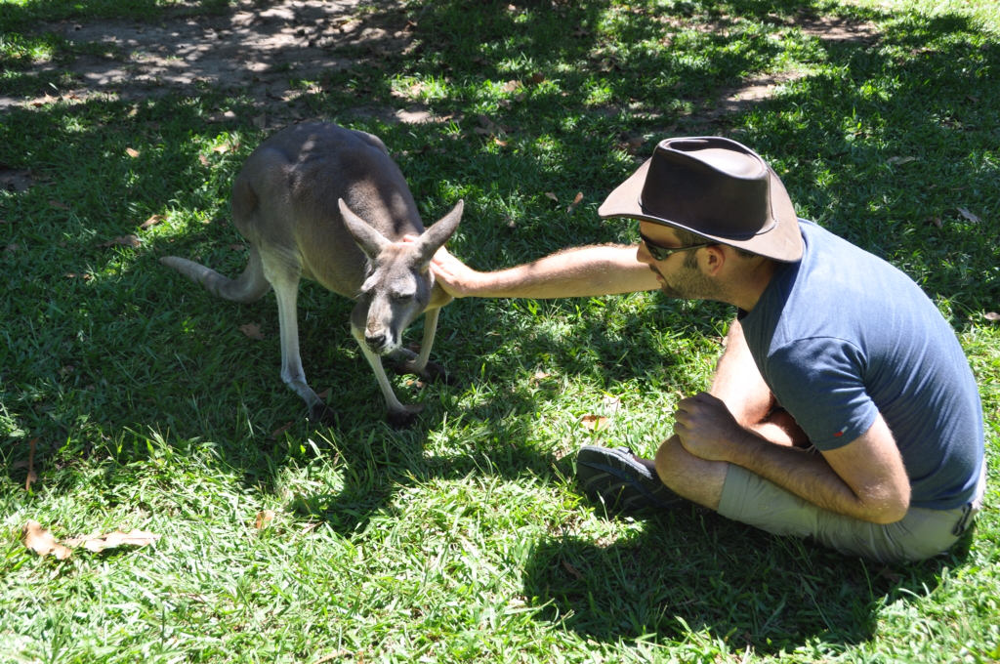

קנגורו רך ונעים

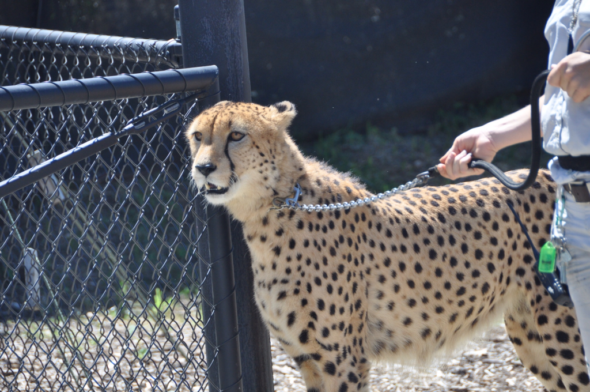
אחרי שליטפנו עוד קנגורו וקואלה שהשתמשו בהגזמה במרכך שיער, הלכנו למופע המרכזי המפורסם של הגן. במיני-איצטדיון ישבנו וחזינו במופע ציפורים מאולפות מרהיב, בנחשים, בעופות נדירים ובמופע המרכזי - האכלת התנינים. עובד גן שנראה די מבוהל החל לנופף לתנין בתרנגולות ודגים, להחזיקם מעל התנין ולברוח רגע לפני שהוא עצמו נטרף - מעניין כמה הוא משלם על ביטוח חיים...

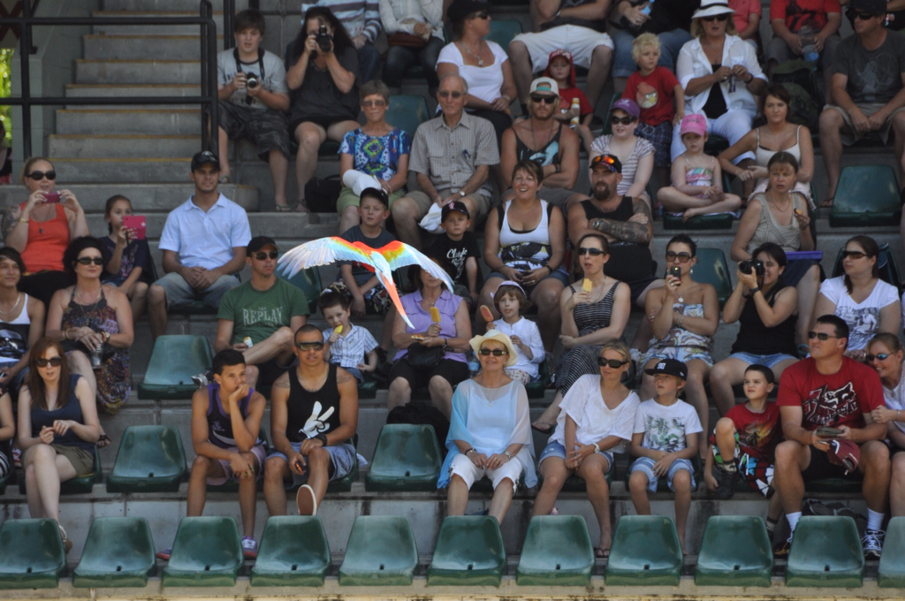
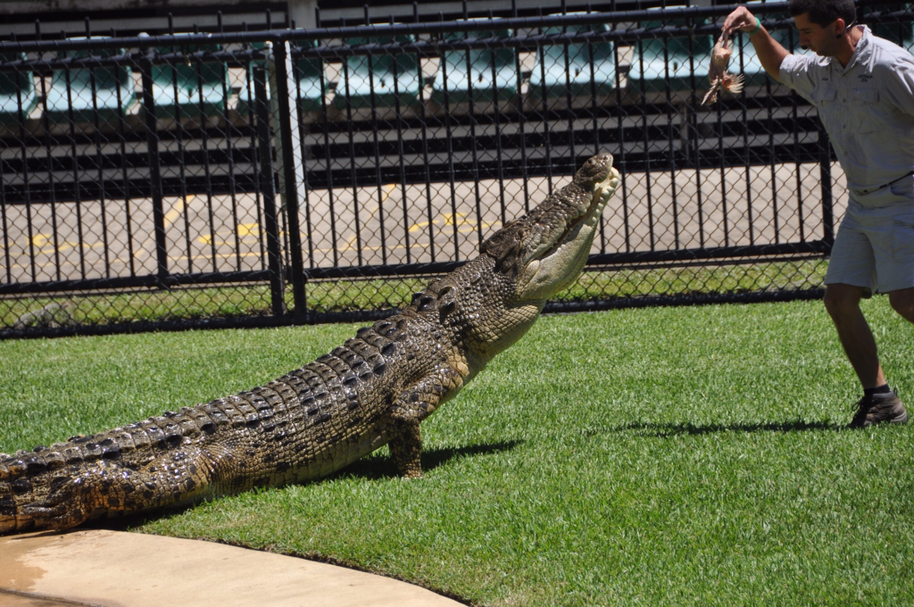

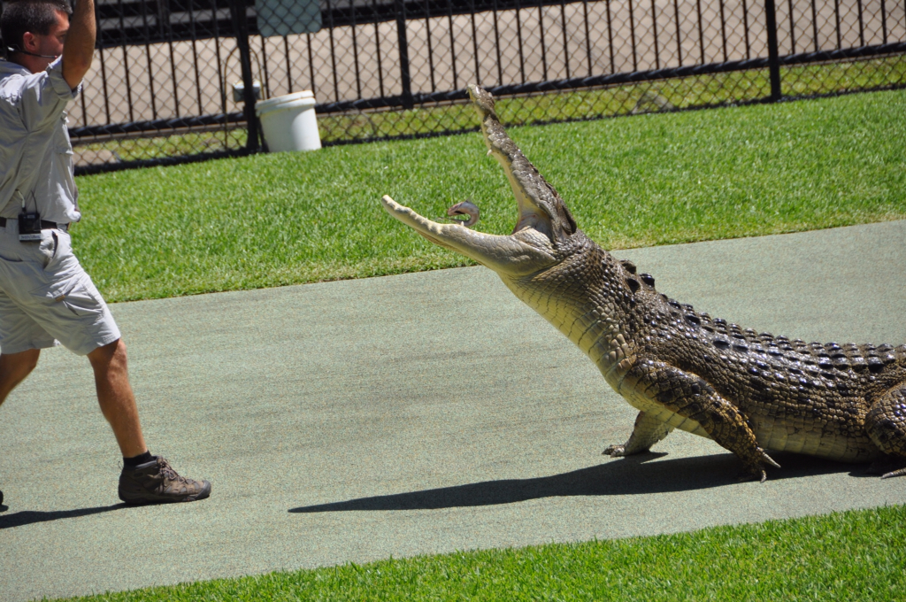

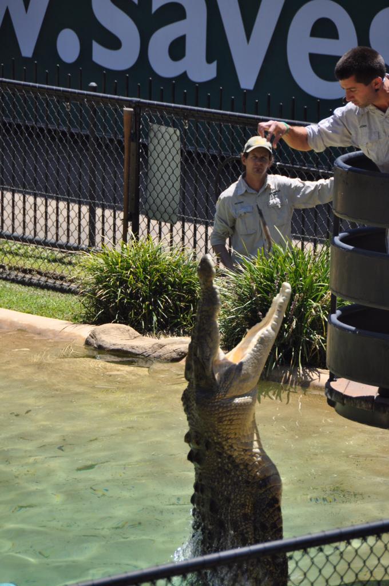

הגן היה גדול מאד ועשיר בחיות אוסטרליות שעדיף היה לא לדעת שמסתובבות שם בחוץ. איזשהו מהלך אבולוציוני עתיק ומרושע ביבשת הזאת גרם להתפתחות של חיות גדולות, ארסיות ומחודדות שיניים. לצד החיות המפלצתיות התפתחו כאן גם המוני מינים של חיות כיס מתוקות כמו ה Wombats - חיה שפשוט בא לך להתכרבל בה. רוב חיות הכיס טיפשות מידי בכדי להסב נזק למישהו והן צמחוניות וחביקות - חוץ מהשד הטזמני הערמומי. הגן מתפרש על שטח גדול מאד ולמרות שביקרנו בו כ5 שעות, עדיין לא הספקנו לראות את כולו.

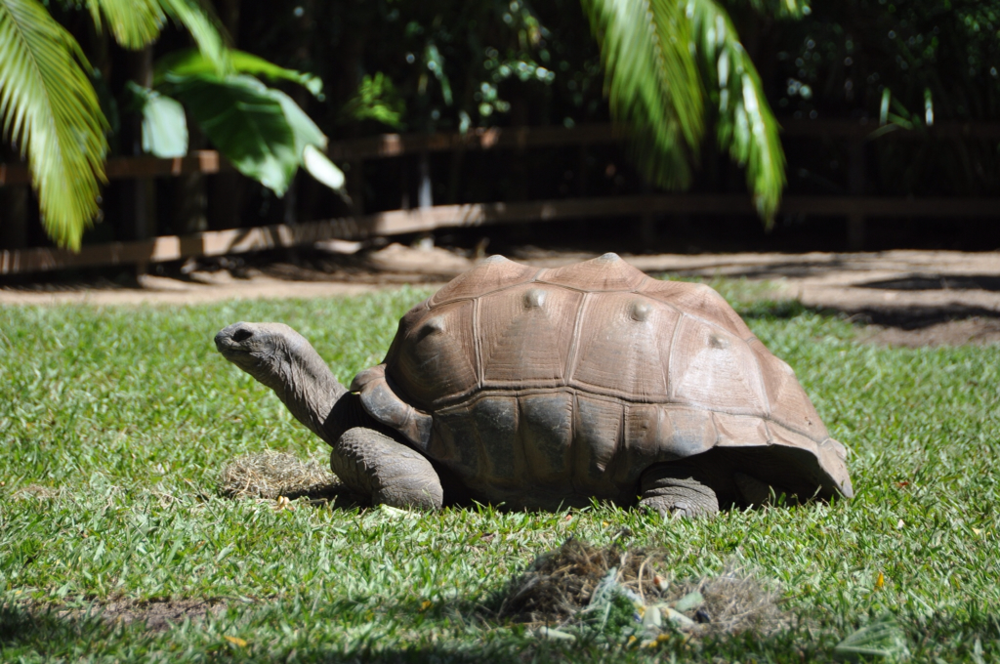

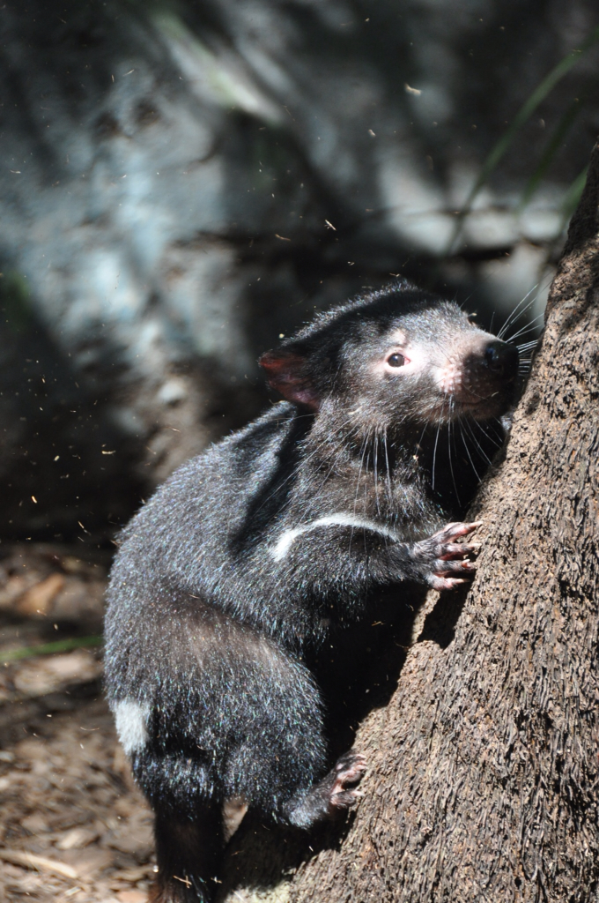
