את הטיול שלנו באוסטרליה תכננו לסיים בצלילה בGreat barrier reef המפורסם באיזור קיינז - אך בחיים כמו... בחיים העולם לא תמיד רוקד לפי הכוראוגרפיה שאתה מנסה לטוות לו. בימים האחרונים השמיים השפריצו כמויות של מים כמו שבחיים לא יצא לנו לראות - קשה להבין מה זה מבול אמיתי לפני שראית ברווזים שוחים בכביש :) ברוב אתרי הקמפינג (holiday parks) בהם ישנו היו בריכות וחלק מימי הגשם העברנו בבריכה - אם כבר רטובים, אז למה לא בסטייל?

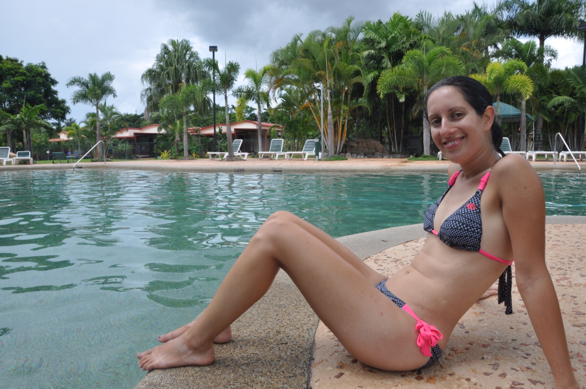

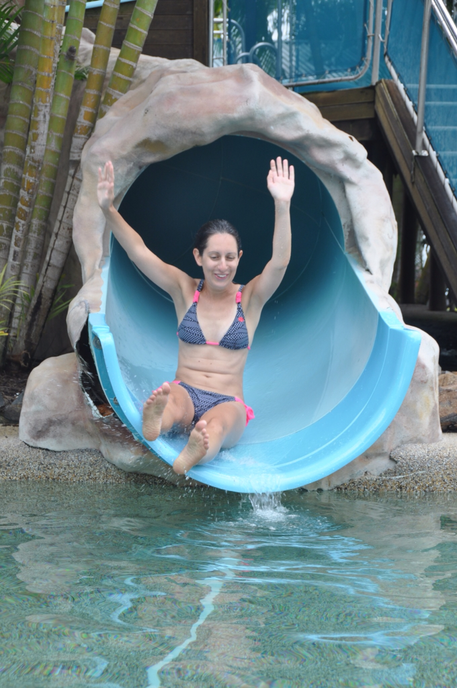

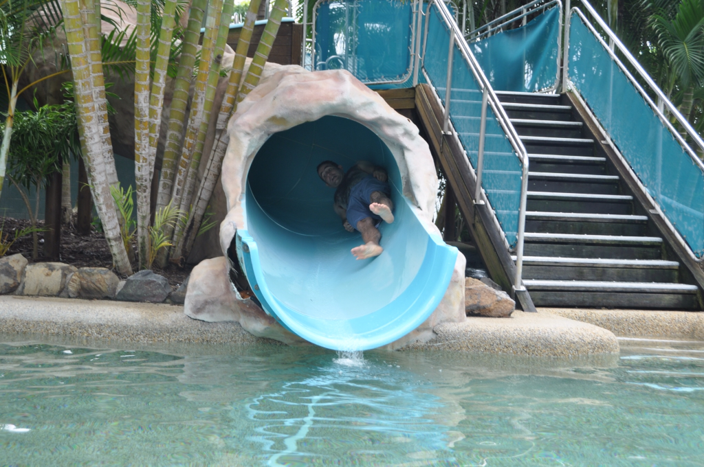

לא היתה לנו ברירה וגם יצא לנו לעשות נסיעות לא קצרות בגשם - חוויה מעניינת כשלעצמה. אם לרגע הפסיק הגשם - אז עצרנו בעיירות בדרך להצטלם עם ״דברים גדולים״ (ומטופשים). כמעט שלא יצא לנו לאכול כאן ״בחוץ״ - באמצע נסיעה ארוכה החלטנו לנסות מסעדת פאסט פוד מקומית מאד פופולרית שנקראת Hungry Jack's, כדי להתנסות בחוויה אוסטרלית מקומית. הצחיק אותנו סמלה הלא מקורי של הרשת שנראה כמו העתקה זולה מ-״ברגר קינג״. התאכזבנו לגלות שזהו ברגר קינג בתחפושת - כס המלוכה השמנוני היה תפוס באוסטרליה על ידי מונרך מקומי ואלמוני - וענקית הג׳אנק נאלצה להתפשר על שמה... המלך הוא עירום ושמן! בסוף בכל העולם מאכילים אותך בדיוק באותו הזבל.

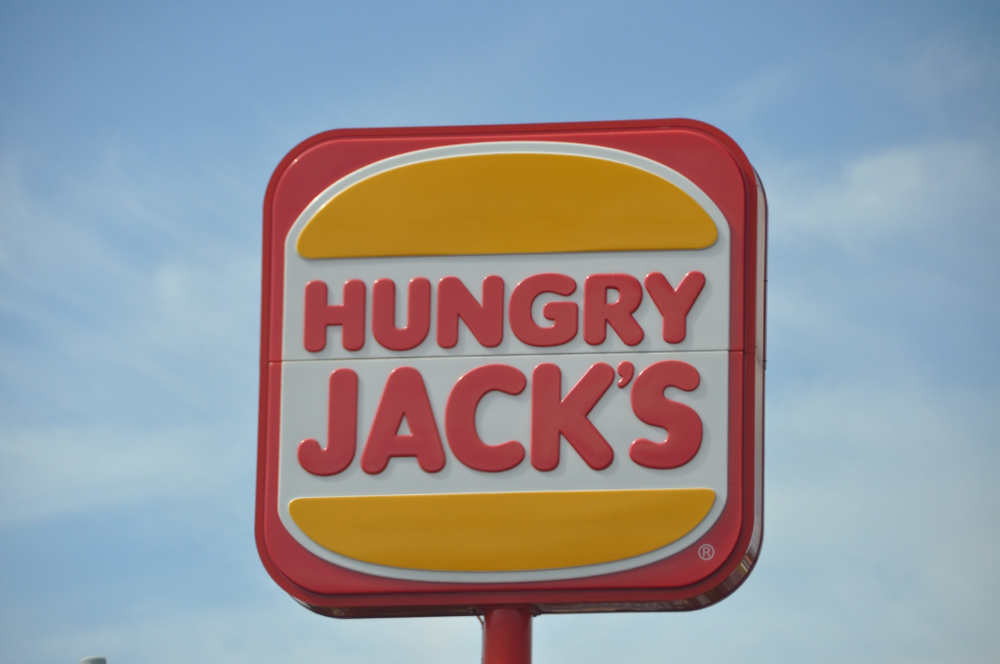
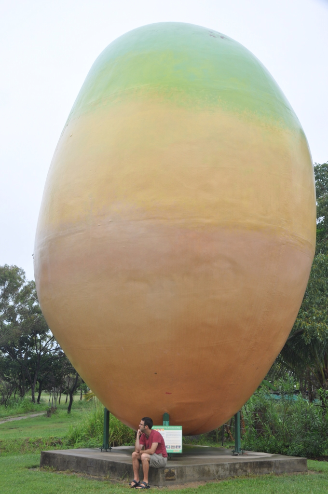

מנגו ״גדול״

למזלנו הגענו לקיינז ממש רגע לפני הסערה הגדולה בה כמה בתים איבדו את גגותיהם ולא מעט אנשים נתקעו בשטפונות ממש בכניסה לקיינז. בהתחלה עוד חשבנו לעשות צלילה קלה בכל זאת, אבל אחרי שהבנו שהסופה יוצרת כאן גלים ענקיים והראות במים עלובה ויתרנו על הרעיון והתמקדנו בתכנון המשך הטיול. בקיינז החזרנו את האוטו והתפנקנו בבית דירות מגניב. המטבחון הפרטי ביחד עם הצורך לחסל את שאריות המזון שצברנו - הצית את חדוות הבישול וחיינו קצת כמו מלכים.

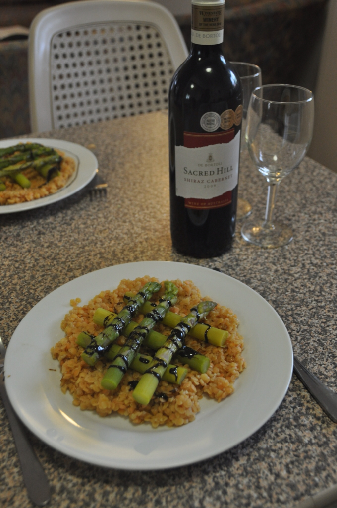
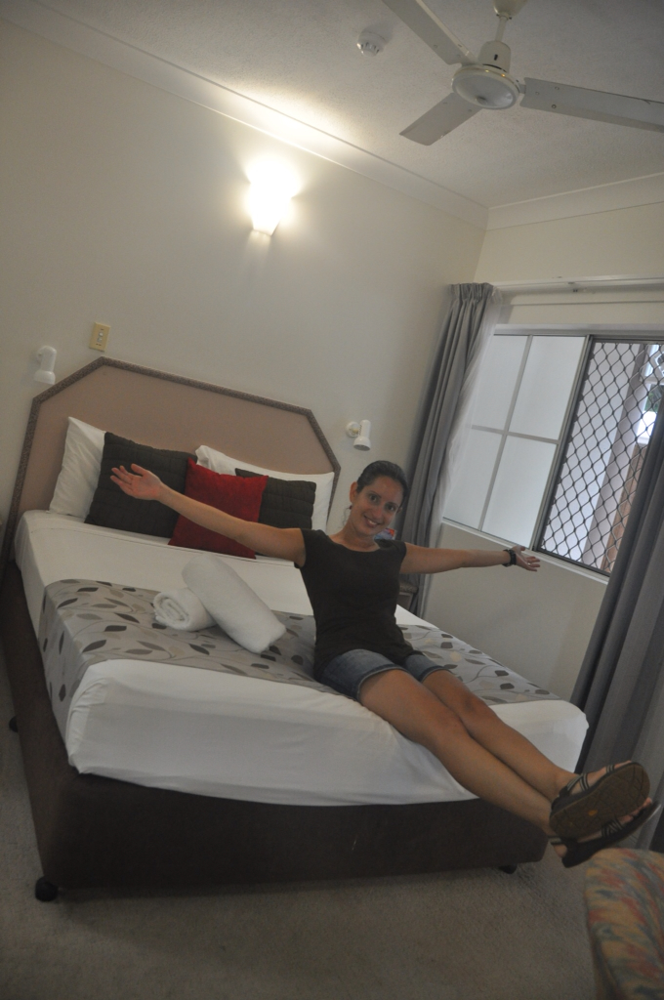

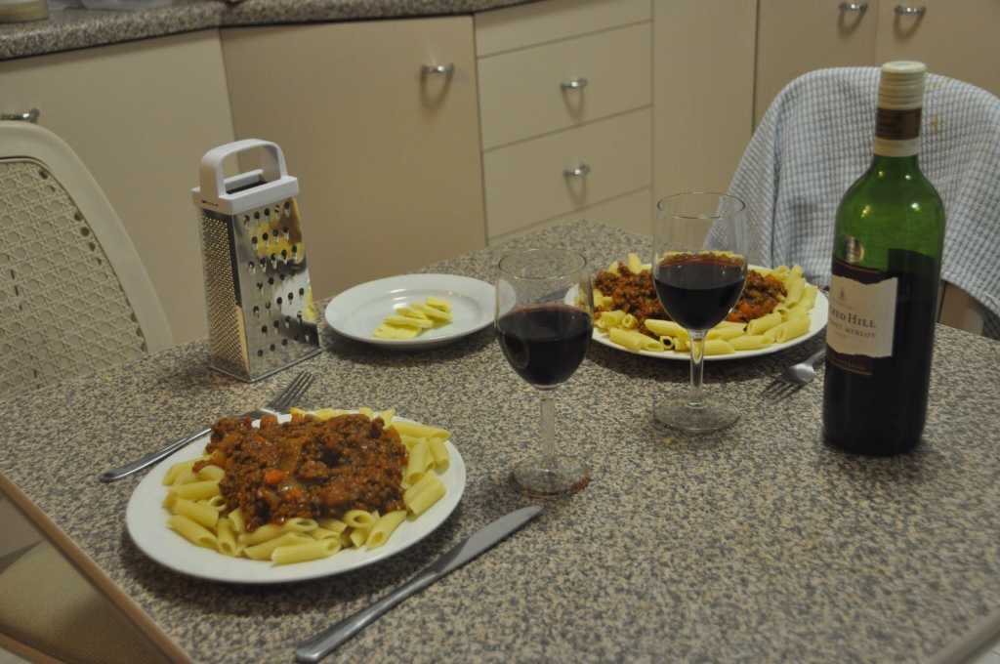

קצת הזנחתי את ״פנת הבישולים״ של הבלוג בחלק הזה של הטיול. המטבחים באתרי הקמפינג כאן היו פחות מזמינים מבניו זילנד והשקיעה המוקדמת יחסית גרמה לנו לבשל ארוחות פשוטות ומהירות. אחרי שקצת עלינו במשקל בניו זילנד, ניסינו לאכול יותר מאוזן ואכלנו כאן הרבה סלטים. העוף כאן זול וטעים כך שיצא לנו לאכול הרבה מאכלי עוף. האננסים כאן גדולים, זולים ומתוקים והם היוו חלק נכבד מארוחות הבוקר שלנו. למרות שאגוזי מקדמיה הם אוסטרליים - הם יקרים כאן אפילו יותר מבארץ! באחת מהעיירות טעמנו גלידת מקדמיה ביתית מעולה. הנה כמה ״ארוחות אוסטרליה״ טיפוסיות:

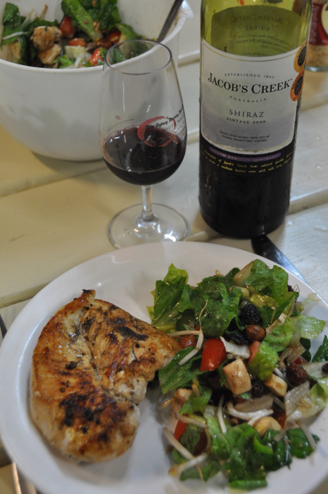
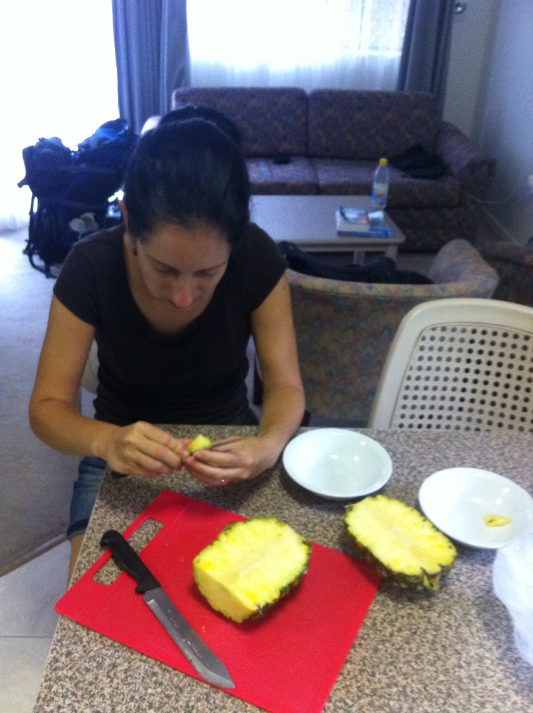

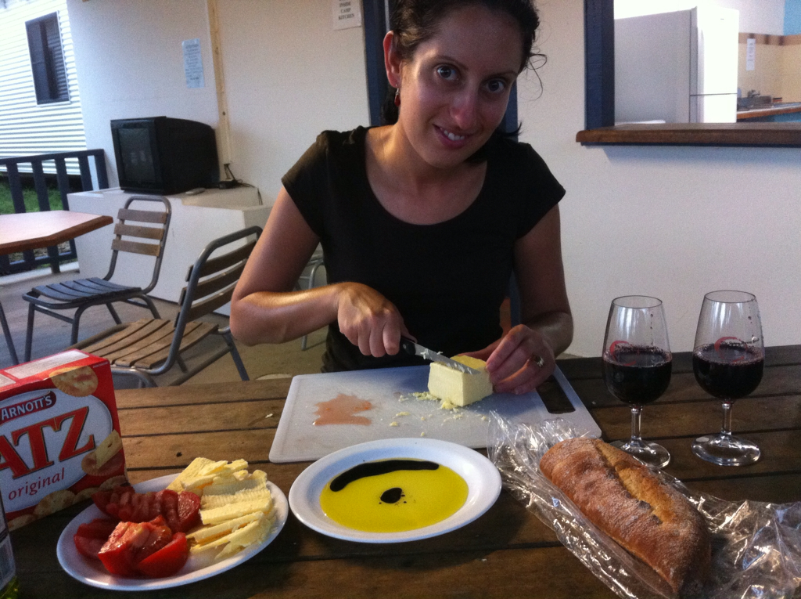

זהו, הטיול באוסטרליה הסתיים. אנחנו עכשיו בשדה התעופה ממתינים לטיסה לארה״ב. אוסטרליה היתה נהדרת אפילו שהיתה קשוחה איתנו לפעמים - בעיקר מזג האויר והתחושה התמידית שבכל רגע משהו עומד לעקוץ, להכיש או לטרוף אותך :) בהחלט הייתי ממליץ לטייל קודם באוסטרליה ורק אז בניו זילנד - בדיוק כפי שהייתי מעדיף לראות את חצי גמר המונדיאל לפני הגמר ולא להפך...

בימי הגשם יצא לנו לתכנן טוב את ״פרק ארצות הברית״ ואנחנו כבר מלאי ציפייה והתרגשות. ננחת היישר ב״מסלול התיירים השחוק״ והסוער של המערב לפני שנכנס לפנים היבשת לחקור קצת מהפחות מתוייר.

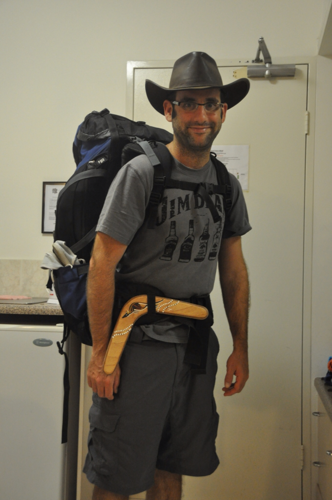
