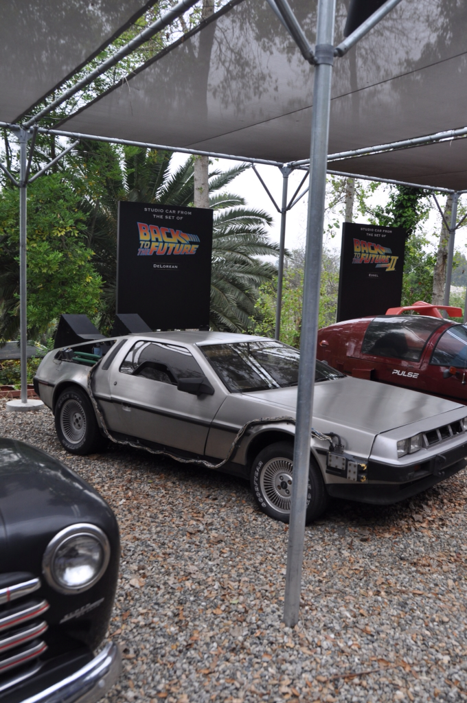

את ביקורנו בארה״ב התחלנו בהוליווד הנוצצת. בשדה התעופה אספנו את הרכב שלנו - טויוטה קמרי - מה שנחשב בארץ כ״רכב מנהלים״ נחשב כאן כרכב סטנדרטי בעוד הקורולה למשל היא רכב ״מוקטן״. בדיוק כמו המיתוס - באמריקה הכל גדול יותר - אפילו הציצים! הציצים?! כן! - כמעט מייד אחרי שנחתנו, הלכנו להתרענן ב״מוסד״ האמריקאי ומקדשו של אל באנדי ״hooters", בו מלצריות שבורכו על ידי הטבע או סכין המנתחים מגישות לך בירה והמבורגר בלבוש מינימלי - הו אמריקה :)

לראשונה בטיול, אחרי ארבעה חודשים, לננו במקום שקורא לעצמו מלון. מימשתי אלפי נקודות שצברתי עם השנים בנסיעות עבודה ולקחנו את ה-Holiday Inn שממש על ״שדרת הכוכבים״ - בו נוכל להתפנק, להתחכך ואף לדרוך על הכוכבים הנוצצים ביותר. ממש מעל המלון התנוסס שלט ״Hollywood" המפורסם, מה שלא הפריע לנו לפספס אותו לחלוטין במשך יומיים. בבוקר היום השלישי כבר הרגשנו שמשהו חסר וחיפשנו את מיקום השלט באינטרנט. התוצאה הראשונה בחיפוש בGoogle הייתה - "תרים את הראש יא טמבל" ;)

כיף לראות את הרחובות המוכרים מהסרטים ומכל כך הרבה סדרות טלויזיה. בערבים רמסנו תחת רגלינו את הכוכבים הקשוחים ביותר וליטפנו את הכוכבות הכי חמות (יעל לא הרשתה לי ללקק...) בשישי בערב יצאו לרחובות כל הבליינים ופוצצו את המקומות ה״נחשבים״. אורך התורים בכניסה התפלג התפלגות פופולארית עם פרמטר של גודל השומר הכושי בכניסה. לוס אנג׳לס מלאה בטיפוסים קיצוניים - אפשר למצוא כאן את האנשים העשירים ביותר לצד העניים ביותר ועובדה זאת מורגשת היטב ברחובות. על שדרת הכוכבים אינסוף קשקושים לתיירים - אפשר להצטלם עם קבצן מחופש לאיירון מן, לבקר ב״מוזיאון״ שיאי גינס או לרכוש פסלוני אוסקר שיוצרו בסין על ידי סיני שאפילו לא שמע על ג׳קי צ׳אן.

קפצנו לoutlet באזור לוס אנג׳לס בעיקר כדי להצטייד בבגדים מתאימים לסוג הטיול שלנו פה. כיף אחרי כל כך הרבה זמן לעשות קצת שופינג. משונות הן דרכי האל - נותן אגוזים למי שאין להם שיניים וכל כך הרבה נעליים למי שיש לה רק שתי רגליים ;)

אין ספק שהיום המגניב ביותר כאן היה ביוניברסל סטודיוז: אולפני הקולנוע והטלויזיה המפורסמים הם למעשה עיר לכל דבר - Universal City. במקומות מהסוג הזה בולטת כל כך העצמה הכלכלית האינסופית של ארה״ב בכלל ושל תעשיית הקולנוע בפרט: המתקנים, ההופעות, התחפושות, האפליקציה לטלפון שמדווחת בזמן אמת את אורכי התורים והתשתיות בכלל - פשוט ״אמריקה״!

רוב המתקנים הרציניים הם סוג של רכבות הרים ושאר מתקנים מעודדי הקאה תלת וקוואד-מימדיים (אל תשאלו אותי מה זה אומר). פלאי הטכנולוגיה מאפשרים לשרק לירוק לך בפרצוף, למגי מהסימפסונס לבלוע אותך בעודך חי ולג׳וקים מהמומייה לזחול לך בתוך המכנסיים. ההשקעה במתקנים היא ללא פשרות וקטעי מדיה רבים בוימו ושוחקו על ידי השחקנים והבימאים המקוריים במיוחד בשביל המתקנים. המתקן המרשים ביותר ללא ספק היה המתקן של קינג קונג שהוכן על ידי פיטר ג׳קסון, שהסביר אודות האתגרים הטכנולוגיים במבטא ניו זילנדי מזכיר נשכחות. קינג קונג נלחם בדינוזאורים והגן בקנאות על הקרונית האומללה שלנו מכל כיוון. מספר הממדים שקוף-האדם דילג בינהם מחייב בדיקה מחודשת של תאוריית המיתרים - סטיבן הוקינג אתה מוזמן: למתקן יש אפילו גישה לכסא גלגלים...

המופעים היו לא פחות מושקעים מהמתקנים - כאשר המופע המושקע ביותר היה של הסרט Water World. עבור המופע בנו עיר צפה בה צפינו במלחמה עתירת אפקטים בין ה Smokers לכפיל מלוקק של קוין קוסטנר. השיא היה לא פחות מהתרסקות של מטוס באמצע העיר תוך כדי שהוא משפריץ מים על הקהל (בדיוק על המושבים שמסומנים - soaked). עוד מופע שאהבנו היה Animal Actors בו ראינו כמה מסודות האילוף של חיות שחקניות ופגשנו בחיות מפורסמות.

סיור בן שעה לוקח את מבקרי הפארק אל מאחורי הקלעים של כמה סטי צילום מפורסמים. בין היתר ראינו מכוניות מפורסמות כמו זאת מ״אביר על גלגלים״ ואת הדלוריאן המקורית של דוק בראון! ראינו כמה רחובות ובתים מבויימים מסרטים והמון אפקטים גרנדיוזיים כמו שרק בהוליווד יודעים לעשות. הסיור היה פשוט מדהים ואסור בשום פנים לפספס אותו.


*אפקטים מהסט של ״מהיר ועצבני״*

את הביקור בפארק סיימנו לא לפני שקיבלתי צו הרחקה מה״Lorax" בשל עודף חיבה לגיבור של ד״ר סוס - אני אוהב את ה״Lorax"!

את היום הכיפי הזה ואת הביקור באיזור לוס אנג׳לס סיימנו בטיול שקיעה בסנטה מוניקה השלווה. זאת לא הגזמה להגיד שראינו באיזור ל.א יותר דוברי ספרדית מדוברי אנגלית. אחרי הכל - לאיזור היסטוריה ספרדית ומקסיקנית עשירה. נכנענו לריחות ולצלילים וישבנו במסעדה מקסיקנית מגניבה על המזח לארוחת נאצ׳וס מושלמת.

