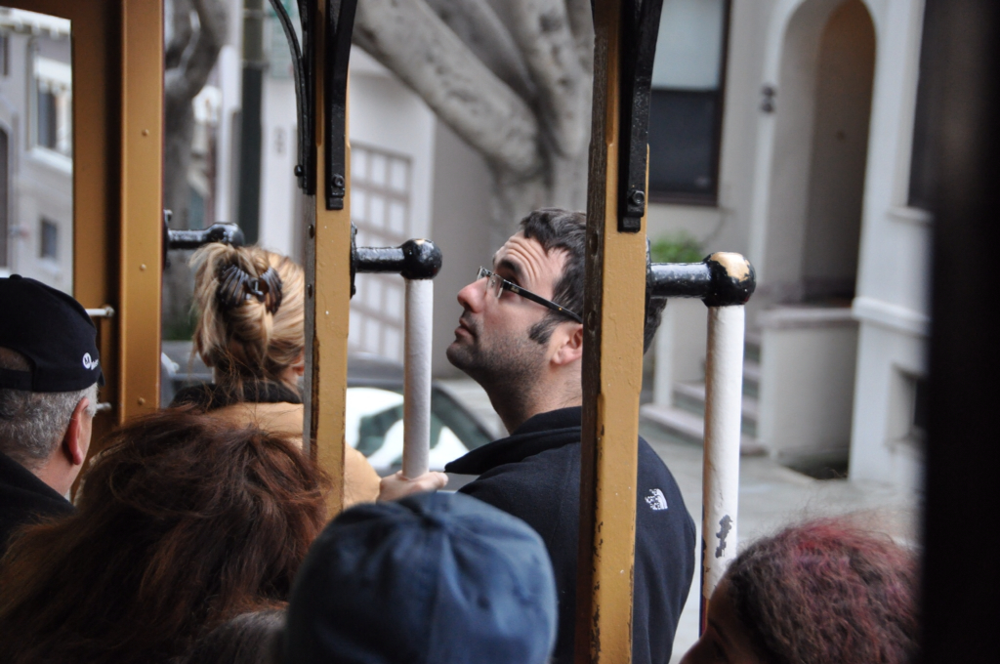
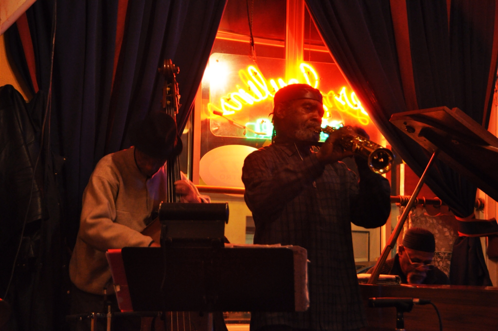

אז מה עוד לא נאמר על סן פרנסיסקו? העיר ,שבקיץ הקריר והערפילי שלה מושכת אליה מיליוני תיירים, מפורסמת בכל כך הרבה דברים: הערפל שתמיד אופף אותה, ההומואים, הפלצנים, הליברליזם, לחם השאור, צ׳יינטאון צבעונית, הרכבל שמטפס על גבעות העיר ועוד לא הזכרתי את גשר שער הזהב. אלפי סרטים וסדרות טלויזיה צולמו ממש כאן - בשניה שעלינו על הגשר הדרומי של העיר מיד זיהינו אותו מהסרט Moneyball שראינו לפני שבועיים ואפילו לא ידענו שהתרחש כאן. לא כל כך ידענו למה לצפות ואיך כל הדברים הללו יתחברו לעיר הקטנה והצפופה הזאת.

קצת לפני שיצאנו לטיול הזה ראיתי פרק של סאות׳ פארק שנתן הסבר קצת גועלי לאיך שהערפל המסתורי שאופף את העיר קשור בקשר הדוק לסוג האוכלוסיה שמתגוררת כאן. בפרק נראו תושבי סן פרנסיסקו הפלצנים נוסעים במכוניות ההיברידיות והידידותיות לסביבה שלהם כשהם כל כך מרוצים מעצמם - עד שבין כל שני משפטים שהם אומרים הם מפליצים וממלאים את הריאות בריח של עצמם - עודף ההפלצות הוא זה שיוצר את הערפל... במהלך הפרק מנסה חבורת הילדים להציל את העולם מאסון אקולוגי שעלול להתרחש כשענן הפלצנות של סן פרנסיסקו יתנגש ב״ענן הפלצנות של נאום הזכיה באוסקר של ג׳ורג׳ קלוני״ :) באנגלית הם השתמשו בדימיון בין המילים smug ו-smog.

נראה שהתמונה מתחיל להתבהר - מסתבר שגם לחם השאור החמוץ של סן פרנסיסקו קשור לאותו ערפל מיסתורי: במאפייה הותיקה והידועה ביותר של סן פרנסיסקו - Boudin, למדנו שהמקומיים הפלצנים לוקחים קשה את נושא הלחם שלהם. הם טוענים שאת הבצק של הלחם San Francisco Sour Dough אפשר להכין אך ורק באקלים הערפילי והייחודי של סן פרנסיסקו. חוקרים שבחנו את הטענה הצליחו לבודד את הבקטריה שאחראית לטעמו של הלחם ולייצר כיכר לחם זהה במעבדה - כיום בתקופת המקררים והמזגנים אין שום בעיה לשחזר את האקלים בכל נק׳ על פני כדור הארץ. אך את הבעלים של מאפיית בודין זה לא משכנע: "You can make bread as sour as you want, this is not San Francisco Sour Dough!" המאפיה מחזיקה סניפים בשיקגו וסן דייגו ואחת לחודש שולחת משאיות משוריינות עם הבצק המקורי שהוכן בסן פרנסיסקו - אז אמרתי כבר שהם פלצנים?! בכל אופן, אפוי בערפל או לא, הלחם כאן ממש טעים. אולי המנה המזוהה ביותר עם הלחם היא מרק צדפות בסגנון ניו אינגלנד מוגש בתוך הלחם החמצמץ - פשוט תענוג.

את הלחמים כמו גם את המרקים ומאכלי פירות ים טריים מוכרים בעשרות דוכנים באיזור ״רציף הדייגים״ שבנמל העיר שהוא מקום תוסס בפני עצמו. בנמל אפשר לראות גם כלבי ים מטפסים על הרציפים משתנקים ומרביצים אחד לשני להנאת המוני התיירים. רציף 39 מלא במסעדות וחנויות נחמדות וממש כיף להסתובב שם.

אז איך קשור גשר שער הזהב המפורסם ללחם השאור החמוץ? אכילת יתר של לחם מחמצת הפכה מאות מתושבי סן פרנסיסקו לחמוצים בעצמם - שלא לומר אובדניים. נוצר צורך לבנות ״מתקן התאבדות״ המוני שיאפשר לתושבים להפרד מהעיר בדרך לעולם שכולו טוב. גשר שער הזהב הוא המבנה שמחזיק בשיא המפוקפק של מספר המתאבדים בקפיצה הגדול בעולם עם מעל 1300 מתאבדים חמוצים במיוחד! ועכשיו ברצינות: מה הפך את הגשר לכל כך מפורסם? הוא מזמן לא הגדול ביותר, לא היפה ביותר - ולא, הוא לא עשוי מזהב! הגשר מככב בכל כך הרבה סרטים: עשרות סרטים אפוקליפטיים מתהדרים בסצנות בהן הגשר מושמד - בסצינה האחרונה שאני מצליח לזכור ״מגנטו״ נראה עוקר את הגשר ומטיס אותו עמוס בצבא של מוטנטים לעבר אי בלב ים באחד מסרטי X-Men. למה דווקא הגשר הזה? כובע... תשפטו בעצמכם. אך אם הגשר קוסם לכם ואתם חושבים לבוא לכאן כדי לקפוץ - כדאי שתעשו את זה מהר! במאי 2011 אושר תקציב של שני מיליון דולר לבניית מחסום מתאבדים! התכנון הוא לבנות רשת מתחת לגשר לכל אורכו שתמנע את הנפילה החופשית אל תוך המים.

ההיסטוריה של העיר גם היא עשירה וללא ספק השפיעה על אופיה של העיר - עם סיפורים כמו ניסויים שנויים במחלוקת בLSD, שנים של חיפושי זהב קדחתניים, אפליה של אוכלוסיה סינית גדולה ואפילו רעידת אדמה שהשמידה את העיר כמעט לחלוטין. אבל אנחנו לא בשעור היסטוריה, אז תקראו לבד בזמנכם החופשי... סיפור אחד אפל ומצמרר בהסטוריה הלא כל כך רחוקה של העיר - הוא הסיפור של הכלא אלקטרז. הכלא שממוקם על אי לחופי סן פרנסיסקו ושימש כלא ״מאובטח מקסימלית״ הוא אחד מבתי הכלא המפורסמים בעולם ואפילו מככב בספר השיאים של גינס בתור בית הסוהר המאובטח ביותר. הכלא, ששימש בית לאסירים מפורסמים כמו אל קפון, נסגר ב-1963 מפני שעלות התחזוקה היתה גבוהה יותר מלממן את שהותם של כל האסירים בסוויטות המלכותיות של הריץ. שיט קצר הביא אותנו אל האי בו לקחנו סיור מעניין ואינפורמטיבי על ההיסטוריה של האי, סיירנו בין התאים ושמענו על נסיונות הבריחה המפורסמים.

סן פרנסיסקו עצמה לא גדולה בשטח ואפשר להסתובב בה ברגל - אך חלק מהרחובות מטעים כי הם מטפסים על פני גבעות תלולות. אך אל דאגה, לתושבי העיר יש פיתרון ידידותי לסביבה - הקרוניות של רחוב פאוול יקחו אותך מעבר לגבעות, ואם אין מקום תוכל גם להיתלות עליו מבחוץ (הילדים שביננו נתלים מבחוץ גם אם יש מקום). בגלל שבאמת הייתי ילד טוב לקחו אותי גם למוזיאון המדע של סן פרנסיסקו בו יש המון מיצגים אינטראקטיביים שגורמים לך לחשוב על העולם ולדחוף ילדים מרגיזים בתור.

מאד אהבנו את העיר ויצאנו עם טעם של עוד. חוץ מכל האטרקציות התיירותיות העיר פשוט יפה ומלאה במקומות בילוי, במסעדות טובות וסתם רחובות מעניינים. בערב האחרון שלנו כאן התחיל לרדת גשם. כשמזג האויר בחוץ סוער הלכנו למועדון ג׳אז מגניב בו ניגנה להקה טובה. נפרדנו מהעיר היפה הזאת עם בקבוק יין צרפתי משובח ולרגע אחד הרגשנו ממש כמו שני פלצנים מקומיים :) הנה עוד כמה תמונות פרידה מהעיר - נתראה בפוסט הבא...

