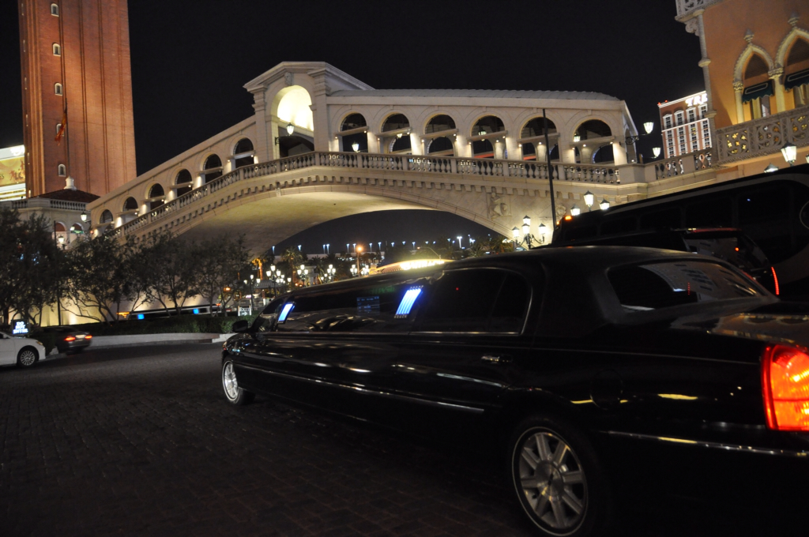

אחרי השלווה של יוסמיטי שוב חיכה לנו שינוי אוירה קיצוני - העיר הגדולה האחרונה בה נבקר לפני שנצא אל חיק הטבע היא לאס וגאס - אולי העיר המוגזמת ביותר בעולם. הכל התחיל כאן בשנות הארבעים - כשאירופה מתחפרת במלחמה, האמריקאים הקימו מלונות קזינו מפוארים באמצע המדבר של נבדה. בהתחלה בתי הקזינו נוהלו בעיקר על ידי ארגוני פשע ומשכו לכאן טיפוסים מפוקפקים. מאז ועד היום נשפכו על ה״סטריפ״ של לאס וגאס מיליארדי דולארים רק כדי להרחיב את קשת הטיפוסים המפוקפקים שממשיכים לזרום לכאן בקצב מסחרר... השגנו מחיר מצחיק לחדר משודרג בStratosphere שבקצה הסטריפ - ברוכים הבאים ל״עיר החטאים״!

כלכלת לאס וגאס מושתתת על חולשות המין האנושי: התמכרות להימורים, תעשיית מין משגשגת ותאוות המזון. ״הכסף הגדול״ נכנס למלונות מהימורים לכן הם יעשו שמיניות באויר כדי למשוך את תשומת לבך בדרך לקזינו שלהם - וזאת לא מטפורה - חלקם באמת יעשו שמיניות באויר... ההשקעה בבתי המלון היא מוגזמת וללא ספק האטרקציה הגדולה ביותר בוגאס היא שוטטות בין בתי המלון כדי לחזות במבנים הפומפוזיים ובהופעות המושקעות שמוצגות בבתי המלון כדי למשוך את הקהל. בין המלונות היותר מושקעים יש את ״פריז״ בו אפשר לראות את מגדל אייפל ושער הנצחון, לטייל בקזינו שמעוצב כמו רחובות פריז עם boulangeries ו creperies פזורים בין דוכני הבלק ג׳ק ומכונות ההימורים; כמו הפריז יש גם את הVenetian בו גונדולייר יקח אותך בין רחובות ונציה או ניו יורק ניו יורק - עם עיקרון דומה... הLuxur מעוצב כפירמידה ממצריים העתיקה וTreaser Island הוא אניית פיראטים אחת גדולה. בתי המלון פשוט ענקיים ולמרות ששני בתי מלון ממוקמים אחד צמוד לשני, יכול לקחת 20 דקות הליכה בין מלון למלון - וזה אם אין ״פקק תנועה להולכי רגל״ - כן, גם זה קורה בעיר החטאים עמוסת התיירים...

העתק של גשר ריאלטו - Venetian

כדי להרגיש את לאס וגאס כמו שצריך כדאי מאד להמר. במהלך הנסיעה הארוכה לכאן שיננו טבלאות בלק ג׳ק בעל פה כדי להגביר את הסיכוי שלנו להוציא משהו מכאן - אך טבע האדם הוא חלש... גם כשהצלחנו להרויח חשבתי לעצמי - עוד משחק אחד - נכפיל את הכסף ונצא... אבל בתי הקזינו כאן יודעים את העבודה... מלצריות מפנקות את מי שמהמר במשקאות חינם והפיתוי להמשיך ביחד עם חוקי הסטטיסטיקה בסוף יפילו אותך. בתי הקזינו מעוצבים ומוארים כך שלעולם לא תוכל לדעת אם יום או לילה - זאת הצגה שלעולם אינה נפסקת 24 שעות ביממה. את התקרה צובעים בצבע השמיים ומציירים עננים מלאכותיים וכשקמים בבוקר נראה שכלום לא השתנה - את הנמלה העמלנית שלי שלי מאד הטרידה השאלה - מתי הם מנקים כאן את השטיחים?! :)

גם בנושא האוכל הגוזמא כאן ניכרת. בכל מלון מוצעות ארוחות בופה מפוארות שיפוצצו אותך לחלוטין. יש כאן גם המון מסעדות טובות רגילות. אנחנו ניסינו את הKGB שמפורסמים בהמבורגרים הטעימים (ובמלצריות החטובות) וסניף של הCheesecake Factory המעולים. אפשרויות הבילוי כאן הן פשוט בלתי מוגבלות - זה כל כך שונה ממה שהיה לנו עד כה בטיול. כשנכנסנו למלון ועמדנו בתור לcheck-in כולם הסתכלו עלי בעיניים עקומות כשאני עומד באמצע לובי מפואר עם התרמיל העצום שלי על הגב ונעלי הטיולים - אך לכל חגיגה יש סוף וגם יומי הגיע: נלקחתי לoutlet ונקנו לי כל מיני מחלצות שאני לא צריך :)

כמו הרבה דברים בחיים, אם לוקחים משהו לקיצוניות צצות התכונות הטובות והרעות שלו על פני השטח - ואין דבר קיצוני יותר מלאס וגאס - נעמיד את העיר במבחן ״הטוב הרע והמכוער״:

הטוב: מקצוענות חסרת פשרות

תעשיית הבידור מגיעה לשיאה בעיר האורות בדמות מופעים מושקעים. עשרות מופעים מכל מיני סוגים מפורסמים במאות שלטי חוצות מוארים בכל פינת רחוב. אחרי מחקר קצר בחרנו במופע Love של ה- Cirque de soleil. על רקע פסקול שירי הביטלס, הועלתה הופעה שפשוט קשה לדמיין שיכולה להתקיים - אקרובטיקה, ריקוד עם תפאורה ותלבושות פסיכדליים שכאילו נלקחו מתוך חלום - פשוט מדהים שאפשר להרים הופעה כזאת. כל פרט ופרט נלקח בחשבון כולל התלבושות של הסדרנים ומוכרי הכרטיסים.

אי אפשר לבקר בלאס וגאס ולהתעלם מתעשיית המין הענפה שמתנהלת כאן. מה שבהתחלה נראה נחמד - ״הי - יש פה ציצים״, הופך למטרד כשבכל מטר ברחוב רודף אחריך בטלן חסר שיניים ודוחף לך עלונים של זונות לידיים. כמעט בכל קזינו יש רקדניות זנותיות בתוך כלובים שמנעימות את זמנך בנענועי עכוז. אולי אני כבר נשוי וזקן - אבל לא ברור לי איך במקום כזה יכול להתפתח יחס שיויוני לבנות המין היפה. בכל שעות היום מסתובבות ברחוב משאיות שכל תפקידן לשאת שלטי פרסומת של זונות, וברוב הברים המלצריות בקושי לבושות. כוסיות בלבוש צמוד - יש לזה פוטנציאל - אבל ב8 בבוקר בתור לStarbucks?! ככה זה בעיר החטאים.

איפה שיש כסף, יש שרלטנים - ואנחנו נפלנו על אחד הגדולים. כשראינו שדייויד קופרפילד מגיע לשבוע הופעות בוגאס ממש התרגשנו - הקוסם הגדול של זמננו ילהטט מולנו בקסמיו המופלאים. המופע היה פשוט בדיחה עלובה - במקום קסמים, חזינו בניסיונות עלובים לסחוט רגשות לצד קסמים שצ׳יקו ודיקו הפסיקו לעשות עוד בשנות השמונים. למשל - הקוסם הגדול הקרין סרטון ארוך ולא במקום של ילדה שעברה את השואה וחלמה להיות חופשיה כמו פרפר. אחרי שהוא הקריא את השיר המרגש שכביכול כתבה ומרח כמעט 10 דקות, הוא עשה טובה ו״הפך״ את הפתק עם השיר לפרפר אמיתי ששוחרר לקהל. מה שמדהים זה שהיו אנשים שהזילו דמעה - הפרפר המסכן בטח נרמס בקהל בעוד האנשים מוחאים כפיים - הנוכל שרף 10 דקות מה״מופע״ כדי להרוג פרפר ואנשים מוחאים כפיים!

כדי להתרענן קצת מוגאס המוגזמת יצאנו לטיול קצר ב Hoover dam - הסכר הגדול והמפורסם ביותר באמריקה - ואחד מסמלי ״נצחון האדם על הטבע״ של העולם. הסכר עושה בנהר בקולורדו העצום כבשלו, מתעל את המים לצורכי מדינות האזור ומפיק כמות אדירה של חשמל. עם כמות הבטון שנשפכה על הסכר הזה אפשר לבנות מדרכה שתקיף את קו המשווה - אמריקה!

 

תודה מיוחדת לפאד, ״מלך השכונה״, על הטיפים ללאס וגאס.
