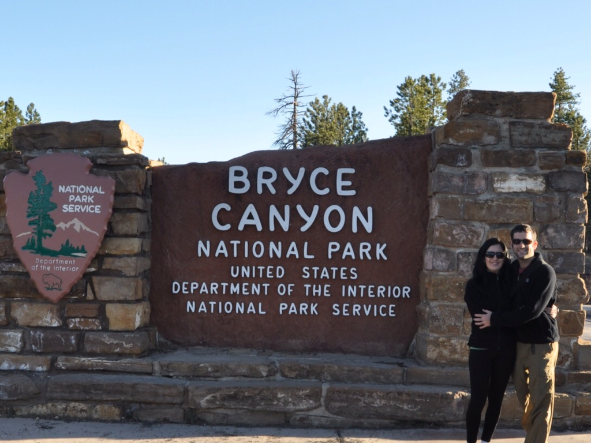

מלאס וגאס המסנוורת יצאנו צפונה אל המדבר האינסופי של יוטה בדרך לBryce Canyon והפארק הלאומי Zion. יותר מידי פעמים שמענו אנשים מספרים שברייס קניון הוא המקום היפה בארה״ב - הגיע הזמן לראות אותו בעצמנו. התרגלנו כבר לנסיעות הארוכות - הכבישים פה נוחים ותפאורת המדבר היא בדיוק מה שרואים בסרטי המסעות האמריקאים. מידי פעם חולף על הכביש שיח קוצני יבש או שועל חמקמק וברדיו מתנגנים האלבומים הכי אמריקאיים שברשותנו - ג׳וני קאש, דילן וכמובן ״הבוס״.

גם המוטל הזול בו ישנו הזכיר לא מעט סצינות מסרטים אמריקאים. את הפקיד השמן בקבלה נראה שהערנו, ובאופן סמלי בקבלה היתה תלויה תחזית מזג אויר ״עדכנית״ של היום בו יצאנו לטיול - 23 בנובמבר אשתקד. במוטל, שדווקא היה סביר, היינו כמעט לבדנו חוץ מכל מיני אנשים בבגדים מלוכלכים שמדי פעם נכנסו וביקשו הצעת מחיר לחצי שנה... מיד כששוקעת השמש יורדת כאן הטמפרטורה אל מתחת לאפס - מה שמאפשר קירור אופטימלי של בירות על עדן החלון... בערב הראשון עוד הספקנו לראות כמה תצפיות בזמן השקיעה לפני שהערב ירד והקפיא את כל האיזור.

למחרת עשינו טיול קצת יותר יסודי וירדנו אל תוך הקניון במסלול מעגלי נחמד. הייחוד של ברייס קניון הוא בעמודים המגולפים שפיסל הטבע באדמה שקוראים להם כאן Hoodoos. שקיעה של חומר, ארוזיה, מי גשמים וקור שמקפיא מאגרי מים בתוך הסלע הם האחראים על פיסול הצורות המעניינות במשך כמה עשרות מיליוני השנים האחרונות.

הפארק מסודר מאד ונח להתמצאות - הפירוט על המסלולים שנכתב על ידי הריינג׳רים בעיתון הפארק מאד אפקטיבי. בכל הפארקים הלאומיים מתקיימת תכנית ״הריינג׳ר הצעיר״ ויצא לנו לראות כל מיני זאטוטים חמודים בבגדי ריינג׳ר מסתובבים עם פנקסים בחולצות מלאות כיסים.

החלק הדרומי של הפארק הוא הגבוה ביותר ולכן הקר ביותר ובאפריל עדיין מלא שלג. הפרשי הטמפרטורות בפארק בין יום ללילה עשויות להגיע גם ל30(!) מעלות. עשינו מסלול קצר ונחמד לתצפית שמכוסה כולה בשלג רך ועמוק.

בפארק, כמו בכמעט כל מקום פה, שוב נתקלנו בסנאים. בפארק הזה היו כאן גם סוג של איילים שנקראים Mule deer (אייל פרדי) עם אוזניים חמודות ומצחיקות.

אך מפגשים קרובים יותר עם חיות אלו היו לנו דווקא בפארק הלאומי Zion. כבר בכביש הכניסה לפארק חיכתה לנו הפתעה - פתאום קפץ אייל אל הכביש משום מקום כשאנחנו נוסעים במהירות. הספקתי קצת לבלום ולסטות מהכביש והאייל רק נתן נגיחונת קטנה בצידו של הרכב ואז המשיך לקפץ כאילו לא קרה כלום - ואחריו עוד 3 חברים. למרות שיש להם 4 רגליים שמאפשרות הליכה נורמאלית, האיילים הללו משתמשים ברגליהם כאילו היו קפיצים ונעים אך ורק בדילוגים מצחיקים כאילו היו חיות צעצוע. פארק Zion היה פחות דרמטי מאחיו Bryce והרבה יותר עמוס בתיירים. כנראה בגלל כמות המבקרים, הסנאים בפארק התרגלו לאנשים ומנסים לגנוב אוכל.

המממ... אמר הסנאי ופכר אצבעותיו

 

 

 

 

 

 

 

 

זהו, מכאן נתחיל בנסיעה דרומה לכיוון אריזונה. יוטה מדהימה בדיוק כפי שמספרים, עוד נחזור לפארקים המזרחיים של יוטה בהמשך הטיול שלנו - יש למה לחכות. המדבר כאן קר ויבש בעונה הזאת ובעיקר בערבים הגוף שלי נטען בכמות מטורפת של חשמל סטאטי. הפסקתי לגעת עם הידיים בידית של דלת המכונית אבל בלילה האחרון זה כבר נהיה קצת מוגזם: כנראה לסדינים היה מקדם חיכוך גבוה ופשוט בכל תזוזה במיטה היה אפשר לראות נצנוץ על הסדין עם קול פצפוץ פריך. אם רק הייתי יכול לנצל את הכח הזה לטובה אולי הייתי מטעין בטריות או נלחם ברוע - ביום הוא סתם בטלן שמטייל מסביב לעולם במקום לעבוד, אך בלילה הוא - אלקטרו-מן - פושעי העולם היזהרו!

נסיים עם עוד כמה תמונות מברייס:

 

 

 

 

 

