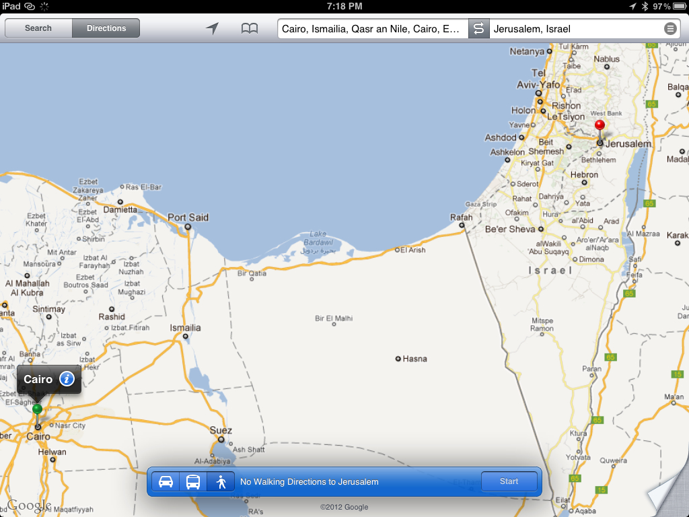
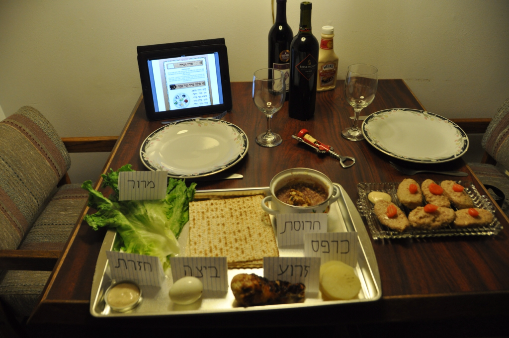
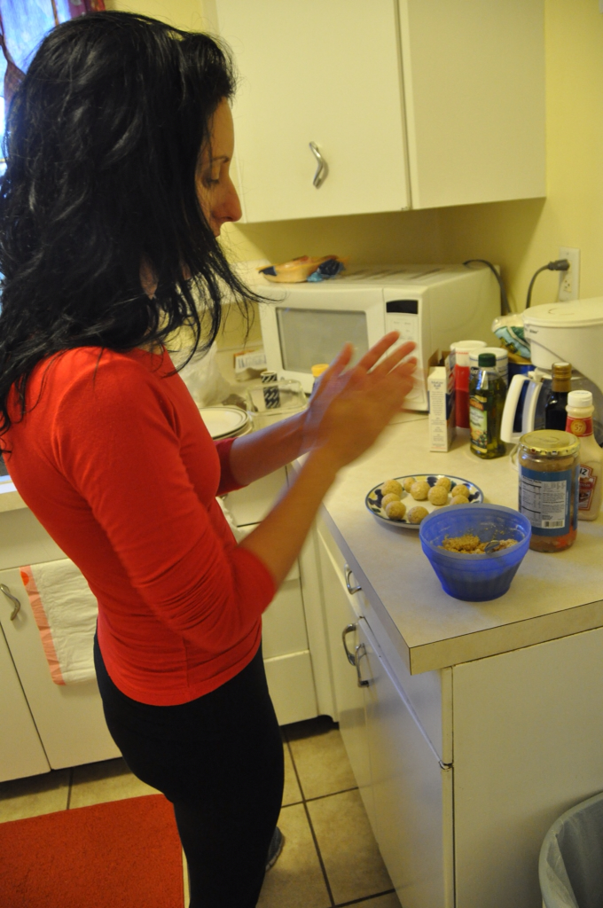
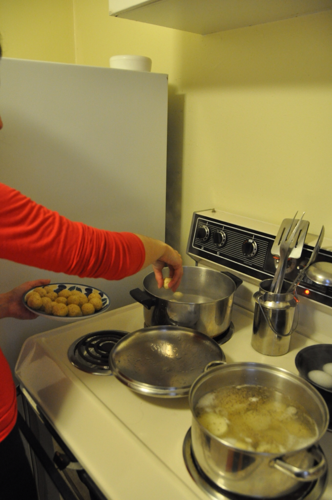
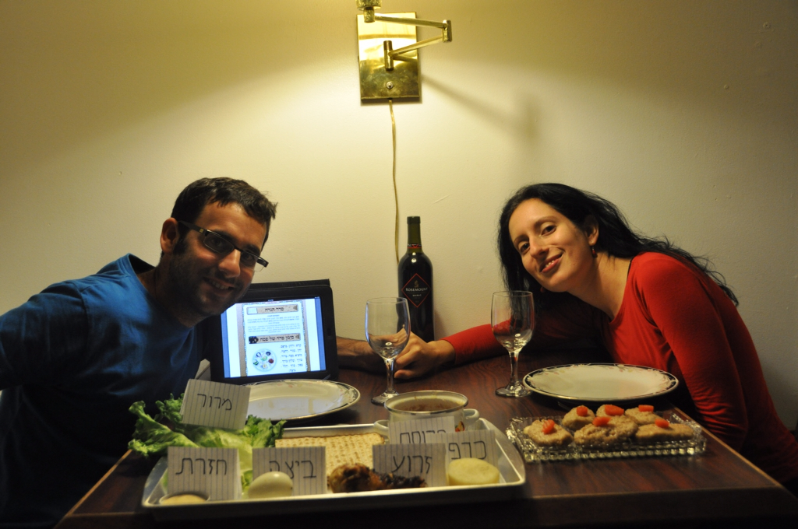

עבדים היינו לקפיטליזם ב״מדינת היהודים״ שבארץ ישראל. בנינו ותחזקנו פירמידות של קוד כאשר המוסכמות החברתיות הן שלשלאותיינו והשגרה היא נוגשנו. אך לא היום! היום, ממש כמו בני ישראל, אנחנו באמצע המדבר של אריזונה מחפשים כיוון. ההבדל המהותי בינינו לבין אבותינו הוא שבעוד אנחנו מצויידים ב-GPS משוכלל, לבני ישראל היתה טכנולוגיה פריטיבית שנקראה בזמנו Firestand (או בעברית ״עמוד אש״). כאילו שלא די בזאת, הנווט שלהם היה חסר חוש כיוון מגמגם שעשה קונצים עם מטה קסמים... ניסיתי לברר כמה זמן אמורה לקחת ההליכה במדבר, אבל מסתבר שאפילו בגוגל לא רוצים לקחת אחריות! מדובר בפחות מ500 קילומטרים - גם אם ניקח בחשבון שמשה ילך לאיבוד בהר סיני ל40 יום, את איטיות הילדים והפסחים - וכמובן את כלב בן-יפונה שתמיד משתרך מאחור עם הבנות - זה לא אמור לקחת יותר מחודשים בודדים...

אנחנו בכל מקרה, בעוד חודש נתברג חזרה אל מקומנו הקטן בעולם הגדול הזה. כל מה שנשאר לנו בינתיים, הוא לספר אודות המסע המופלא של אבות אבותינו מעבדות - לחירות.

בפייג׳ שבאריזונה התאכסנו במוטל-דירות עם מטבח שאפשר לנו לארח את הסדר הראשון שלנו. למזלנו היו לנו רק שני אורחים מה שהקל מאד על ההפקה :) המזון בסופרים הגדולים זול בצורה קיצונית מה שרק הוסיף להנאה. אפילו מצאנו סופר שמוכר ליהודונים לחם שלא תפח כראוי וצלחת הסדר שלנו לא חסרה דבר! אפילו החרוסת שהכנו במו ידינו היתה ממש כמו בבית. אשתי היקרה התמחתה בהכנת קניידלך והסדר היה פשוט מושלם.

")
מבעוד מועד הצטיידנו בהגדה אלקטרונית והחריגה היחידה שעשינו מהמסורת היתה שאולי שתינו קצת יותר מ4 כוסות (בהסבה כמובן...) זהו ללא ספק היה הסדר הכיפי ביותר שהיה לנו - בשנה הבאה ברעננה הבנויה - שיהיה פסח שמח!

