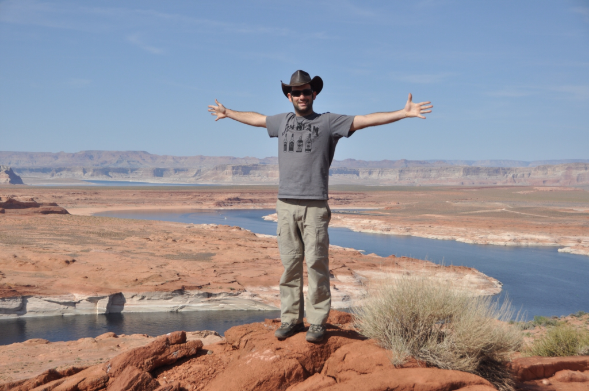

נהר הקולורדו הארוך, שמקורו בשלגים הנמסים על פסגות הרי הרוקי, מספק מים לתושבי דרום מערב ארה״ב כבר כמה אלפי שנים. כפי שראינו כבר בסכר הובר, האמריקאים בייתו את הנהר, ובעזרת מערכת סכרים דואגים לנתב את המים ליעדם תוך שימוש באנרגיה ההידראולית להפקת חשמל נקי. אגם פאוול הוא אגם מלאכותי שנוצר באמצעות סכר כזה באמצע המדבר על הגבול בין יוטה לאריזונה. האגם העצום, שבמקור נועד לשמש כמאגר מים לשתיה וחקלאות, הפך עם השנים לאטרקציה בפני עצמו בתור אתר נופש קייצי בעיקר למקומיים. לאגם אין ממש צורה ״אגמית״ אלא הוא פשוט נראה כמו נהר מוצף - שזה בעצם מה שהוא...

האיזור של אגם פאוול הוא ללא ספק אחת ההפתעות הטובות של הטיול שלנו - הנופים כאן מרהיבים ויש המון מה לראות. ישנו בעיירה פייג׳ באריזונה ובמשך 3 ימים חיינו מארוחות שאריות ליל הסדר. אחד המראות הדרמטיים ביותר באיזור הוא ה- Horseshoe bend - נקודה בה נהר הקולורדו עושה פניית פרסה של כ270 מעלות בתוך קניון עמוק. כדי לראות את הפרסה במלואה צריך לזחול עד קצה הצוק, להציץ ומהר לברוח מפחד :)

בסמוך לפייג׳ נמצא ה-Antelope Canyon, ללא ספק הקניון היפה ביותר שיצא לי לראות. מי הגשמים שחקו את החול האדמדם לכדי קניון צר דמוי מנהרה בו אפשר ללכת לאיבוד במשך שעות. הקניון העליון מפורסם בקרב צלמים מקצועיים שבאים כדי לצלם את קרני השמש נכנסות לנקיקי הסלע וצובעות אותם באדום.

השטח בו נמצא הקניון שייך לשבט הנבאחו, וכדי לטייל בו חייבים לשלם לאינדיאנית שעומדת בכניסה לאתר ולהגיע עד לקניון עם מדריך מורשה ברכב 4x4. זמן השהיה בקניון מוגבל, לכן חשוב לתזמן את הביקור סביב שעת הצהריים. בשעה 11:30 בדיוק מתיישרת השמש מעל הקניון וקרניה חודרות מבעד לנקיקים עד שאפשר לראותן בבירור.

בפייג׳ נתקלנו לראשונה באוכלוסיה אינדיאנית גדולה. בינתיים ההיכרות עם האוכלוסיה התמצתה בנפנוף אינדיאנים שיכורים שמבקשים כסף ובקניית שרשראות מאמנית אינדיאנית שברחה בשנייה שעבר ברחוב שוטר. אחרי כל סרטי האינדיאנים עליהם גדלנו, קשה להמנע מלדמיין את האינדיאנים המודרנים עם נוצה וסל חיצים על הכתף. כל אינדיאני זקן שראיתי - ניסיתי לדמיין בתור ילד קטן - יורה חיצים על כרכרות של ספרדים תוך כדי שהוא קורא קריאות שבטיות. עוד נתמקד באינדיאנים בהמשך הטיול - בינתיים המשכנו לטייל במסלולי הטיול המדבריים סביב פייג׳ ואגם פאוול.

בשל צורתו הייחודית, אגם פאוול מלא מפרצים צרים אשר בקיץ מתמלאים ביאכטות קיאקים ואופנועי ים. אנחנו לקחנו שייט מודרך בסירה של חברה קטנה אל תוך אחד המפרצים. לא היו כמעט תיירים כך שהיינו על הסירה רק אנחנו ומשפחה של צרפתים. מייד התיידדנו עם איזבל ויחד יצאנו לחקור את האגם.

בגלל שהיינו קבוצה כל כך קטנה, איכשהו שכנענו את המדריך לאפשר לנו לרדת מהסירה ולטייל קצת ברגל בחלק התחתון של קניון אנטילופ. למרות שאמורים לשלם לאינדיאנים דמי כניסה - איכשהו זרם איתנו המדריך והכניס אותנו ״בדלת האחורית״. היינו בחלק הזה של הקניון לגמרי לבד. הקניון התחתון רחב יותר מהעליון ומיוחד בפני עצמו.

זהו, עזבנו את פייג׳ הנהדרת, את מוטל הדירות הנחמד "Debbie's hide a way" שהיה לנו לבית לכמה ימים ואת תום הגנן העליז. מכאן ניסע דרומה לכיוון הגראנד קניון. נתראה בפעם הבאה...

