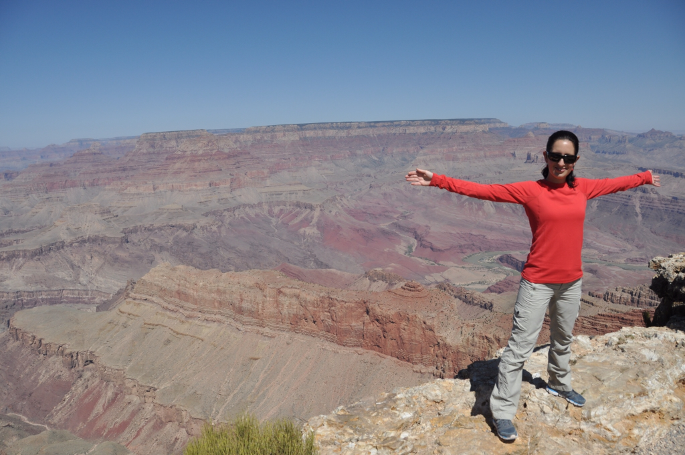
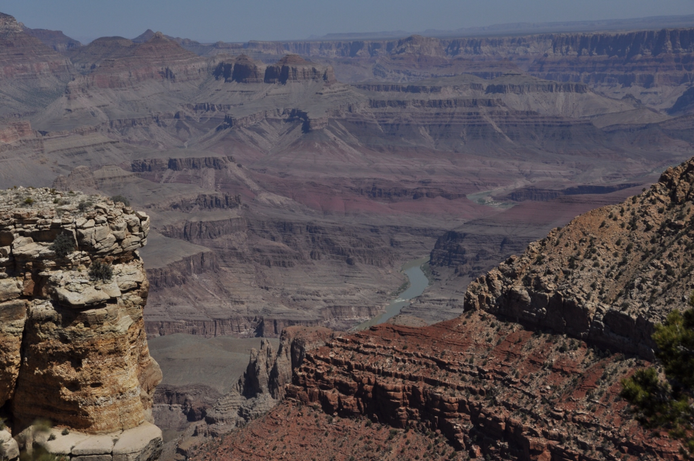

מפייג׳ המשכנו לעקוב אחרי נהר הקולורדו לכיוון דרום עד שהגענו לאתר המפורסם ביותר אותו יצר הנהר - הגראנד קניון. לא בכל יום יוצא לראות משהו שנחשב לאחד משבעת פלאי תבל. ממש כמו שקיות הצ׳יפס שנמכרות כאן בסופרים הגראנד קניון ע-צ-ו-ם - אורכו כ500 ק״מ, רוחבו כ-30 ק״מ ועומקו כשני קילומטרים.

האמריקאים מאד גאים בגראנד קניון שלהם וחייבים להודות שהוא באמת גדול - אבל חוץ מזה, אם נשים רגע בצד את כל עניין האובססיביות האמריקאית סביב גודלם של דברים, לא נעים כל כך להודות - הוא לא כל כך יפה... כלומר, הוא יפה - אבל הרבה פחות ממקומות אחרים שראינו כאן... אירי אחד הגדיל לעשות ואמר בקול מאוכזב ״It's just a big hole" :) דבר נוסף שמרגיז בטיול בקניון העמוק הוא שבניגוד לטיפוס על הר בו מתחילים בטיפוס, מגיעים לשיא ואז מסיימים בירידה - כאן מתחילים בשיא (הנוף הכי יפה הוא מלמעלה), יורדים אל הקניון תוך כדי שכל הזמן רואים את אותו הנוף ולסיום יש בונוס - עליה תלולה באותה הדרך...

")
קשה להגיד שממש התאכזבנו מהגראנד קניון, אבל אחרי טיול כל כך ארוך עם כל כך הרבה דברים שראינו כבר קשה מאד להרשים אותנו... מהגראנד קניון המשכנו לעיר קטנה וחמודה בשם Flagstaff. מסביב לעיירה פזורים כמה אתרים היסטוריים מעניינים של ״אנשי הפואבלו״ שחיו פה כמה אלפי שנים לפני שמגלי הארצות ״גילו״ את אמריקה. אנשי הפואבלו, או כפי שכינו אותם הנבאחו ״אנסזי״, היו חקלאים בניגוד לנבאחו למשל - שהיו לקטים ציידים. המהפכה החקלאית, כפי שמעריכים היסטוריונים, התרחשה כאן במקביל ובאי תלות לשאר היבשות ומעניין לראות איך בני האדם בתרבויות כל כך שונות מצאו פתרונות דומים כדי לשרוד בעולם הזה.

ביקרנו בשני אתרים של אנשי הפואבלו פחות או יותר מאותה תקופה אך עם סגנונות בניה שונים לגמרי. אתר אחד הוא של בניית האדובי המפורסמת - עם הבתים האדמדמים העשויים חול מים וחימר. חלק מהבתים היו משפחתיים אך היו גם מעיין ערים קטנות עם עשרות רבות של חדרים.

באתר השני פגשנו לראשונה את בתיהם של הcliff dwellers, שאת בתיהם בנו בתוך הצוקים - לרוב על ידי הרחבת מערות קיימות וסתימתן באבנים. מאד מעניין לשמוע על השיטות בהן נוקטים הארכיאולוגים והאנתרופולוגים כדי לנחש איך חיו האנשים הללו בתקופות הקדומות. התאוריה המקובלת על רוב ההיסטוריונים כיום היא שהאינדיאנים הראשונים הגיעו לכאן לפני כ15 אלף שנה דרך גשר יבשתי שעדיין היה קיים בתקופה זאת בין מזרח סיביר של היום לצפון אמריקה. הקרחונים המשיכו להינמס, מפלס הים עלה, ומאז הם חיים בניתוק מ״היבשת הראשית״ מחכים ש״יגלו״ אותם. אחרי שהכחידו פחות או יותר את כל היונקים הגדולים שהתגוררו כאן (חוץ מהבפאלו שאיכשהו שרד), התחילו חלק מהאינדיאנים לביית חיות בית, קצת תירס ומכאן - עד המצאת הפופקורן - הכל היסטוריה.

סביב פלאגסטאף יש גם לא מעט מסלולי טיול שונים ומשונים, אנחנו בחרנו במסלולון שעובר סמוך להר געש צעיר שהתפרץ לפני כ-1000 שנה בלבד והשאיר סביבו אדמה בזלתית טריה ומעניינת. למרות כל האטרקציות, כנראה שמפלאגסטף נזכור בעיקר את מבשלת הבירה המקומית Beaver Street Brewery שהיא גם מסעדה ומתהדרת בתואר המסעדה היחידה בטיול בה אכלנו פעמיים (להוציא גלידרייה מטורפת באוקלנד שהיא טכנית לא מסעדה) מומלץ בחום! פיצות מדהימות מתנור לבנים ובירות טעימות - ד״ש לאריק המלצר!

הדבר האחרון שראינו באיזור הוא אחד המקומות שקידמו את חקר החלל - האתר הראשון המוכח בעולם של התרסקות מטאור מהחלל החיצון. באתר מוזיאון מעניין העוסק במטאורים בפרט ובחקר החלל בכלל. אחד המיצגים הנחמדים הוא עמדת מחשב בה בוחרים פרמטר כמו גודל המטאור, מהירותו, זוית הפגיעה ועוד והתוכנה מראה את גודל ההרס (אם הצלחת לחדור את האטמוספרה). לא תתארו מה גודל השמחה כשניצחתי ילד אחד והצלחתי לייצר מטאור שישמיד לחלוטין את כדור הארץ :) מטאורים פוגעים בכדור הארץ פעם בכמה עשרות אלפי שנים - לפעמים הם מתרסקים בים, לפעמים יוצרים מכתשים ולפעמים מכחידים כמעט את כל החיים על כדור הארץ. למזלנו, אורך החיים הקצר של בני האדם נותן את התחושה שמטאורים הם מדע בידיוני - האם באמת יש יותר סיכוי שבסוף נמות מפצצת האטום של ידידינו אמדינג׳אד? אם כבר הזכרנו פצצת אטום, אז אספר שעד לפני ביקוע האטום במחצית המאה העשרים היו בטוחים שהמכתש הוא מכתש געשי - מה הקשר לפצצת אטום?! הדמיון הרב בין מכתש שיוצר מטאור ובין זה שיוצר פיצוץ תת קרקעי מבוקר של פצצת אטום הביא את המדען שומייקר לעשות את ה1+1 הנדרש. עוד על פצצת האטום בפוסט הבא על ניו מקסיקו - להתראות!

 

 

 

