גם בקליפורניה וגם באריזונה היה לאוכל המקסיקני מקום של כבוד על מדפי הסופרים ובמסעדות - בניו מקסיקו כבר יש יותר בוריטו מאנשים. סנטה פה היא בירת ניו מקסיקו, בירתה הקולינרית של האזור ואחת הערים המגניבות שיצא לנו לראות בטיול. בעיר לקחו ברצינות את שימור ההיסטוריה הארכיטקטונית של אנשי הפואבלו והעיר כולה בנויה בצבעים ובסגנונות שמזכירים את בתיהם של הילידים האמריקאים.

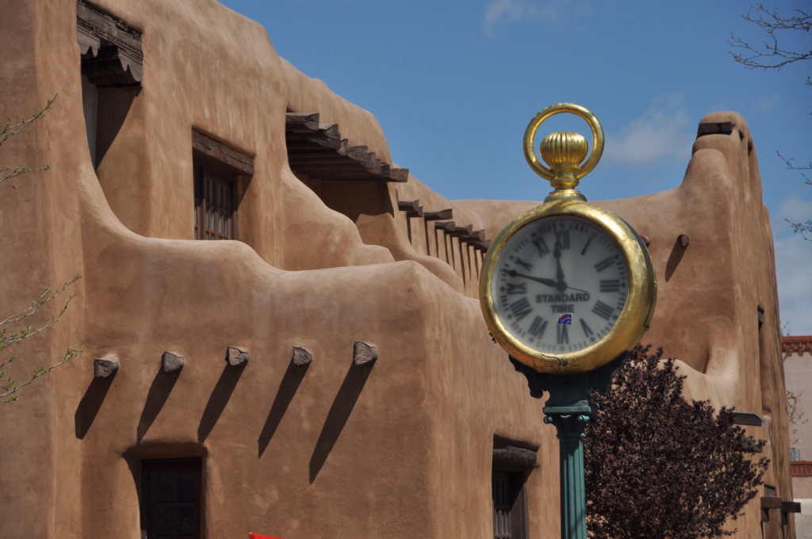
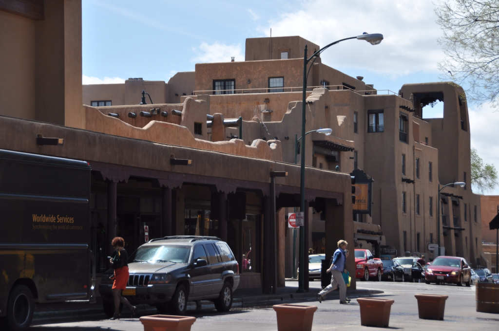

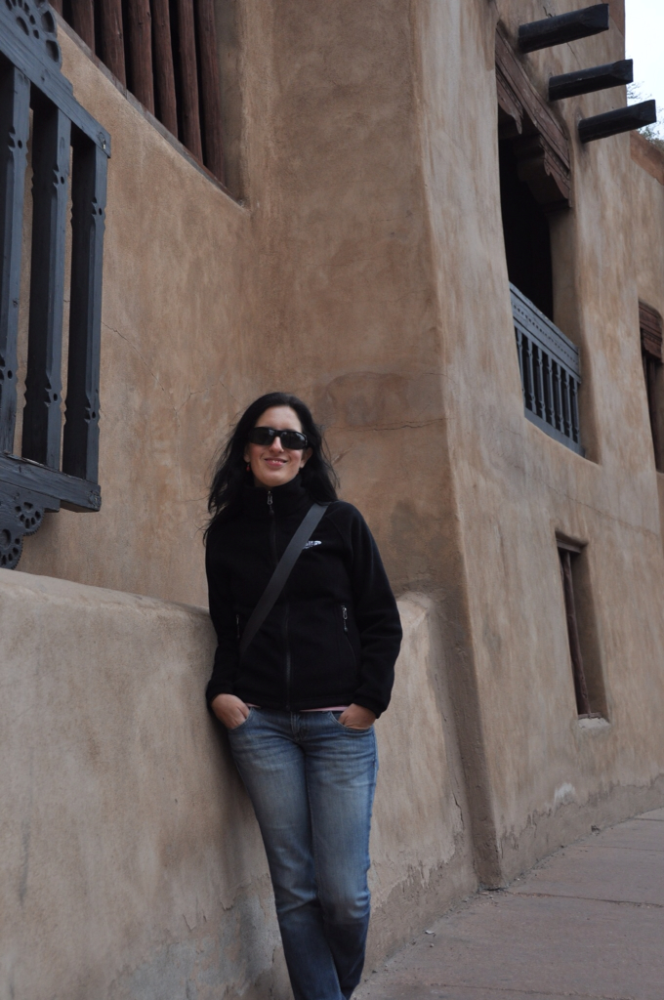

העיר מלאה בגלריות פסלים ואומנות מנקרות העיניים. מספר פעמים היינו צריכים להזכיר לעצמנו שאיננו אמריקאים עשירים ושהחפצים המוצגים לראווה אינם בהישג ידינו. הסתפקנו בקניית דברים כמו שרשרת העשויה תירס ומזונות כמו בוריטו שהגיע מגן עדן. המטבח כאן מלא בשעועית, אבוקדו, צ׳ילי ותירס בצורותיו השונות. כאן לא שואלים אם תרצה את התבשיל שלך חריף, אלא רק שואלים: ״ירוק או אדום?״. בעיר יש גם חנות שוקולד קטנה שמפורסמת במשקאות השוקולד המריר והחריף שלה. משקה ה״אנסזי״ שלהם הוא כנראה השוקולד הטהור ביותר שטעמתי בחיי. בעל המקום היה מאושר עד הגג שבחרתי במשקה טהור וחריף - היחיד ללא ממתיק ואפילו פינק אותנו בשוקולדים חינם.

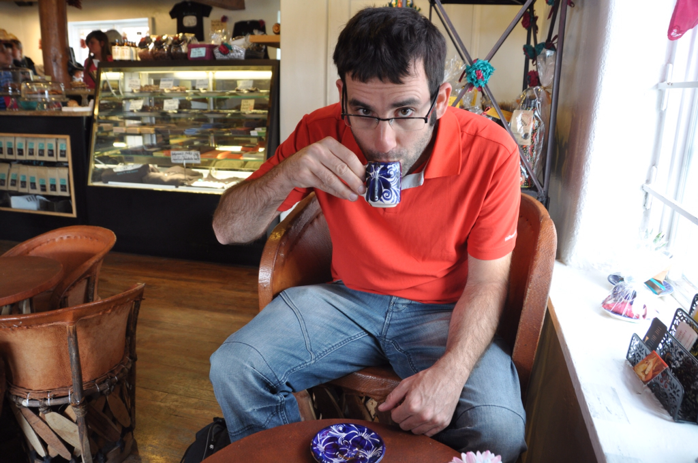
ביקרנו במוזיאון המעניין להיסטוריה של סנטה פה בו למדנו על דיכוי הילידים על ידי הספרדים. הספרדים הטילו מיסים בצורה של עבודה ואף החליטו לנצר את האינדיאנים המסכנים. הספרדים תלו כל מי שדבק בדתו באשמת כישוף. כפי שלא קשה לחזות, באיזשהו שלב יקום אינדיאני חמום מח שלא יאהב את זה... לאינדיאני שלנו קוראים פופאי. ב1680 דהר פופאי בין כל הפואבלוס עם ערימה של חבלים מלאי קשרים. בכל בוקר יתירו אנשי הפואבלו קשר אחד בחבל שברשותם. ביום בו הותר הקשר האחרון - מסתערים על סנטה פה! וכך היה. האינדיאנים ניצלו את העדר הצבא הספרדי ושחטו את כל המתיישבים הספרדים שנשארו. במוזיאון או באינטרנט לא צויין אם הם אכלו את גופות הספרדים - אבל מספיק לראות תמונות שלהם כדי להבין שכנראה שכן :)

בסנטה פה שוב מצאנו דיל מעולה לווילה עם מטבח (שבנויה בסגנון הפואבלו כמובן) ואין ספק שזה היה המקום המפנק ביותר בו ישנו בטיול כולו. למרות שבכל יום דחפנו בוריטו בצהריים עדיין נשאר לנו כוח לבשל. הכנו כאן פלפלים ממולאים ואפילו מילוי בוריטו בייתי לטיולים בהמשך הדרך. ביום בו הגענו לכאן היה לי כאב בטן רציני שעלה לי בפספוס של טאקו, נאצ׳וס או עוד בוריטו מגן עדן - במשך כמה שעות נראיתי כך:

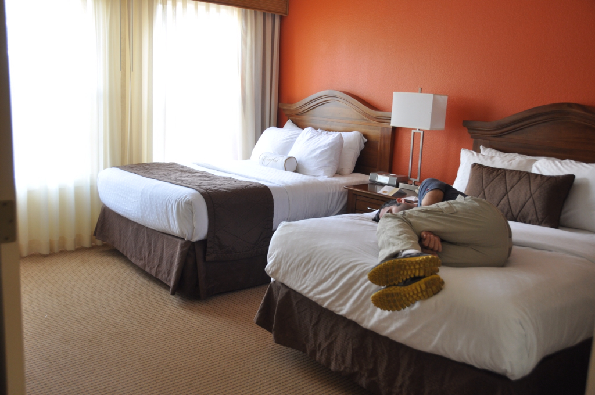
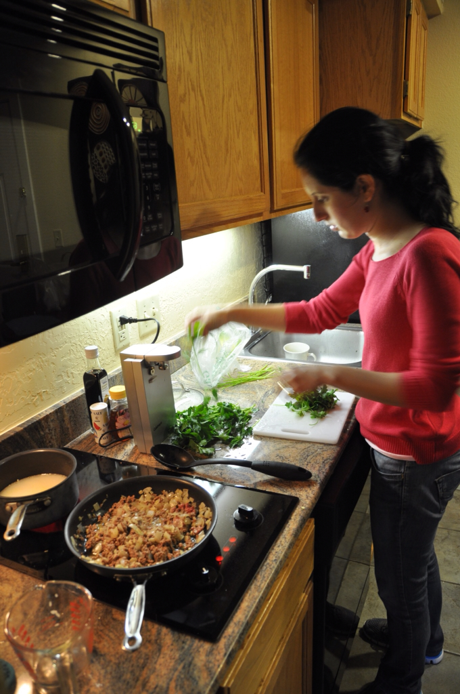
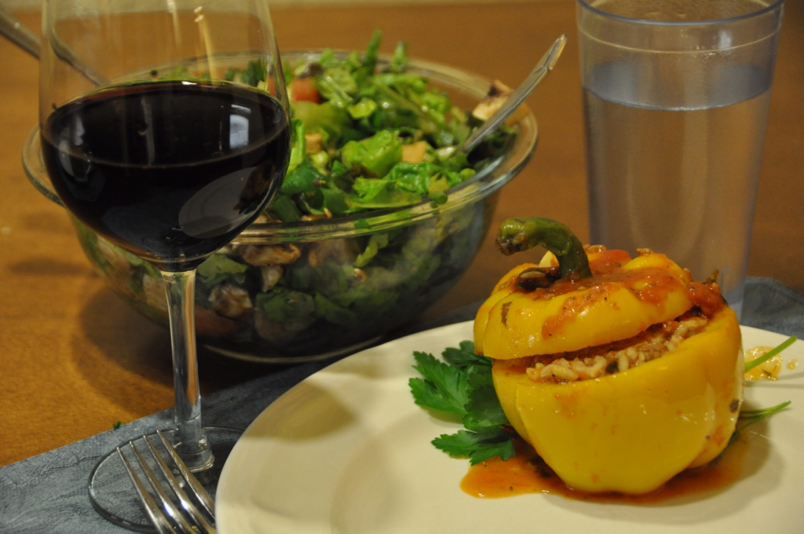
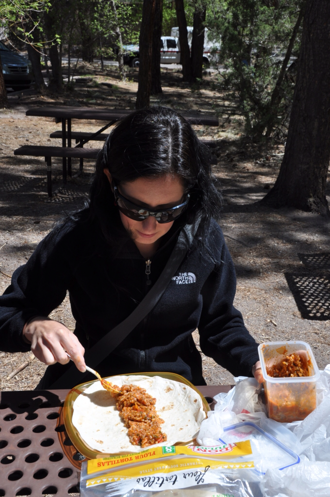
מסנטה פה המפנקת נסענו אל ״העיר שלא הייתה״ - לוס אלאמוס. לוס אלאמוס הוקמה בתחילת שנות הארבעים ושימשה בתור חוד החנית של פרוייקט מנהטן המפורסם. מדענים ופרופסורים מובילים נעלמו מעל פני האדמה ועבדו כאן במרץ על פצצת האטום. הכל התחיל בסוף שנות השלושים עם פרוץ המלחמה - שני מדענים שכנעו את אלברט איינשטיין להצטרף אליהם במכתב בהול לנשיא דאז פרנקלין רוזוולט. במכתב הוזהר הנשיא שלפי המחקרים האחרונים פצצת אטום אפשרית ויתכן שהיא בהשג ידם של המדענים הגרמנים. כדור השלג התחיל להתגלגל והבהלה לאורניום הזכירה את הבהלה לזהב של המאה הקודמת. כיום בלוס אלאמוס ישנה מעבדת מחקר בנושא מצויידת במאיץ חלקיקים שמקדמת שימוש באנרגיה אטומית למטרות שלום (לפחות זה מה שהם אומרים...). במקום מוזיאון גדול ועשיר בנושא הפצצה והפיזיקה שמאחוריה.

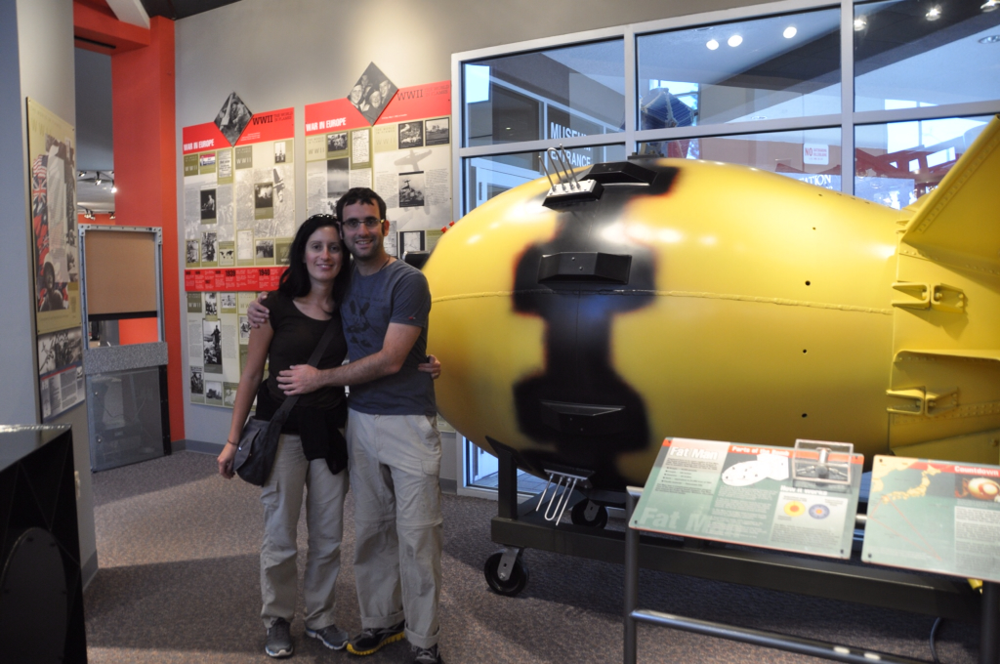

Fat man - הפצצה שהפכה את נגאסקי לאבקת וואסאבי

בתור מי שחוטא בקריאת חוברות לימוד בפיזיקה בזמנו החופשי ועוד מהילדות נמשך לדברים שמתפוצצים, המוזיאון היה פשוט מרתק. בילינו שם מספר שעות עד שהנמלה קילפה אותי מהמקום. אם נשים רגע בצד את מאות אלפי הנשים והילדים שהאמריקאים טיגנו בהירושימה ונגאסקי יחד עם הדיון המטריד לגבי האם זה באמת היה הכרחי, דבר אחד חייבים לומר לזכות פצצת האטום: מאז ההפצצה האיומה לא היו עוד מלחמות בסדר גודל קרוב למה שהיה במלחמת העולם השניה - מלחמה שהדיה משפיעים על חיינו עד היום. המלחמה הבאה בקנה מידה עולמי - כנראה תקרא כך: מלחמת העולם III - המלחמה האחרונה - עכשיו ב3D.

לפני שסיימנו את ביקורנו הקצר והטעים בניו מקסיקו, ביקרנו בעוד אתר ארכיאולוגי של אנשי הפואבלו - Bandelier National Monument. באתר זחלנו קצת במערות של אנשי הפואבלו ולמדנו עוד קצת על חיי היום יום שלהם. על עיר די מטורפת של אנשי הפואבלו החצובה כולה בסלע תוכלו לקרוא בפוסט הבא.

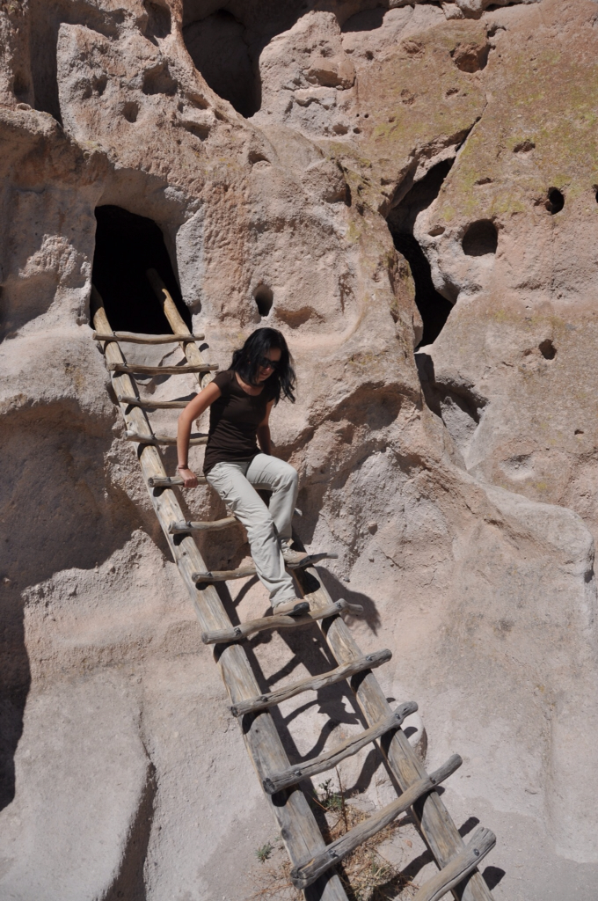
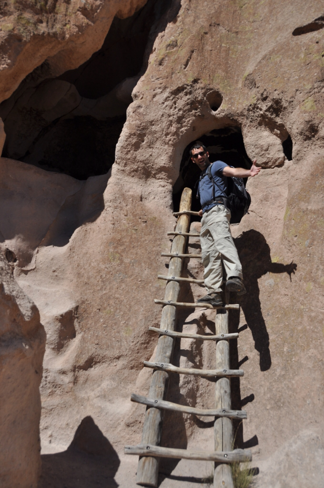
