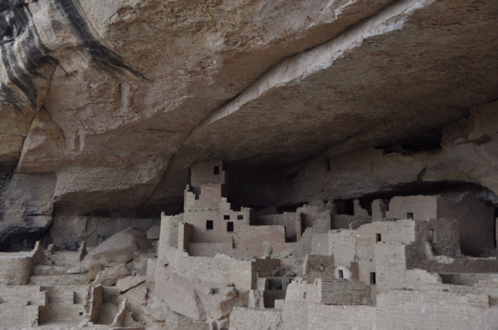
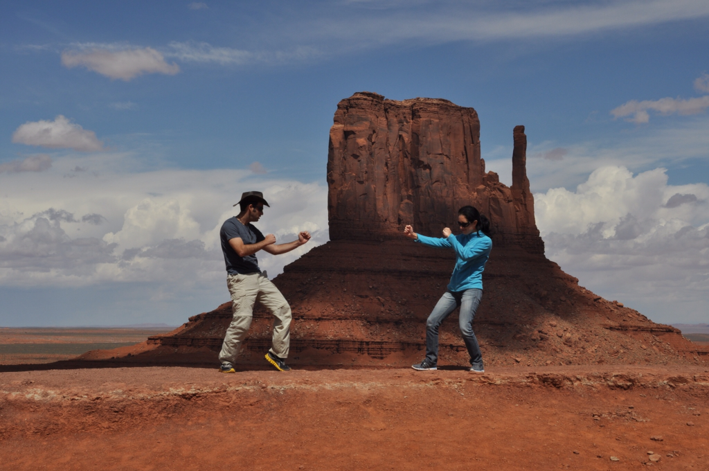

עזבנו את ניו מקסיקו ונסענו צפונה לכיוון קולורדו והאתר הארכיאולוגי Mesa Verde. התחזית לאיזור כולו היתה כפור ושלג למשך השבוע הקרוב, אבל החלטנו בכל זאת לנסות את מזלנו. הנסיעה בשלג היתה בהתחלה מגניבה, אבל כשנערם קרח על הכביש זה התחיל להיות קצת מפחיד. בנסיעה זהירה הגענו לפתח האתר ושאלנו את השומר בכניסה בספקנות אם יש לנו מה לעשות כאן במזג אויר כזה. השומר משך בכתפיו ואמר שהריינג׳רים נמצאים בשטח ומעבירים סיורים כרגיל - מה יש להפסיד... אחרי נסיעה די ארוכה בתוך האתר המושלג, השלג נפסק ועד שהגענו לחניון, כאילו בהזמנה יצאה השמש והזכירה לנו שיום בחוץ. התלבשנו טוב ויצאנו בעקבות ריינג׳ר נחוש לתור את אתר מגוריהם של אנשי האנסאזי מלפני 1400 שנה. הכניסה לעתיקות היא בליווי ריינג׳ר בלבד וכרוכה בטיפוס בסולמות עץ. ה״ממלכה״ העתיקה בנויה כולה בתוך סלע ושמורה במצב מעולה - הסיור היה מרתק.

למרות כל הטכנולוגיה והשיטות, לארכיאולוגים קשה מאד לדעת מה באמת היה סדר היום בתקופה הזאת ואפילו מה היה תפקידו של כל אחד מהחדרים במבנים המשונים הללו. מרבית התגליות על אנשי האנסאזי נתגלו דווקא בעזרת מחקר אנתרופולוגי של מספר קבוצות אנשי פואבלו מודרניים. במשך כמעט 20 דורות מאז ההתיישבות במסה ורדה העבירו אנשי האנסאזי את אמונותיהם ומנהגיהם מאב לבן. מנהגים רבים נשתמרו כך שהאנתרופולוגים יכלו לשחק בטלפון שבור עם אנשי האנסאזי ולהסיק מסקנות פחות או יותר מבוססות לגבי חייהם של האנשים הללו.

אחרי כשעה בשמש החליט מזג האויר שמספיק וכמות של שלג החלה לרדת עלינו כאילו כדי ללמד אותנו על חייהם הקשים של מתיישבי מסה ורדה הקדמונים. בהתחלה הריינג׳ר החרוץ התעלם מהמצב והמשיך בסיור כרגיל. כשהוא הבין שהקבוצה הקטנה כבר לא ממש מקשיבה הוא שחרר אותנו אל הסולמות המובילים חזרה לחניון. כמעט בן רגע נהיה ממש קפוא ובגלל השמש השקרנית לא הבאנו כפפות. עם ידיים כואבות מקור טיפסנו בסולמות העץ ממש כמו ילדי אנסאזי בחורף וברחנו לאוטו החמים שלנו.

ממה שיצא לנו לראות האנשים בקולורדו ממש נחמדים. ישנו כאן בעיירות קטנות ונחמדות, טעמנו בירות של מבשלות קטנות והתערבבנו קצת עם המקומיים. ערב אחד ישבנו בפאב בו הופיע זמר קאנטרי ששר שירי ערפדים כשכל המקומיים הכירו את המילים. כשישבנו בדיינר אחד בזמן שבחוץ סופת שלגים ניגשה אלינו זקנה חביבה שישבה עם בעלה הקאובוי והציעה לנו להשאר לישון בעיר ולא לנסוע בשלג. עוד נחזור לחלק הצפוני של קולורדו בהמשך - בינתיים קופצים שוב ליוטה.

בדרך ליוטה עצרנו באתר קיטשי ומטופש שהאמריקאים משום מה מאד מתרגשים ממנו. ה-Four Corners היא הנקודה היחידה בארה״ב בה גבולות של ארבע סטייטס נפגשים בנק׳ אחת - קולורדו, יוטה, ניו מקסיקו ואריזונה. ממש להזיל דמעה מרוב התרגשות...

משם המשכנו ליוטה לביקור קצר ב״עמק המונומנטים״ - Monument Valley. באיזור הזה של יוטה נוצרו פסלי אבן וחול באמצע המדבר. השמורה נמצאת בשטח של שבט הנבאחו ולכן מנוהלת בצורה אינדיאנית (שזאת המקבילה ל״בצורה ערבית״ של אמריקה)... השמורה מאד יפה וכיף פשוט לשבת לפיקניק מול הנוף המונומנטלי. מכאן נמשיך צפונה אל הפארקים של מזרח יוטה. נתראה בפוסט הבא.

