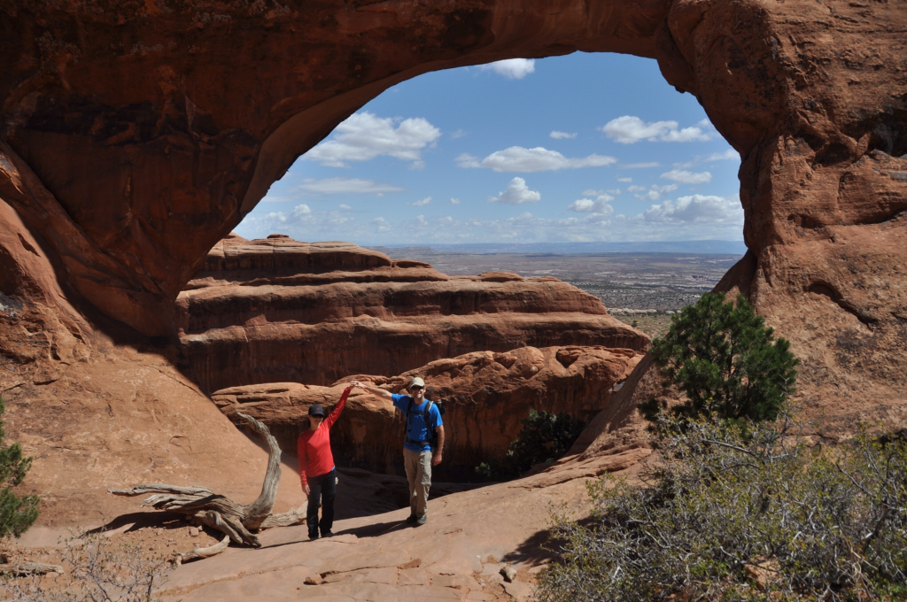

האזור המדברי של מזרח יוטה מיושב בדלילות רבה - שלא לומר נטוש. התושבים הלבנים הראשונים שהתיישבו באיזור לפני 200 שנה היו מורמונים שנתנו לעיירות שמות תנכיים מצחיקים כמו Moab. מאז ועד היום, תמיד מצאו התושבים דרך מקורית להתפרנס. בהתחלה שימש האזור כתחנה בדרך מערבה על נתיב המסחר של נהר הקולורדו, בשנות החמישים נמצא כאן אורניום שמשך לכאן תעשיה שלמה של (שי)כורים. בינתיים הסתיימה המלחמה הקרה והרעיון הכללי של שואה אטומית התחיל להראות לאמריקאים פחות ופחות קסום. האורניום חזר להיות שווה כמו סתם אבן והרבה נטשו את האזור. מאז שנות השבעים התחילו להבין את הפוטנציאל התיירותי של האזור בכל מה שקשור לספורט אתגרי - יש כאן נופים מרהיבים ותופעות גאולוגיות מיוחדות. באים לכאן כדי לטפס על צוקים, לנסוע בג׳יפים, לעשות ראפטינג, בייס ג׳אמפינג וסתם כדי לטייל בטבע.

הפארק המפורסם ביותר באזור מואב הוא Arches National Park - בו כוחות הטבע יצרו בסלעים המדבריים צורות של קשתות (או חורים - תלוי בעיני המתבונן).

בפארק הקשתות עשינו מסלול יומי די ארוך בשם "Double O Arch". המסלול אמנם לא לגמרי מסומן ולפעמים צריך לחפש את המשך הדרך וכולל טיפוס על סלעים מגושמים ולא מאוזנים, אבל הוא שווה כל רגע - ללא ספק המסלול היפה ביותר שעשינו בינתיים בארה״ב.

לא הצלחנו לקבל הסבר מניח את הדעת מדוע דווקא באזור הפארק הזה נוצרה תופעת הקשתות - המדבר של יוטה נראה כולו אותו הדבר, אך בשטח מאד מצומצם, יצרו איתני הטבע חורים משונים המזכירים קשתות. למרבה המזל אני מכיר תופעת טבע דומה מאד שיכולה לתת הסבר אלטרנטיבי. בפה שלי יש הרבה שיניים - כולן בריאות חוץ משן אחת בה חצבו החיידקים פארק לאומי פופולארי מאד מלא חורים וקשתות. למה דווקא השן הזאת? למה רק אחת? רופאי השיניים המלומדים יסבירו לנו שמדובר במשהו שאי אפשר לראות, אבל קוראים לו "עששת". אני לא רואה מניעה להשתמש באותו המונח גם בתחום הגאוגרפיה - מעתה יש לומר - פארק העששת.

כוחות הטבע ממשיכים לעצב את הקשתות ולפני מספר שנים חתיכת קשת במשקל כמה עשרות טונות התרסקה מטרים בודדים ממטיילים שעברו באיזור. המסלול לקשת הזאת נסגר, אך יש אינספור מסלולים בהם אפשר לעבור ממש מתחת לקשתות מאסיביות. מסלול נוסף שמומלץ לעשות הוא מסלול לקשת שנקראת Delicate arch. אנחנו רק הגענו לתצפית על הקשת והשארנו את המסלול שמגיע ממש עד אליה לפעם הבאה - בתקווה שהיא לא תתרסק עד אז...

עוד פארק יפה באיזור מואב הוא Canyonsland National Park המפורסם במגוון התופעות הגאולוגיות המעניינות שבו. בפארק הגדול מספר מסלולי הליכה נחמדים המשקיפים אל העמקים. באופן אירוני, דווקא תקופת כריית האורניום הנרחבת באיזור היא זאת שאיפשרה את קיום הפארק היפה הזה. ללא תשתית הכבישים היקרה שמימנו החברות שחיפשו אורניום באזור המבודד והבעייתי הזה, לא היינו יכולים היום להנות מנופיו...

ממואב המשכנו מזרחה לכיוון קולורדו והרי הרוקי. על קולורדו - בפוסט הבא...
