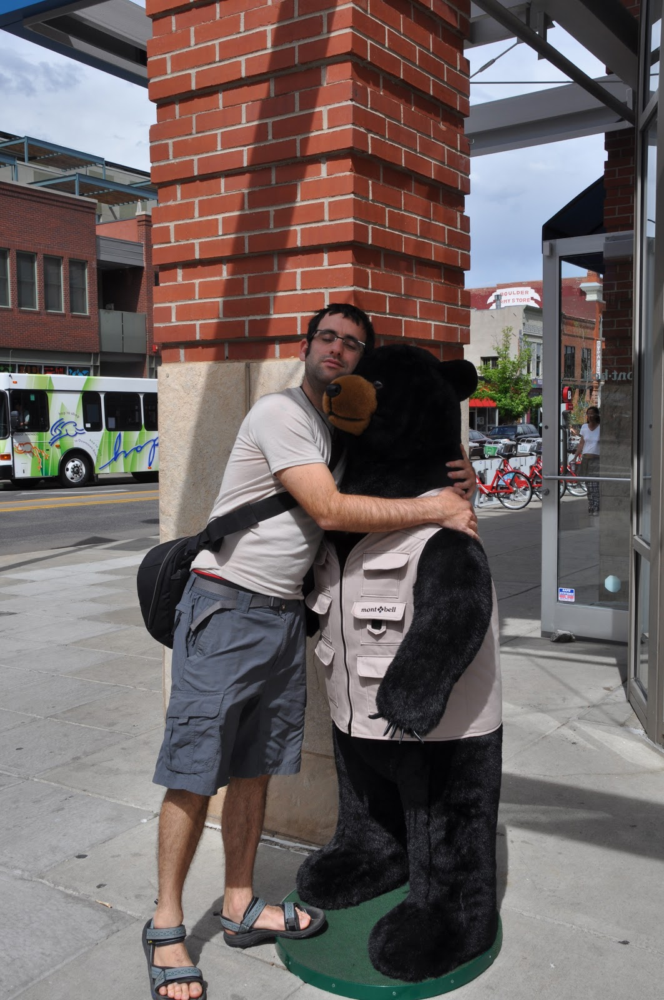

אספן שבקולורדו ידועה בתור עיירת הסקי של הסלבריטאים והעשירים. מחירי הנדל"ן כאן הם מהיקרים בארה"ב ומדרונות הסקי כאן משובחים כמעט כמו הבירות המקומיות. הגענו לאספן בדיוק בסוף עונת הסקי ולפני עונת הטיולים הקיציים. בעוד חלק ממסלולי ההליכה נפתחו, רובם עדיין מכוסים בשלג - מה שלא הפריע לנו לנסות ולהתחכם:  שכרנו תוספות לנעליים להליכה בשלג עמוק ויצאנו לדרך. תכננו לעשות מסלול הליכה באזור ה-Maroon Bells שמטפס לאגם בשם לCrater Lake. 

המסלול התחיל טוב אבל סימוני המסלול עדיין היו קבורים בשלג ולא ממש יכולנו לאתר את השביל. עקבנו קצת אחרי עקבות - ספק של אנשים ספק של דובים וניסינו לנווט בעזרת המפות שבידנו. אחרי כמה שקיעות בשלג שיכלו בקלות לזכות בפרס ב"פיספוסים" (בעיקר בזכות צווחות הנמלה חסרות הפרופורציה) הבנו שהלכנו לאיבוד באופן רשמי. בCrater Lake נבקר בהזדמנות אחרת, הפעם הסתפקנו בכמה שעות חוייתיות של טיפוס בשלג לא יציב וניווט מאתגר.

האגם התחתון ב- Maroon Bells שנקרא Maroon Lake נחשב לנקודה המצולמת ביותר בארה"ב ובקיץ ממליצים להגיע לאגם התחתון יותר מחצי שעה לפני הזריחה(!) כי אחרת לא תוכל לתפוס מקום בשביל לעמוד ולצלם את קרניה הראשונות של השמש. אנחנו הגענו לכאן בדיוק בזריחה והיינו לגמרי לבד - למרות הקור המקפיא היה יפה מאד. האיזור ליד האגם יפה בכל שעות היום ובעונת הסתיו נמצא בשיאו כשהעצים נצבעים בגווני אדום.

מאספן הצפננו לBoulder המקסימה כדי לסיים את הפרק של קולורדו בטיול ולהתכונן לקראת פרק הסיום. בקולורדו יש כל מה שאפשר לבקש מעיר: נופים יפים, מסעדות מעולות, מבשלות בירה ורחוב ראשי קטן ותוסס שמעוטר במאות פרחים צבעוניים. בעיר יש אוניברסיטה כך שיש כאן הרבה סטודנטים וצעירים, אך נראה שגם תושביה המבוגרים לא ממש התבגרו ויש בעיר אווירה סטלנית ממכרת. סצינות מרחובות בולדר:

חוץ ממבשלות בירה, כדי לנקות את הגוף יצרו הסטלנים של בולדר מפעל תה שמצליח מאד בעיקר בארה"ב - Celestial Seasonings. אני יודע שזה נשמע כמו מקום עם ריח של סבתות וגם אני העדפתי ללכת לעוד מבשלה במקום, אבל הנמלה צדקה והיה ביקור נחמד מאד. במפעל יש סיור טוב והמון טעימות של תה חם וקר שחיממו (וקיררו) את הלב.

אבל החוויה הקולינרית הגדולה ביותר בבולדר וללא ספק המסעדה המוצלחת ביותר שהייתה לנו בטיול הגיעה ממקום לא צפוי. בבולדר מצאנו מסעדה מרוקאית משפחתית קטנה בה המליצו לנו על ארוחת 6 מנות מפוארת. בהתחלה חששנו קצת שלא ישמחו לארח ישראלים, אבל אחרי שסיפרנו שאנחנו מישראל שתינו לחיים עם הבעלים. בעל המסעדה התלהב וסיפר שאבא שלו יהודי ואפילו הראה לנו שהוא מחזיק במסעדה חנוכיה איתה אין לו מושג מה אמורים לעשות... האוכל היה פשוט מדהים. מרקים, סלטים מיוחדים, קוסקוס, כבש וטאג'ין מלווים ברטבים כמו ח'אריסה, חומוס וסלט חצילים גרמו לנו לאושר גדול. כשיעל אמרה למלצר שהמרק הזכיר לה את הבית, אמריקאית בשולחן ליד לא יכלה להתאפק והשמיע Ohhhhhh :) היתה ארוחה אינטימית מאחר ובערב כולו הגיעו למסעדה רק 3 זוגות. הבטחתי להמליץ על המסעדה וגם אקיים - שם המסעדה הוא Tangier - ואם לא הבנתם אז היא מומלצת... נפרדנו עם בקלאווה וברכה בה הותזו עלינו מי ורדים.

בבולדר עשרות מסעדות שנראות מפתות במיוחד אבל אי אפשר כל הזמן לאכול. שמרנו על כושר וביקרנו גם ב Rocky Mountain National Park שקרוב לבולדר ועשינו בו טיפוס נחמד באחד המסלולים שהיה פתוח. רוב המסלולים עדיין סגורים אבל הריינג'רים מצאו לנו בדיוק את מה שהיינו צריכים. פסגת ההר האחרונה בטיול - נכבשה.

משדה התעופה של דנבר השכנה, ניקח טיסת לילה מעייפת לניו יורק בה נסיים את הטיול שלנו! הברכיים מתחילות לשקשק...
