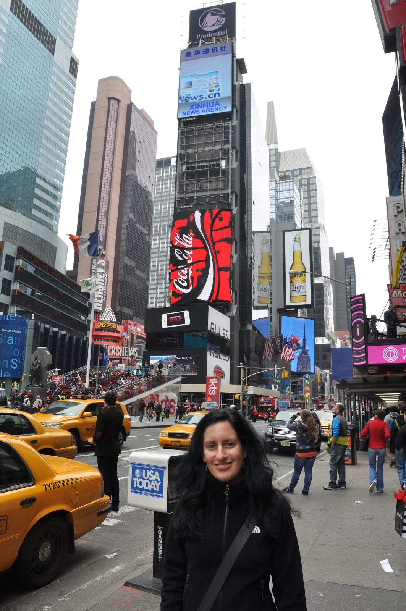
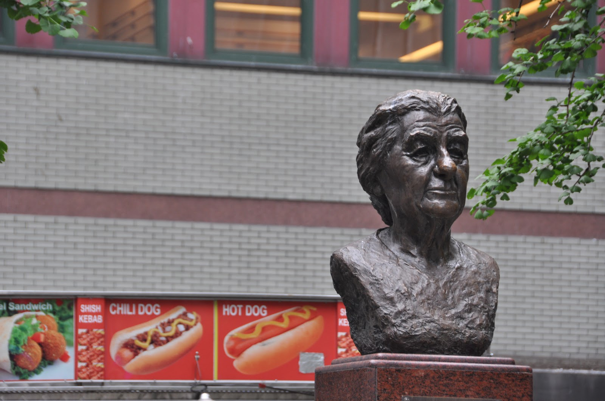

מה אני כבר יכול לכתוב על ניו יורק שלא ידעתם? כנראה ששום דבר משמעותי... הכל כאן משתנה כל כך מהר, אבל בעצם שום דבר לא באמת משתנה - ניו יורק היא ניו יורק. הגענו לכאן לתשעה ימים רגע לפני החזרה ארצה וזכינו לאירוח ברמה שלא יכולנו אפילו לחלום עליה. התארחנו אצל משפחת אלסנר הצעירה בהובוקן ניו ג'רזי ומשם הקמנו בסיס לחרישת העיר. הקצב המהיר של העיר ומיעוט שעות השינה עזר לנו לא לחשוב בכלל על מה שמחכה לנו כשנחזור. ראינו מופעים מרהיבים, סיירנו באזורים ההיסטוריים, אכלנו במסעדות עם שיק ניו יורקי עדכני, שוטטנו במוזיאונים ואפילו נשאר זמן לרבוץ בפארק. ניו יורק - פוסט בתמונות:

*מוקדש לגיא, נעה, מלי, דן ודוד אביעד - תודה על הכל.*

")

מתחת לכדור המפורסם - Times Square

דוכן הנקניקיות על שמי

הקאובוי העירום - Times Square

Freedom Tower - בעודו עוקף את הEmpire State Building בגבהו

  - קיבל את אהבת הנקיון מסבתא לילי")

ניר (מרעננה) מארח לפי מסורת אמריקאית

")

Times Square ב360 מעלות תמונה מלאה [כאן](http://360.io/9hmeea)

אז ככה פחות או יותר נראה הטיול שלנו בניו יורק. מכאן חזרה לחומוס, למשפחה, לחברים ו..... לעבודה.

אז זה הסיפור שלנו - כמעט 6 חודשים של טיול שכבר הפך בשבילנו לשגרה - חלום מתוק שהיקיצה ממנו פתאומית. "החיים הבוגרים" הם אחד המשחקים הכי קשים וחסרי רחמים בהם נתקלתי - לא ברור אם אפשר לנצח בו, ויש כל כך הרבה דרכים להפסיד. בחצי השנה הזאת השתדלנו לעשות כמה שיותר כדי לפחות להשוות את התוצאה או לרגע אחד, נגד כל הסיכויים, אפילו "להוביל". אם אני אי פעם אשכח, בבקשה תזכירו לי - זה הכל רק משחק, אנחנו פה בשביל הכיף! נתראה בטיול הבא!

תודה לכל מי שעקב, כתב וייעץ.  
     עמית
